<hero-tutorial>

# Single-cell RNASeq with 'Orchestrating Single Cell Analysis' in R / Bioconductor

#### Vince Carey

An introduction to a resource, developed primarily by Aaron Lun of Genentech, Inc., that employs Bioconductor resources for many aspects of the analysis of single-cell RNA-seq data. The resource is a "computable book" written in R Markdown, published at <https://bioconductor.org/books/release/OSCA/>.

</hero-tutorial>

`video: https://www.youtube.com/watch?v=0LfpVe-MmGE`

> **Notes**
> 1. The material below requires a billing account. We provide a billing account during the workshop, but if you're following along on your own see 'Next Steps for how to create a billing account.
> 1. Access to the workspace we use requires registration; please [sign up](https://forms.gle/HCY2DM2QsuxAwdhv6) with your AnVIL email address.

## Learning Objectives

This week introduces a resource, developed primarily by Aaron Lun of Genentech, Inc., that employs Bioconductor resources for many aspects of the analysis of single-cell RNA-seq data. The resource is a "computable book" written in R Markdown, published at <https://bioconductor.org/books/release/OSCA/>.

All R users can work with the book on their own computers but will need to take steps to acquire all the relevant software and data. In this workshop:

- We show how an AnVIL workspace and software repository has been defined to allow immediate exploration of all book components
- We clone the workspace to support our own work
- We use RStudio's Git interfaces to acquire our own copies of book content
- We reproduce computations presented in the book and show how to substitute our own data for data analyzed in the book.

## Key Resources

- Visit [https://anvilproject.org](/) for an introduction to AnVIL. AnVIL provides secure access to open and controlled data resources, and the computational environment required to effectively analyze the data. AnVIL can be used for large-scale workflows processing very large data sets, and for interactive analysis of derived or more modest datasets.
- Visit <https://anvil.terra.bio> to use the AnVIL platform.
- The workspace [use-strides/Bioconductor-Workshop-OSCA-3-12](https://app.terra.bio/#workspaces/use-strides/Bioconductor-Workshop-OSCA-3-12) will be the basis of the workshop.

## Workshop Activities

### AnVIL Accounts

#### Create a Google account

- AnVIL (currently) requires a Google account. An account can be created at [Google Accounts: Sign in](https://accounts.google.com/).
- The Google account that you create does not have to be `@gmail.com`; see [Setting up a Google account with a non-Google email](https://support.terra.bio/hc/en-us/articles/360029186611).

#### Sign in to AnVIL

- Visit <https://anvil.terra.bio/>.
- Expand the 'HAMBURGER' menu (blue circle, below).
  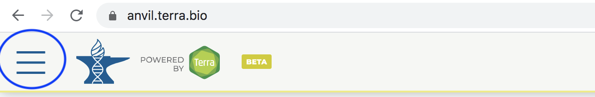
- Click the 'Sign in with Google' icon and follow the prompts.
  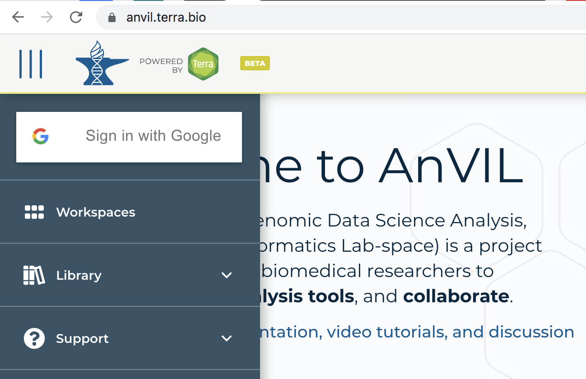
- There are lots of support documents in AnVIL; see [How to register for a Terra](https://support.terra.bio/hc/en-us/articles/360028235911-How-to-register-for-a-Terra-account) account to navigate this step.

#### Workspaces and Billing

- AnVIL data and computing resources are organized around Workspaces. Once you've signed, in, choose 'Workspaces' under the HAMBURGER menu.
  <figure-styles shadowless=true>
  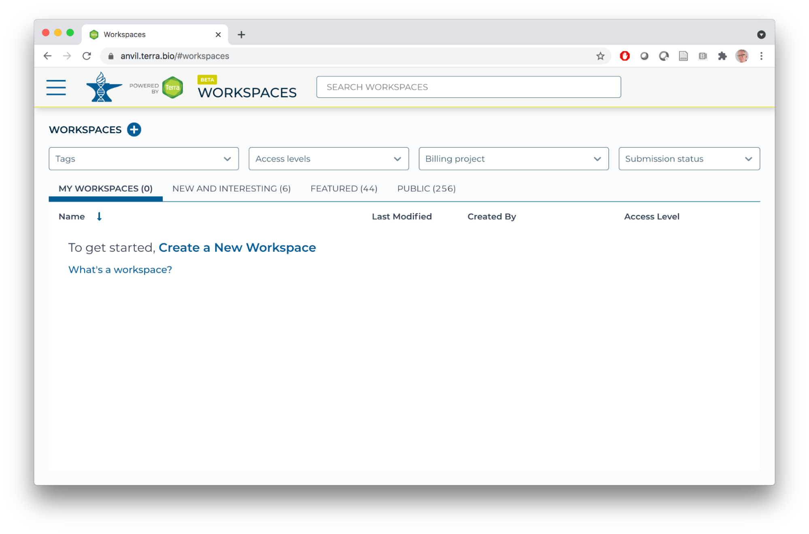
  </figure-styles>
- There are a number of workspaces available to everyone under the 'NEW AND INTERESTING', 'FEATURED'. and 'PUBLIC' tabs; feel free to explore these on your own.
- If you registered for the workshop with an email address known to AnVIL / Terra, you'll see the Bioconductor-Workshops-PopUp workspace under 'MY WORKSPACES'.
  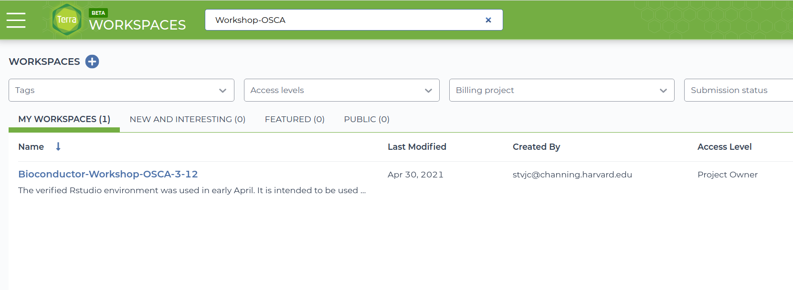
- Enter the workspace by clicking on the [use-strides/Bioconductor-Workshop-OSCA-3-12](https://app.terra.bio/#workspaces/use-strides/Bioconductor-Workshop-OSCA-3-12) link. There are many components to the workspace; we'll cover many of these over the course of the PopUp workshops.
  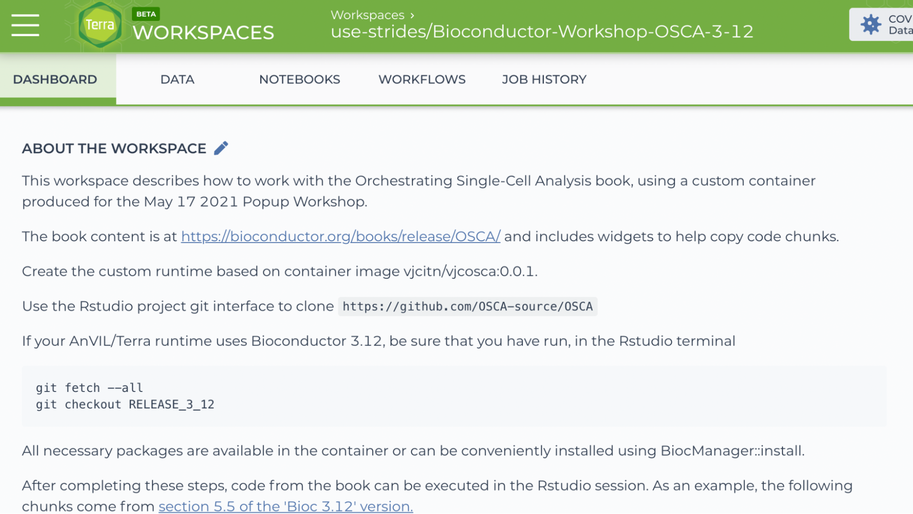
- Start by making a *clone* so that we can perform computations on our own copy of the workspace. Do this by clicking on the TEARDROP (three vertical dots) in the top right of the page, and choose 'Clone'
  <figure-styles shadowless=true>
  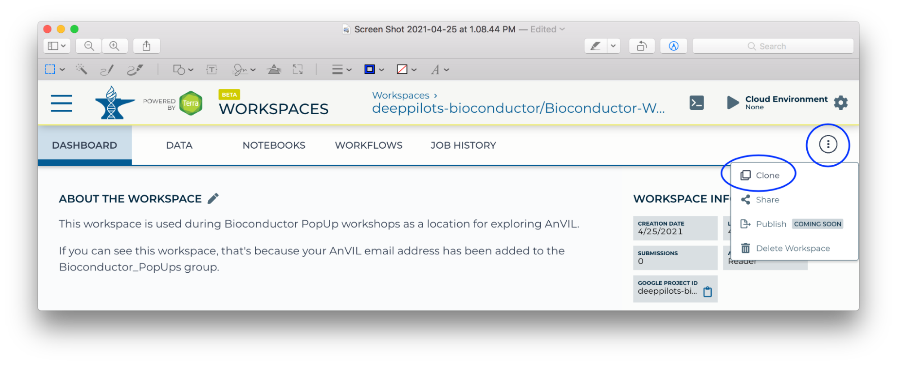
  </figure-styles>
- If you see something like the following, then customize the 'Workspace name' to a globally unique name. In a previous workshop, the 'copy' suffix was converted to 'mtmorgan-popup'. It's convenient NOT to have spaces in a workspace name.
  <figure-styles width="400">
  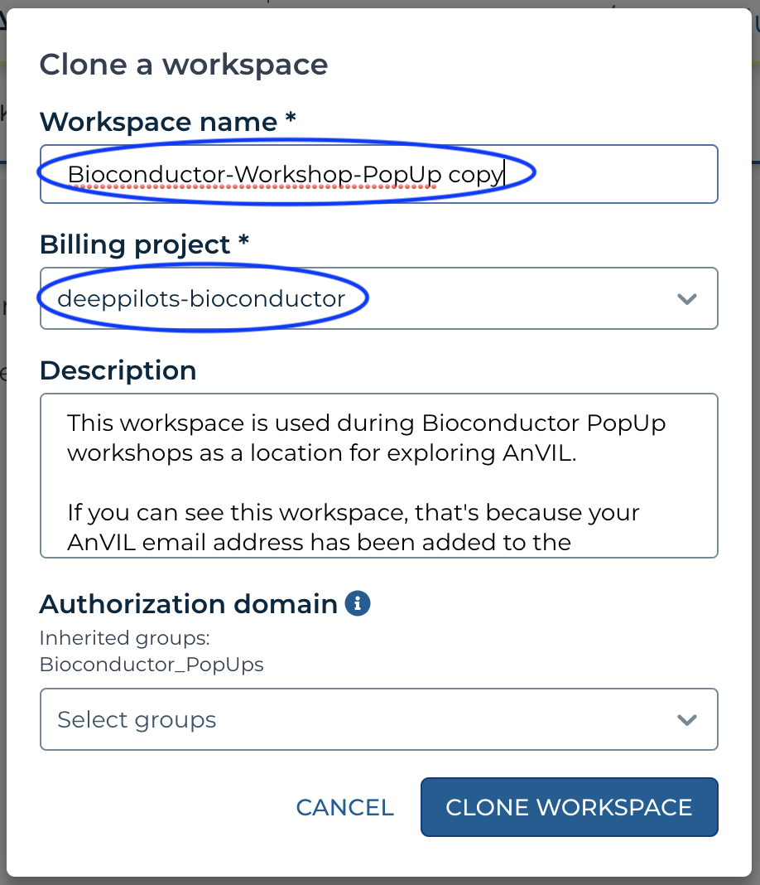
  </figure-styles>
  If instead you see a 'Billing project' that is NOT deeppilots-bioconductor, or if you see something like
  <figure-styles width="400">
  
  </figure-styles>
  Then contact the workshop organizer with your AnVIL email address to be added to the deeppilots-bioconductor billing project. See the Frequently Asked Questions, below, for more information on billing projects.
- Return, via the HAMBURGER menu or by clicking on the WORKSPACES element at the top of the page, to the list of WORKSPACES available to you. You'll see your own version of the workspace. Open it.
  <figure-styles shadowless=true>
  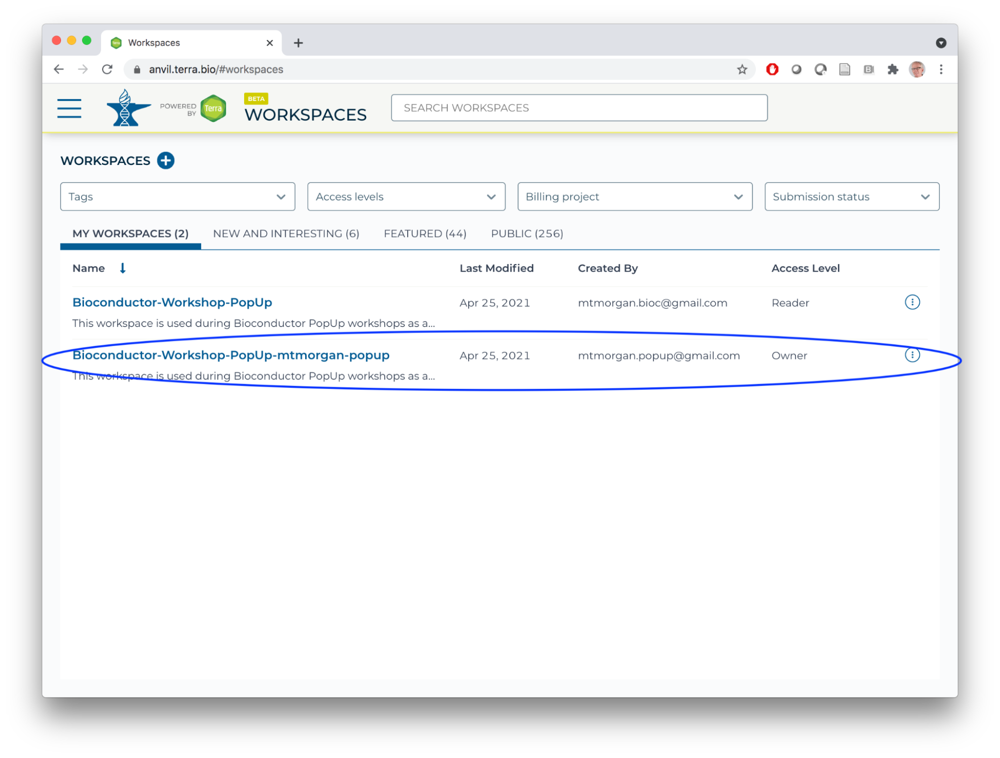
  </figure-styles>
- Congratulations, you now have your own workspace associated with a billing account that allows you to perform computations in the AnVIL cloud!

#### What you've Accomplished:

- Created Google and AnVIL accounts
- Navigated workspaces
- Cloned a workspace to allow your own development
- Identified and linked to a billing account to pay for the computation you'll perform.

## Preparing the Environment

### The "Runtime" that Supports RStudio

An AnVIL RStudio session is easy to start after you've cloned the OSCA workspace. You'll see

<figure-styles width="400">


</figure-styles>

in the upper left corner, and when you click on the "gear" you'll have a widget

<figure-styles width="500">

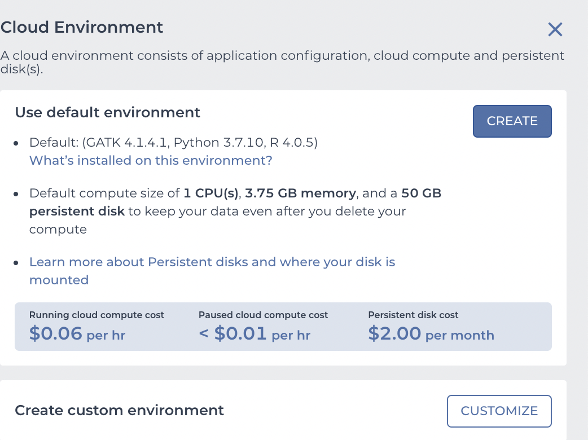

</figure-styles>

and you click the CUSTOMIZE button to see

<figure-styles width="500">

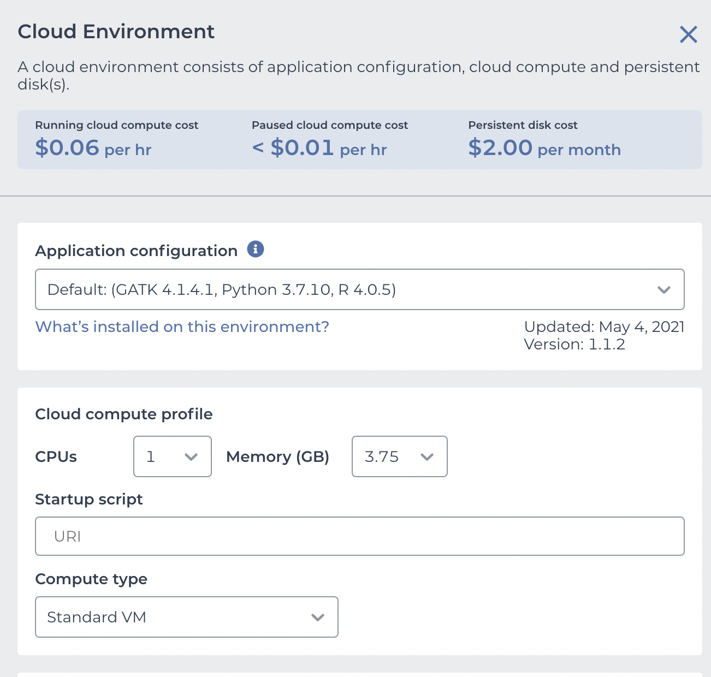

</figure-styles>

This is what we need to configure. Use the "Application configuration" dropdown to pick "Custom Environment" at the very bottom, enter `vjcitn/vjcosca:0.0.1` as the container , and pick a 4 CPU cloud compute profile.

When you see

<figure-styles width="500">

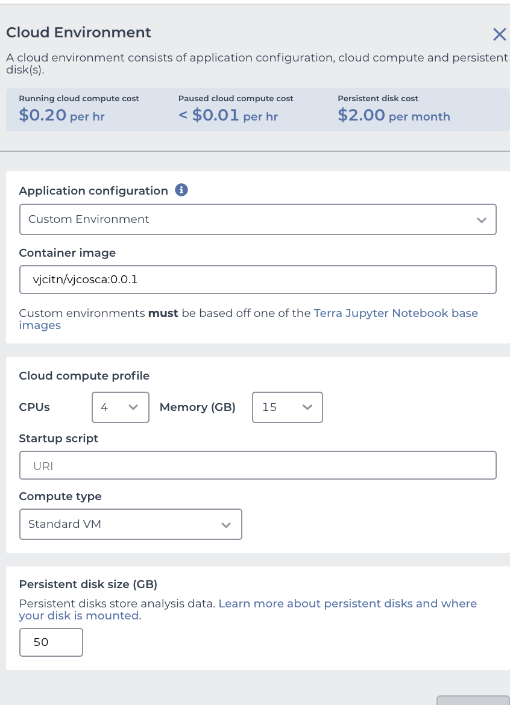

</figure-styles>

you are ready to press CREATE at the bottom. Your browser will refresh and a CRAN icon will show near the upper right corner. Click on it. Then your runtime will be produced by AnVIL with a message indicating to wait 3-5 minutes. You will soon get a notification to "LAUNCH ENVIRONMENT"

That's when Rstudio will appear.

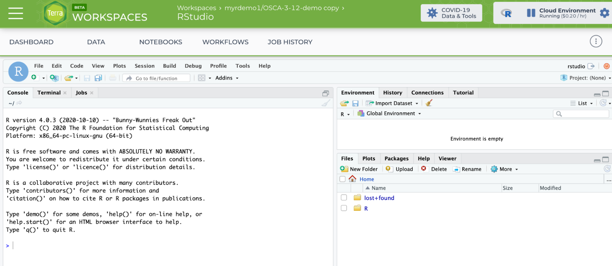

### The git project and branch to be used for the OSCA book

Our work with R and Bioconductor will all be governed by the contents of a GitHub repository. The first thing we'll do with RStudio is to start a git-based project using the File/New project.../Version Control/Git, supplying `https://github.com/OSCA-source/OSCA` as the Repository URL and ~ as the folder. (You need to "Browse" to home to get that "Create project as a subdirectory of:" value.) Then press "Create Project".

<figure-styles width="500">

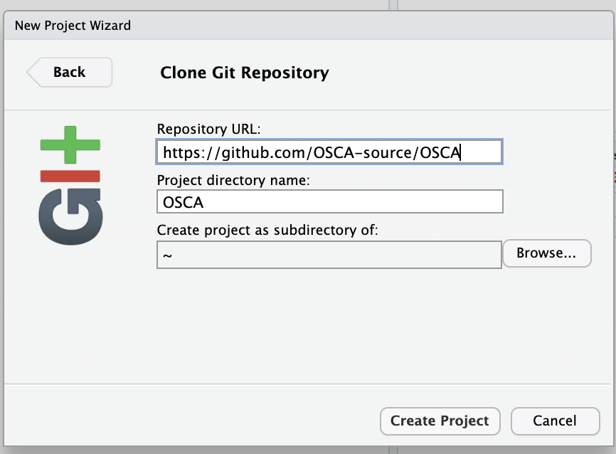

</figure-styles>

Once this is done, you have a refreshed RStudio session. Use the terminal tab and issue the commands

```shell
git fetch --all
git checkout RELEASE_3_12
```

to get a branch compatible with the AnVIL RStudio.

### Some Comments About "Bioconductor"

Bioconductor is a "software/documentation/collaboration" ecosystem rooted in R/github/git that addresses many tasks related to genome-scale computational biology. This schematic may help to get a sense of the scope of issues involved:

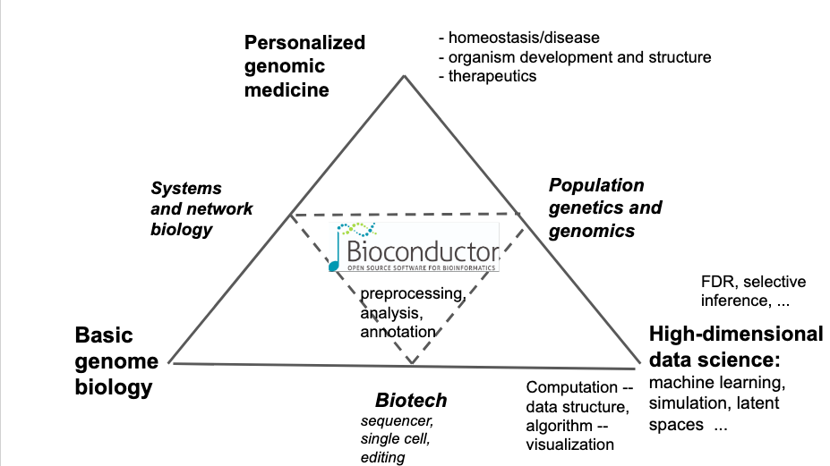

Since the era of spotted cDNA microarrays, Bioconductor has assembled tools to help biologists and data scientists evaluate and analyze high-throughput assays. Basic commitments of the Bioconductor project include open development (we review and distribute packages contributed by members of the community), current curation (all packages in the ecosystem are compiled on three platforms to be compatible with the current version of R), and convenient distribution of software and data (packages can be efficiently installed using the R function BiocManager.) All packages include instructive vignettes, mixing narrative and "live code" to help ensure realistic experiences for readers and users. One recent offshoot of this approach is the "computable monograph" assembled as a collection of R Markdown chapters. This is the focus of today's popup.

### Managing Single-Cell Data

As conscientious computational biologists, we have to be concerned with experimental protocols, data provenance, quality assessment and filtering processes, accurate annotation of digital outputs of assays, and properly documented reproducible analysis workflows. On the right is a figure from a paper by the main architect and author of the OSCA book, Aaron Lun. This [paper](https://genome.cshlp.org/content/early/2017/10/13/gr.222877.117) addresses the use of spiked-in RNA species for the normalization of single-cell RNA-seq experiments. A major conceptual product of the paper is the appraisal of sources of variation in transcript counts attributable to aspects of spike-in preparation and addition to wells.

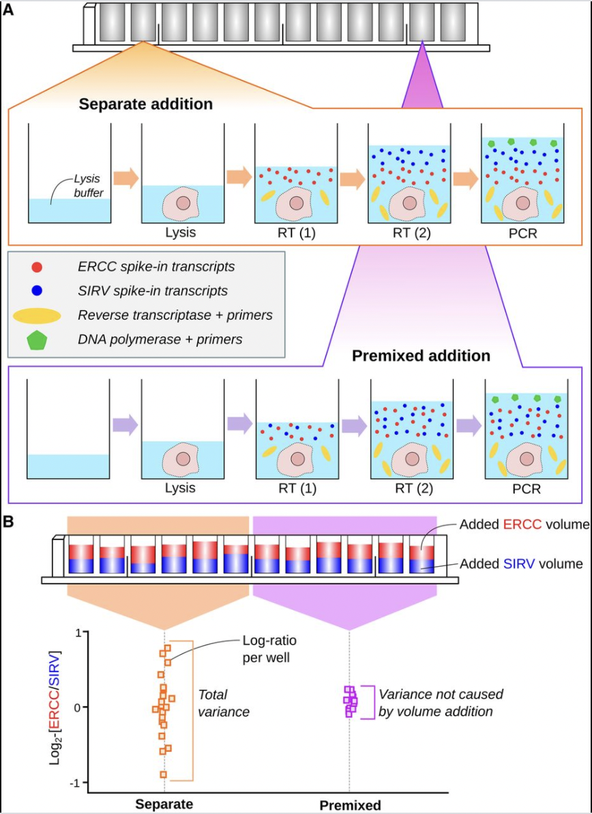

What are the data underlying this paper? The answer is not straightforward. In this workshop, we will consider the use of R to explore one representation of the data.

Here's a report on it:

```shell
> sce.416b
class: SingleCellExperiment
dim: 46604 185
metadata(0):
assays(3): counts logcounts corrected
rownames(46604): 4933401J01Rik Gm26206 ... CAAA01147332.1 CBFB-MYH11-mcherry
rowData names(4): Length ENSEMBL SYMBOL SEQNAME
colnames(185): SLX-9555.N701_S502.C89V9ANXX.s_1.r_1 SLX-9555.N701_S503.C89V9ANXX.s_1.r_1 ...
SLX-11312.N712_S507.H5H5YBBXX.s_8.r_1 SLX-11312.N712_S517.H5H5YBBXX.s_8.r_1
colData names(11): Source Name cell line ... sizeFactor label
reducedDimNames(2): PCA TSNE
altExpNames(2): ERCC SIRV
```

This "SingleCellExperiment" instance involves 185 samples with measurements on 46604 features. The measurements themselves are matrices with names 'counts', 'logcounts' and 'corrected'. For completeness, sce.416b is obtained using scRNAseq::LunSpikeInData().

Before we delve into the book, let's get clear on the SingleCellExperiment class that will be used to manage the data from such experiments. It is derived from SummarizedExperiment, which manages multiple tables on multisample genome-scale experiments. The basic idea is that a matrix with G rows and N columns will be typical for handling G features (often genes) measured on N samples. And in any experiment, we may wish to manage several GxN matrices for different representations -- say the raw counts, and a normalized transformation. These two matrices occupy the "assays" component of the SummarizedExperiment.

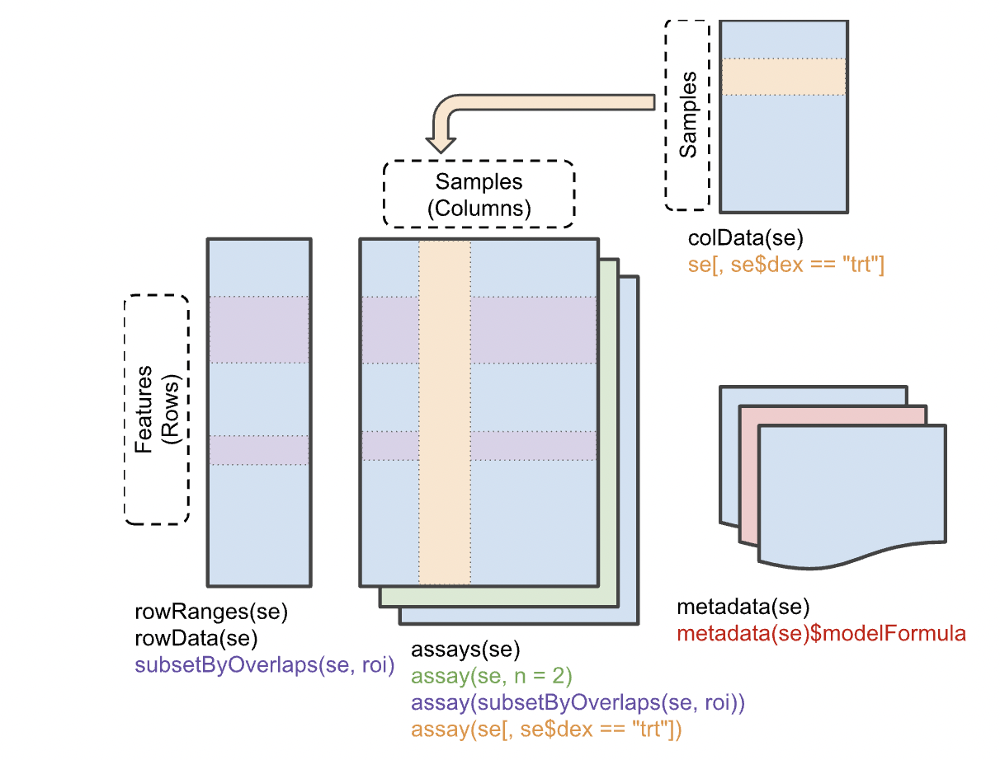

Furthermore, we have an N x R table of sample-level characteristics, stored in the "colData" component, and a G x F table of feature-level metadata, which may include genomic coordinates, functional annotation of genes, etc. The SummarizedExperiment class localizes all this related information and R functions allow convenient interrogation and filtering.

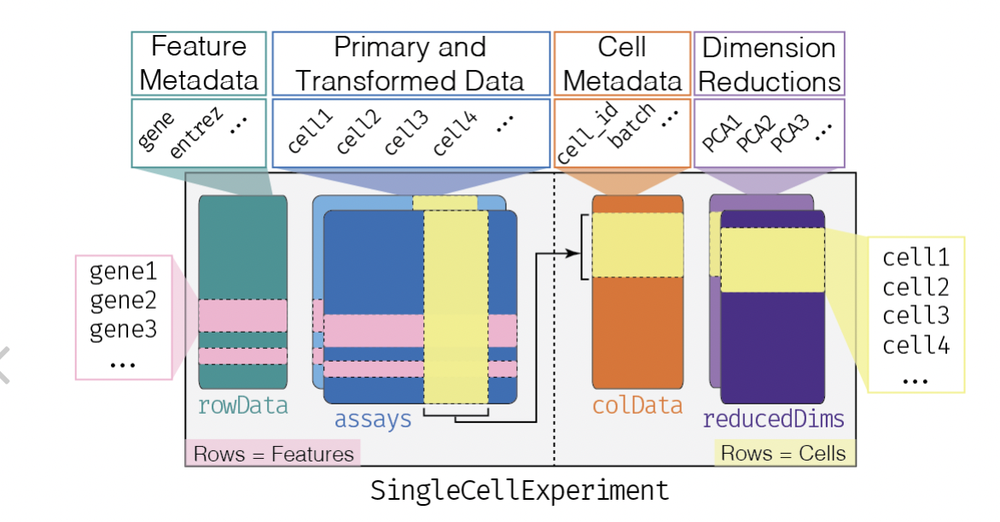

The SingleCellExperiment class is an extension of SummarizedExperiment. The rowData, assays, and colData are all present, but an additional component 'reducedDims' is available to deal with the omnipresent reexpression of assay data through projection to lower-dimensional spaces.

We will want to keep in mind that these fairly complex information sets are managed in R "variables". Our work will be to obtain the data in our session by calling certain R functions in certain packages and operating on the data by passing these variables to other functions. Much of this work will be hidden because we are compiling R markdown documents comprising the OSCA book. But we will be able to inspect the associated variables (datasets) after we do the high-level document compilation.

### Preparing the Caches

Once the RStudio session has begun, it will be useful to carry out a few steps that generally require interaction:

```shell
library(ExperimentHub)
eh = ExperimentHub()   # answer affirmatively if asked
library(AnnotationHub)
ah = AnnotationHub() # again answer if asked
```

Code to be run as we explore the book will make use of these "hubs" to retrieve data from the cloud and to save it locally so that you do not need to repeat the retrievals. The durability of these caches in AnVIL depends upon how you manage the persistent disk with your "runtimes". We will not address this question as you can always construct and populate caches with whatever runtime you happen to be using; the management tasks required only affect wait times, not content availability.

### Exploring an Experimental Dataset

The following code chunk runs pretty quickly:

```shell
library(celldex)
ref = BlueprintEncodeData()
```

After it runs, ask for the value of ref to see

```shell
class: SummarizedExperiment
dim: 19859 259
metadata(0):
assays(1): logcounts
rownames(19859): TSPAN6 TNMD ... LINC00550 GIMAP1-GIMAP5
rowData names(0):
colnames(259): mature.neutrophil CD14.positive..CD16.negative.classical.monocyte ...
epithelial.cell.of.umbilical.artery.1 dermis.lymphatic.vessel.endothelial.cell.1
colData names(3): label.main label.fine label.ont
```

Notice the colData entry label.ont. We can use this mapping of cell types to the Cell Ontology to derive the following graphic:

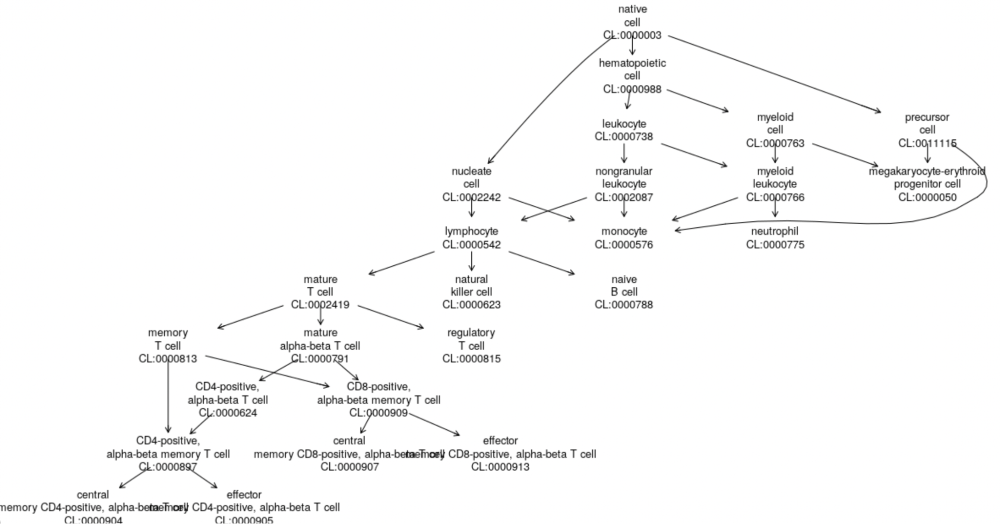

This just shows the positions in a portion of the Cell Ontology, of the first 20 cell types. See [Appendix 1](#appendix-1-sketching-ontological-relationships) for details on how this is done.

To conclude the exploration, answer the following questions:

How many genes are measured in ref?
How many cells were assayed and had results recorded in ref?
Based on ref$label.main, how many different major cell types are represented in ref?

### Rendering a Chapter

The book content is in a collection of R markdown files in `/home/rstudio/ OSCA/vignettes/book`.

Be sure that you have checked out the `RELEASE_3_12` branch by using `system("git branch");` you should then see a star next to `RELEASE_3_12`

```shell
* RELEASE_3_12
  master
```

A chapter that renders fairly quickly is bach-mammary.Rmd, based on Bach, K., S. Pensa, M. Grzelak, J. Hadfield, D. J. Adams, J. C. Marioni, and W. T. Khaled. 2017. “Differentiation dynamics of mammary epithelial cells revealed by single-cell RNA sequencing.” Nat Commun 8 (1): 2128.

Use the commands

```shell
library(rmarkdown)
render("bach-mammary.Rmd", html_document())
browseURL("file://./bach-mammary.html")
```

and the chapter content will appear in your browser.

### Moving On

You now have the tools to render any of the chapters of the OSCA book in AnVIL.

### Appendix 1: Sketching ontological relationships

We need some additional software to produce the ontology plot. Use

```shell
AnVIL::install("ontoProc");
library(ontoProc); cl = getCellOntology();
onto_plot2(cl, ref$label.ont[1:20])
```

to reproduce the plot above.

### Appendix 2: Gory details for the 10x PBMC data

```shell
library(DropletTestFiles)
raw.path <- getTestFile("tenx-2.1.0-pbmc4k/1.0.0/raw.tar.gz")
out.path <- file.path(tempdir(), "pbmc4k")
untar(raw.path, exdir=out.path)

library(DropletUtils)
fname <- file.path(out.path, "raw_gene_bc_matrices/GRCh38")
sce.pbmc <- read10xCounts(fname, col.names=TRUE)

#--- gene-annotation ---#
library(scater)
rownames(sce.pbmc) <- uniquifyFeatureNames(
rowData(sce.pbmc)$ID, rowData(sce.pbmc)$Symbol)

library(EnsDb.Hsapiens.v86)
location <- mapIds(EnsDb.Hsapiens.v86, keys=rowData(sce.pbmc)$ID,
column="SEQNAME", keytype="GENEID")

#--- cell-detection ---#
set.seed(100)
e.out <- emptyDrops(counts(sce.pbmc))
sce.pbmc <- sce.pbmc[,which(e.out$FDR <= 0.001)]

#--- quality-control ---#
stats <- perCellQCMetrics(sce.pbmc, subsets=list(Mito=which(location=="MT")))
high.mito <- isOutlier(stats$subsets_Mito_percent, type="higher")
sce.pbmc <- sce.pbmc[,!high.mito]

#--- normalization ---#
library(scran)
set.seed(1000)
clusters <- quickCluster(sce.pbmc)
sce.pbmc <- computeSumFactors(sce.pbmc, cluster=clusters)
sce.pbmc <- logNormCounts(sce.pbmc)

#--- variance-modelling ---#
set.seed(1001)
dec.pbmc <- modelGeneVarByPoisson(sce.pbmc)
top.pbmc <- getTopHVGs(dec.pbmc, prop=0.1)

#--- dimensionality-reduction ---#
set.seed(10000)
sce.pbmc <- denoisePCA(sce.pbmc, subset.row=top.pbmc, technical=dec.pbmc)

set.seed(100000)
sce.pbmc <- runTSNE(sce.pbmc, dimred="PCA")

set.seed(1000000)
sce.pbmc <- runUMAP(sce.pbmc, dimred="PCA")

#--- clustering ---#
g <- buildSNNGraph(sce.pbmc, k=10, use.dimred = 'PCA')
clust <- igraph::cluster_walktrap(g)$membership
colLabels(sce.pbmc) <- factor(clust)
```

TO DO: examine the vignettes/book -- contrast knit2html button with a manual approach that generates all objects in your session -- do clustering and another chapter
