<hero-tutorial>

# The R / Bioconductor AnVIL package for easy access to buckets, data, and workflows, and fast package installation (Martin Morgan, Nitesh Turaga)

An exploration of how workspaces provide a framework for managing data and large-scale analyses using the HCA Optimus Pipeline and 1000G-high-coverage-2019 workspaces and R using the AnVIL package.

</hero-tutorial>

`video: https://www.youtube.com/watch?v=DO6RjmGjIZA`

> **Notes**
> 1. Visit the [course schedule](/events/bioconductor-popup-workshops-20210503#other-sessions) for links to the recorded session, and to other workshops in the series.
> 1. The material below requires a billing account. We provide a billing account during the workshop, but if you're following along on your own see '[Next Steps](#next-steps)' for how to create a billing account.
> 1. Access to the workspaces we use may require registration; please [sign up](https://forms.gle/HCY2DM2QsuxAwdhv6) with your AnVIL email address.

## Learning Objectives

This week we'll explore how workspaces provide a framework for managing data and large-scale analyses. We use the [HCA Optimus Pipeline](https://anvil.terra.bio/#workspaces/featured-workspaces-hca/HCA_Optimus_Pipeline) and [1000G-high-coverage-2019](https://anvil.terra.bio/#workspaces/anvil-datastorage/1000G-high-coverage-2019) package.

## Key Resources

- Visit <https://anvil.terra.bio> to use the AnVIL platform.
- We use [week-2-demo.R](https://gist.githubusercontent.com/mtmorgan/855b303cecd5416ef9402d04ba72e61f/raw/) to guide us through this workshop.
- We use the [HCA Optimus Pipeline](https://anvil.terra.bio/#workspaces/featured-workspaces-hca/HCA_Optimus_Pipeline) and [1000G-high-coverage-2019](https://anvil.terra.bio/#workspaces/anvil-datastorage/1000G-high-coverage-2019) workspaces as examples.
- Review the [Introduction to the AnVIL package](http://bioconductor.org/packages/release/bioc/vignettes/AnVIL/inst/doc/Introduction.html) vignette.

## Review

### Previously...

- Notes and recorded session: [Using R / Bioconductor in AnVIL](/learn/data-analysts/using-r-bioconductor-in-anvil)

### Essential Steps

- Login
- Workspaces
- Billing accounts
- Cloud environment -- (R-based) Jupyter notebooks or RStudio

### Cloud Computing Environment

- Runtime and persistent disk
- A 'personal' cloud computing environment
- Not shared with others
- Ephemeral

### FAQs

- Persistent disk mounted at
  - R / Jupyter: `/home/jupyter-user/notebooks`
  - RStudio: `/home/rstudio`
- Startup script or custom docker file for 'sudo'-like access, and for complete reproducibility

## Workshop Activities

### Setup

- Log in to [AnVIL](https://anvil.terra.bio) using the email address you used to register for the course and navigate (via the HAMBURGER) to Workspaces.
- If you cloned the Bioconductor-Workshop-Popup workspace last week, delete it now.
  <figure-styles shadowless=true>
  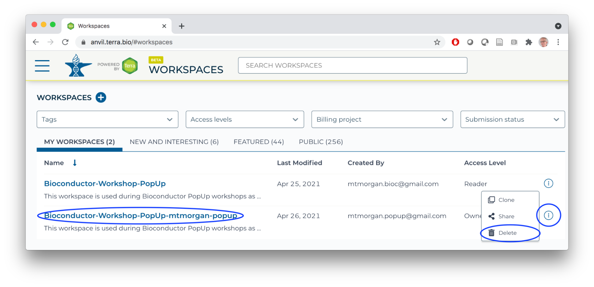
  </figure-styles>
- Clone the Bioconductor-Workshop-Popup.
  <figure-styles shadowless=true>
  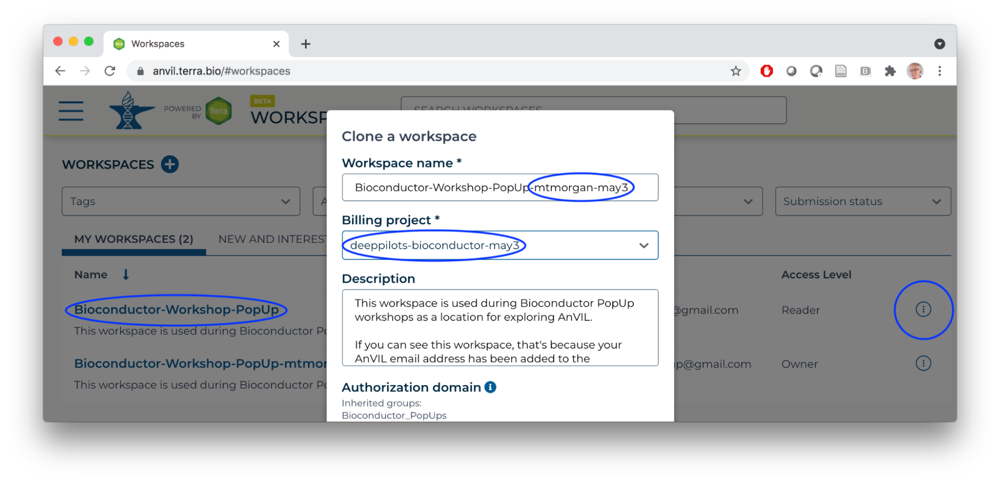
  </figure-styles>
- Start an RStudio cloud environment.
  <figure-styles shadowless=true>
  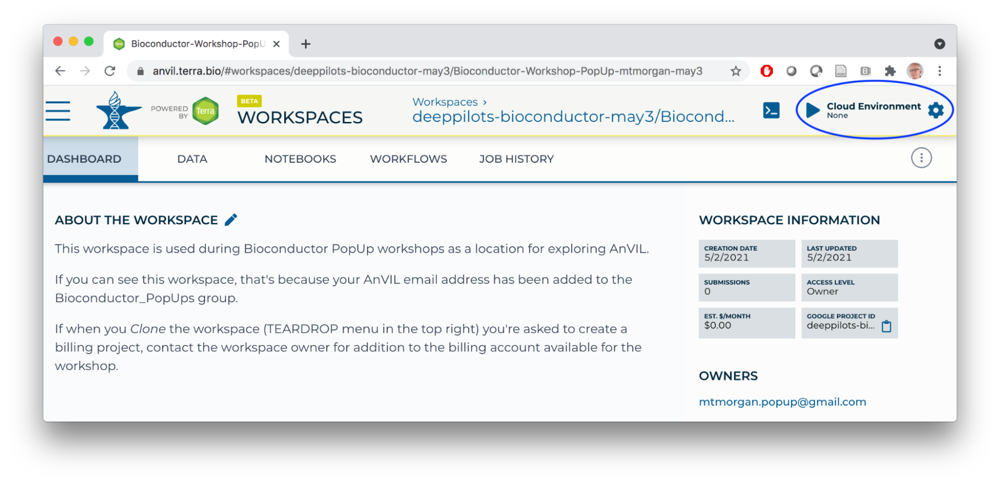
  </figure-styles>
  <figure-styles shadowless=true>
  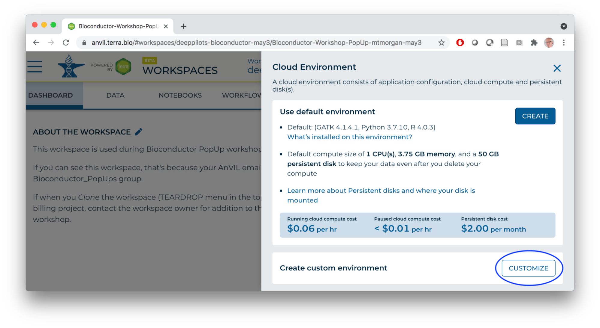
  </figure-styles>
  <figure-styles shadowless=true>
  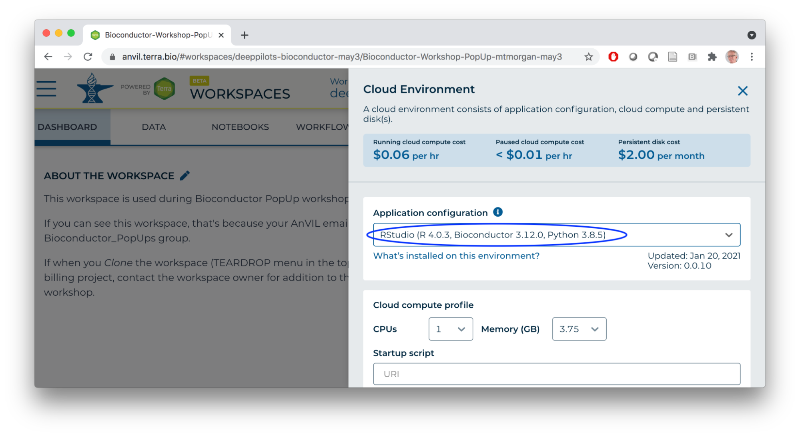
  </figure-styles>
- Launch the cloud environment.
  <figure-styles shadowless=true>
  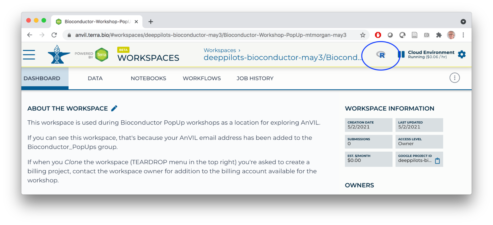
  </figure-styles>
- Copy the [week-2-demo.R](https://gist.githubusercontent.com/mtmorgan/855b303cecd5416ef9402d04ba72e61f/raw/) script into a file on your cloud environment.
  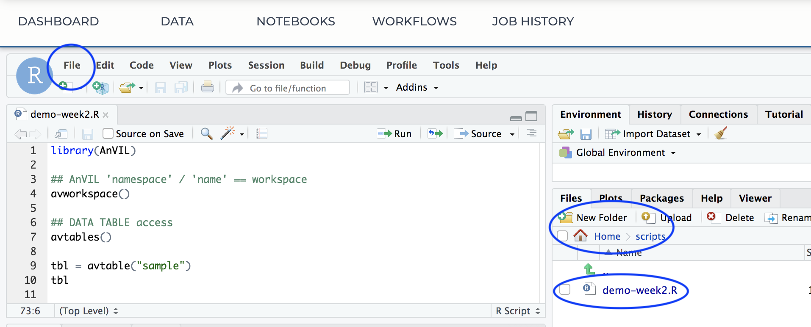

### Workflows

- In a new browser tab/window, navigate (via the HAMBURGER) to the [HCA Optimus Pipeline](https://anvil.terra.bio/#workspaces/featured-workspaces-hca/HCA_Optimus_Pipeline) workspace. This workspace demonstrates how scRNA-seq fastq files can be transformed to a 'count matrix' for interactive analysis.
  <figure-styles shadowless=true>
  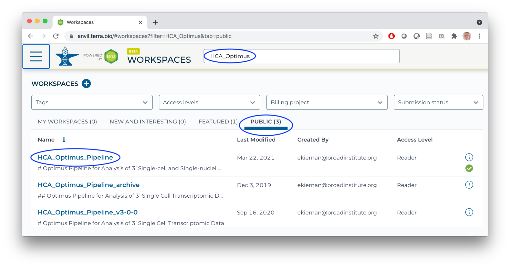
  </figure-styles>
- Overall orientation: DATA TABLES serve as input to WORKFLOWS (scalable 'big data' computation).
  <figure-styles shadowless=true>
  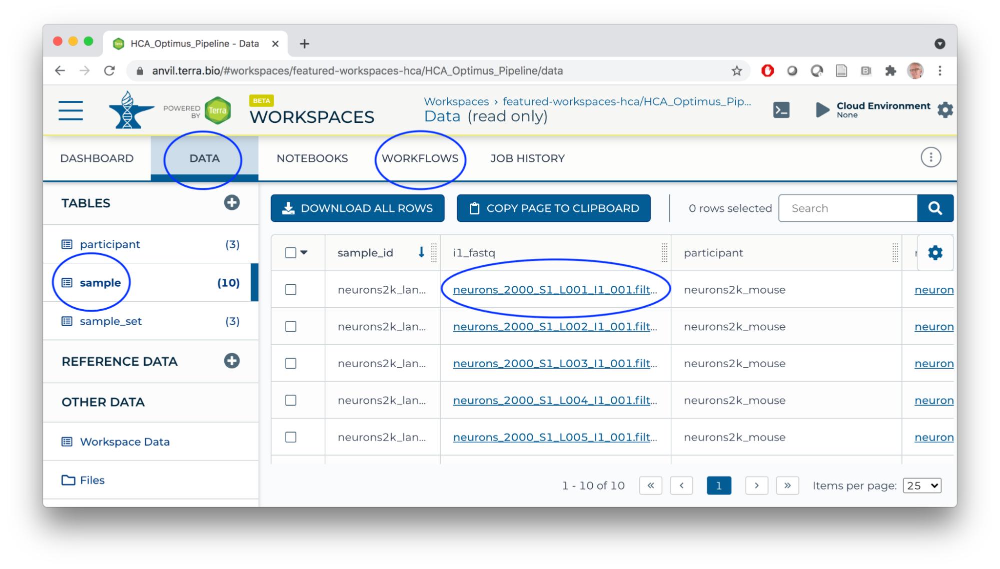
  </figure-styles>
- Workflows transform big data using 'Workflow Description Language' scripts producing outputs (logs, results).
  <figure-styles shadowless=true>
  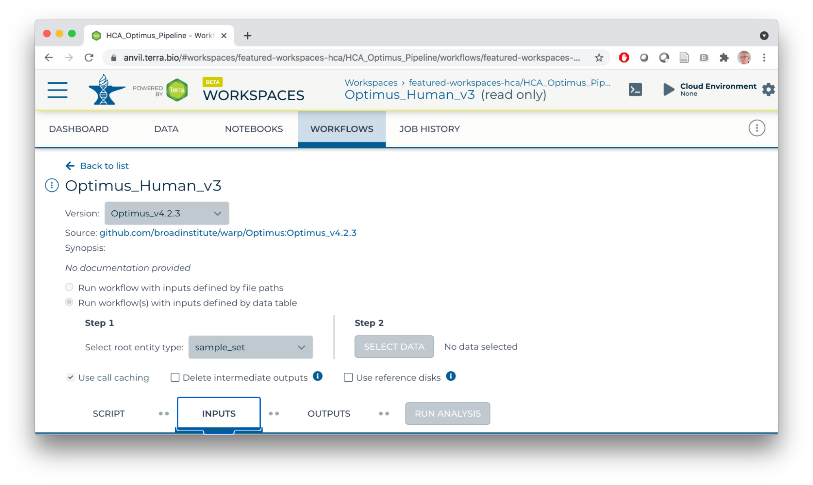
  </figure-styles>
  For this workflow:
  - Single-cell RNA seq analysis.
  - Inputs are fastq files from individual samples.
  - Scripts perform alignment, UMI processing, creating a 'count' matrix of gene x cell (sample) expression matrices, etc.
  - Primary output of interest is a 'loom' file summarizing the count matrix.
- Workspace bucket / Files store workflow outputs (each workflow run has a unique identifier; logs and results are located under the identifier). Buckets also provide a location for storing and sharing interactive analysis results.
  <figure-styles shadowless=true>
  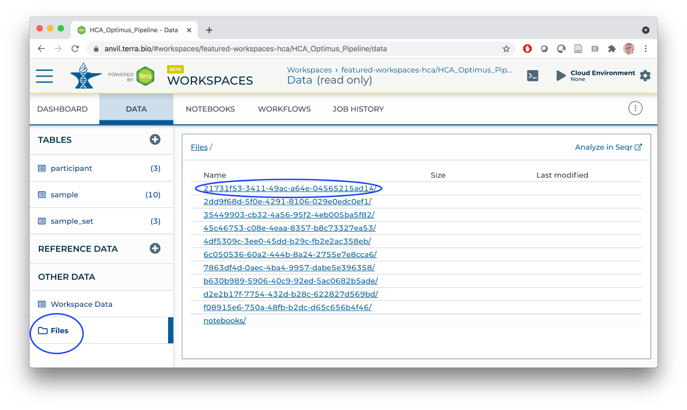
  </figure-styles>

### The AnVIL Package

#### AnVIL Workspaces

```shell
hca = "featured-workspaces-hca/HCA_Optimus_Pipeline"
thousand_genomes = "anvil-datastorage/1000G-high-coverage-2019"

library(AnVIL)
avworkspace()    # current workspace
avworkspace(hca) # set to HCA workspace
```

#### DATA TABLE Access

```shell
avtables()

tbl = avtable("sample")
tbl

tbl %>% count(participant)

## tbl %>% avtable_import()

avworkspace(thousand_genomes)
avtables()
participant = avtable("participant")
participant

participant %>% count(POPULATION, sort = TRUE)
avtable("pedigree") %>%
    count(Population, Sex) %>%
    tidyr::pivot_wider(names_from = "Sex", values_from = "n")

## switch back to this workspace
avworkspace(hca)
```

#### Google buckets

```shell
## Copy files from google buckets to persistent disk

tbl = avtable("sample_set")
tbl

dir.create("~/loom")
gsutil_cp(tbl$loom_output_file, "~/loom/")  # see also gsutil_rsync()
dir("~/loom")

## Workspace Bucket -- 'backup' or share persistent disk to workspace bucket

avbucket()  # bucket associated with this workspace
gsutil_ls(avbucket())

avfiles_backup("~/scripts", recursive = TRUE) # see also avfiles_restore()
gsutil_ls(avbucket(), recursive = TRUE)
```

#### Fast Binary Package Installation

```shell
## do NOT update out-of-date packages yet
BiocManager::install("Bioconductor/AnVIL")

## RESTART R
AnVIL::repositories() # binary Bioconductor and CRAN package installation

## install and use LoomExperiment
AnVIL::install("LoomExperiment") # about 40 seconds, rather than 10's of minutes
sce = LoomExperiment::import("~/loom/pbmc_human_v3.loom")
```

#### Access AnVIL from Outside AnVIL

- Requires gcloud SDK installed on your computer.
- Use sdk to register your Gmail account and google billing project.
  <figure-styles shadowless=true>
  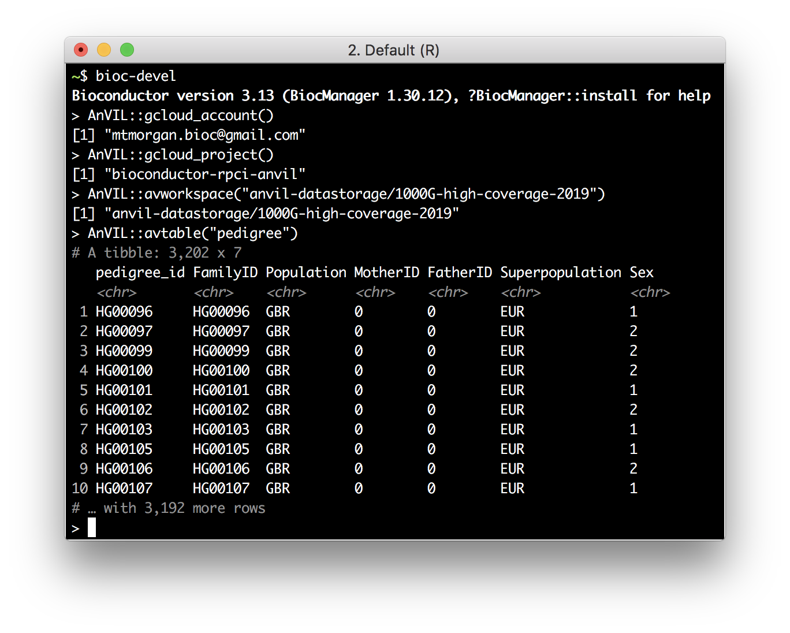
  </figure-styles>

#### Access the AnVIL 'API'

```shell
leo = Leonardo()
leo
leo$listDisks()

terra = Terra()
tags(terra, "Workspaces")
wkspc =
    terra$listWorkspaces() %>%
    flatten() %>%
    select(-starts_with("workspace.attributes"))
wkspc
```

## Summary

### What You've Accomplished

#### Setup

- Clone a workspace, launch an RStudio cloud environment
- Navigate between workspaces

#### Workflows

- Elements of workflow structure -- DATA TABLE inputs, scripts, File outputs

#### AnVIL Package

- Selecting workspaces
- Managing DATA TABLEs
- Moving data to and from google buckets
- Fast binary package installation (in the 'devel' version of the package)
- Advanced features, e.g., local use, API access

## Next Steps

- Follow instructions at [Set up billing with $300 Google credits to explore Terra](https://support.terra.bio/hc/en-us/articles/360046295092) to enable billing for your own projects.

## Frequently Asked Questions

- Uploading workflows -- through GitHub / Dockstore, but also the Broad Methods Repository ([YouTube](https://www.youtube.com/watch?v=VtKlYqWBW6A)); see also the [WDL Puzzles](https://app.terra.bio/#workspaces/help-gatk/WDL-puzzles) workspace.
- Default name and namespace -- the runtime starts in a particular workspace, and the runtime knows the default namespace and name. So by default, I had
```shell
> avworkspace()
[1] "deeppilots-bioconductor-may3/Bioconductor-Workshop-PopUp-mtmorgan"
```
- `gsutil_cp(): CommandException: Downloading this composite object requires integrity checking with CRC32c, but your crcmod installation isn’t using...` This is a bug that should be fixed in the underlying image for the runtime.


