<hero-tutorial>

# Using R / Bioconductor in AnVIL

#### Martin Morgan

An introduction to the AnVIL cloud computing environment. We learn how to create a Google account to use in AnVIL. We explore key concepts related to workspaces and billing projects. We explore creating a Jupyter notebooks-based cloud environment, and an RStudio cloud environment.

</hero-tutorial>

`video: https://www.youtube.com/watch?v=8Ccj__2GqJ4`

> **Notes**
>
> 1. The material below requires a billing account. We provide a billing account during the workshop, but if you're following along on your own see '[Next Steps](#next-steps)' for how to create a billing account.
> 1. Access to the workspace we use requires registration; please [sign up](https://forms.gle/HCY2DM2QsuxAwdhv6) with your AnVIL email address.

## Learning Objectives

This week introduces the AnVIL cloud computing environment. We learn how to create a Google account to use in AnVIL. We explore key concepts related to workspaces and billing projects. Central to interactive analyses is the *Cloud Environment* where computation takes place. We explore creating a Jupyter notebooks-based cloud environment, and an RStudio cloud environment.

## Key Resources

- Visit [https://anvilproject.org](/) for an introduction to AnVIL. AnVIL provides secure access to open and controlled data resources, and the computational environment required to effectively analyze the data. AnVIL can be used for large-scale workflows processing very large data sets, and for interactive analysis of derived or more modest datasets.
- Visit <https://anvil.terra.bio> to use the AnVIL platform.

## Workshop Activities

### AnVIL Accounts

#### Create a Google account

- AnVIL (currently) requires a Google account. An account can be created at [Google Accounts: Sign in](https://accounts.google.com/).
- The Google account that you create does not have to be `@gmail.com`; see [Setting up a Google account with a non-Google email](https://support.terra.bio/hc/en-us/articles/360029186611).

#### Sign in to AnVIL

- Visit <https://anvil.terra.bio/>.
- Expand the 'HAMBURGER' menu (blue circle, below).
  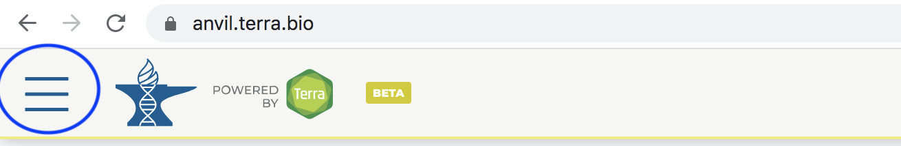
- Click the 'Sign in with Google' icon and follow the prompts.
  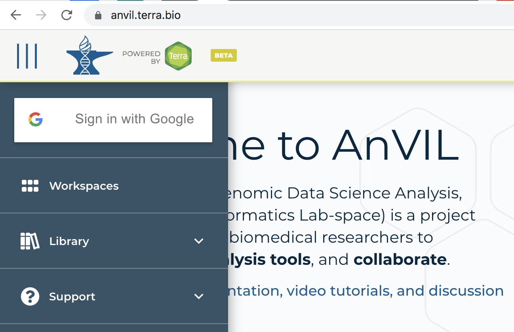
- There are lots of support documents in AnVIL; see [How to register for a Terra account](https://support.terra.bio/hc/en-us/articles/360028235911-How-to-register-for-a-Terra-account) to navigate this step.

#### Workspaces and Billing

- AnVIL data and computing resources are organized around Workspaces. Once you've signed, in, choose 'Workspaces' under the HAMBURGER menu.
  <figure-styles shadowless=true>
  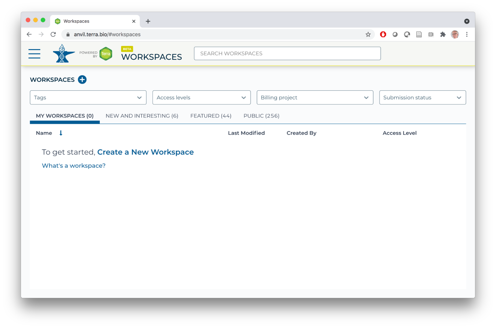
  </figure-styles>
- There are a number of workspaces available to everyone under the 'NEW AND INTERESTING, 'FEATURED'. and 'PUBLIC' tabs; feel free to explore these on your own.
- If you registered for the workshop with an email address known to AnVIL / Terra, you'll see the Bioconductor-Workshops-PopUp workspace under 'MY WORKSPACES'.
  <figure-styles shadowless=true>
  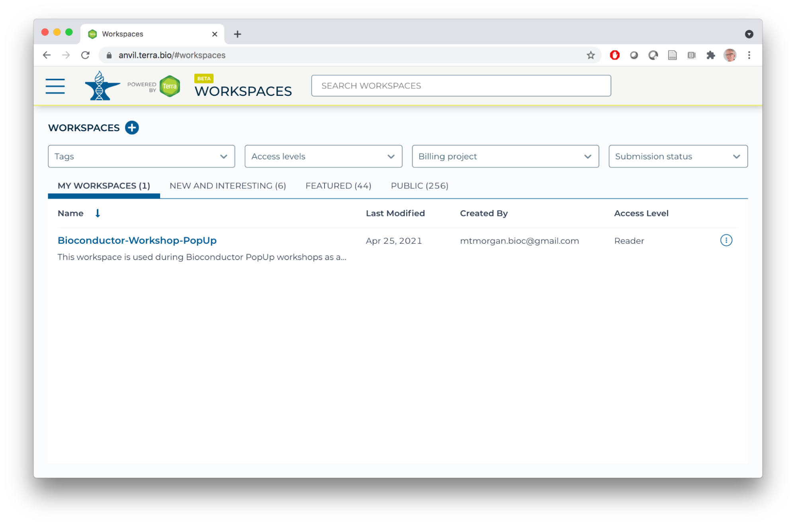
  </figure-styles>
- Enter the workspace by clicking on the [Bioconductor-Workshop-PopUp](https://anvil.terra.bio/#workspaces/deeppilots-bioconductor/Bioconductor-Workshop-PopUp) link. There are many components to the workspace; we'll cover many of these over the course of the PopUp workshops.
  <figure-styles shadowless=true>
  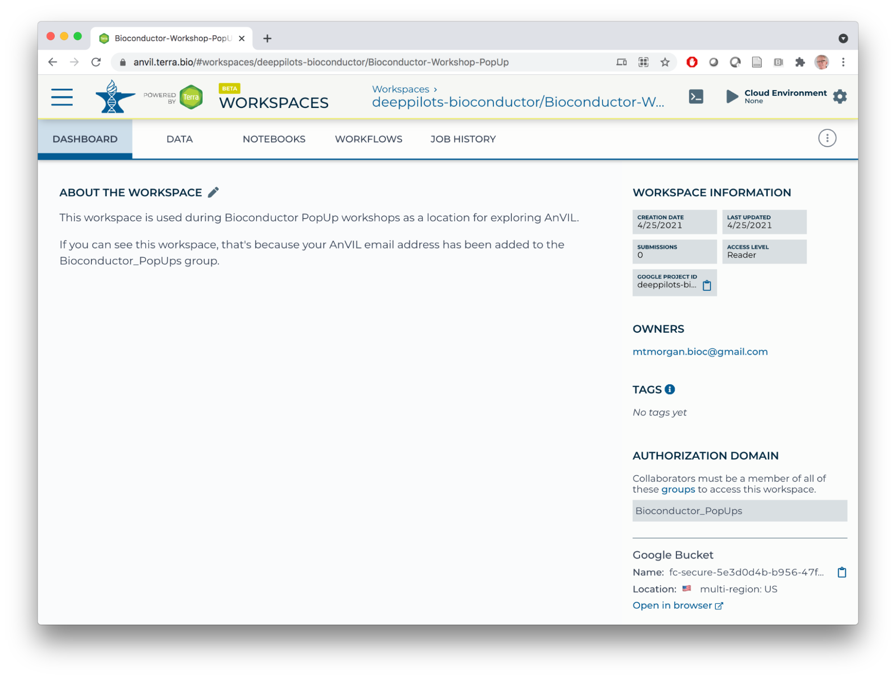
  </figure-styles>
- Start by making a *clone* so that we can perform computations on our own copy of the workspace. Do this by clicking on the TEARDROP (three vertical dots) in the top right of the page, and choose 'Clone'.
  <figure-styles shadowless=true>
  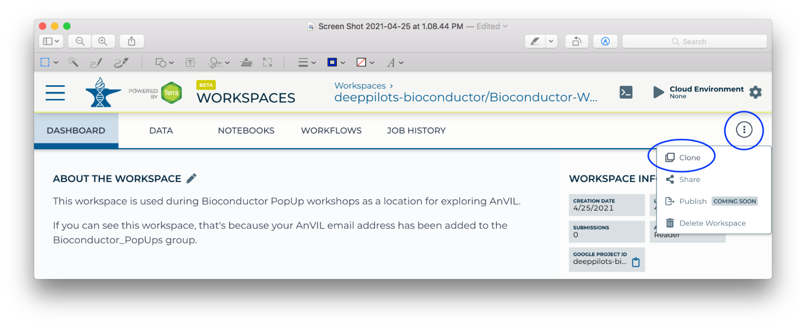
  </figure-styles>
- If you see something like the following, then customize the 'Workspace name' to a globally unique name. For instance, I changed `copy` to `-mtmorgan-popup`. It's convenient NOT to have spaces in a workspace name.
  <figure-styles width="400">
  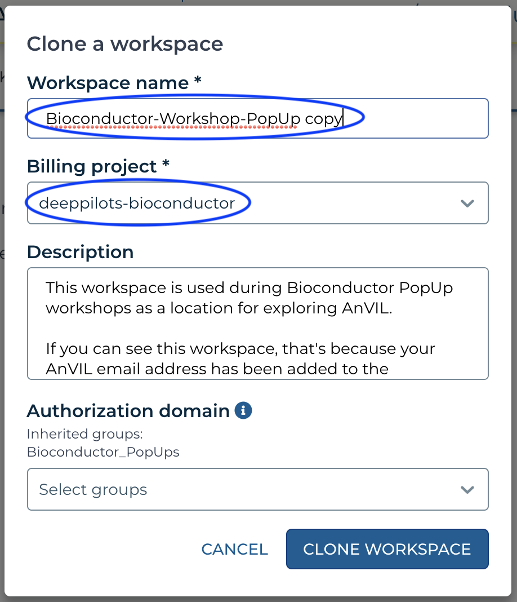
  </figure-styles>
  If instead, you see a 'Billing project' that is NOT deeppilots-bioconductor, or if you see something like
  <figure-styles width="400">
  
  </figure-styles>
  then contact the workshop organizer with your AnVIL email address to be added to the deeppilots-bioconductor billing project. See the [Frequently Asked Questions](#frequently-asked-questions), below, for more information on billing projects.
- Return, via the HAMBURGER menu or by clicking on the WORKSPACES element at the top of the page, to the list of WORKSPACES available to you. You'll see your own version of the workspace. Open it.
  <figure-styles shadowless=true>
  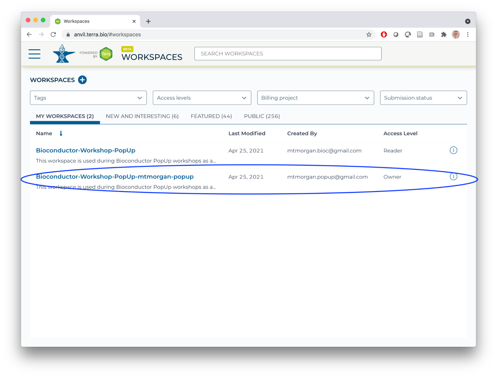
  </figure-styles>
- Congratulations, you now have your own workspace associated with a billing account that allows you to perform computations in the AnVIL cloud!

#### What you've accomplished

- Created Google and AnVIL accounts.
- Navigated workspaces.
- Cloning workspaces to allow your own development.
- Billing accounts to pay for the computation you'll perform.

### (R-based) Jupyter Notebook Cloud Environments

#### Creating a computing environment

- Navigate to the NOTEBOOKS tab of your workspace. Click on the RUN Cloud Environment icon.
  <figure-styles shadowless=true>
  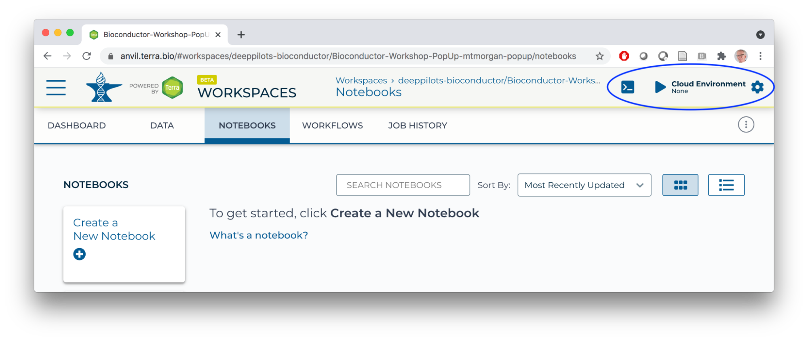
  </figure-styles>
- Create a Cloud Environment with a single CPU, modest memory, and a *persistent disk* to perform computation with.
  <figure-styles shadowless=true>
  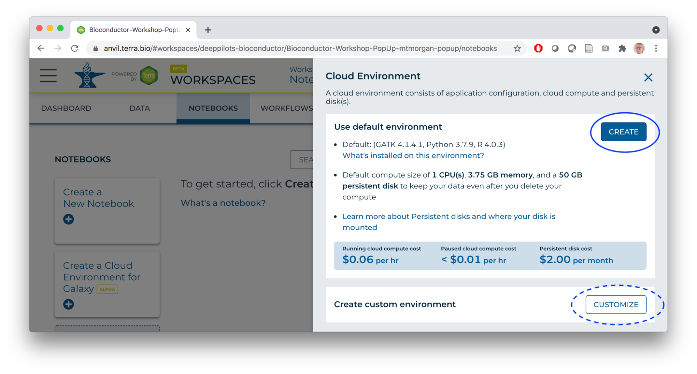
  </figure-styles>
- Compute environments can be customized, e.g., to 96 CPUs, 624 GB of memory, and very large disks (!). Of course this costs more…
  <figure-styles shadowless=true>
  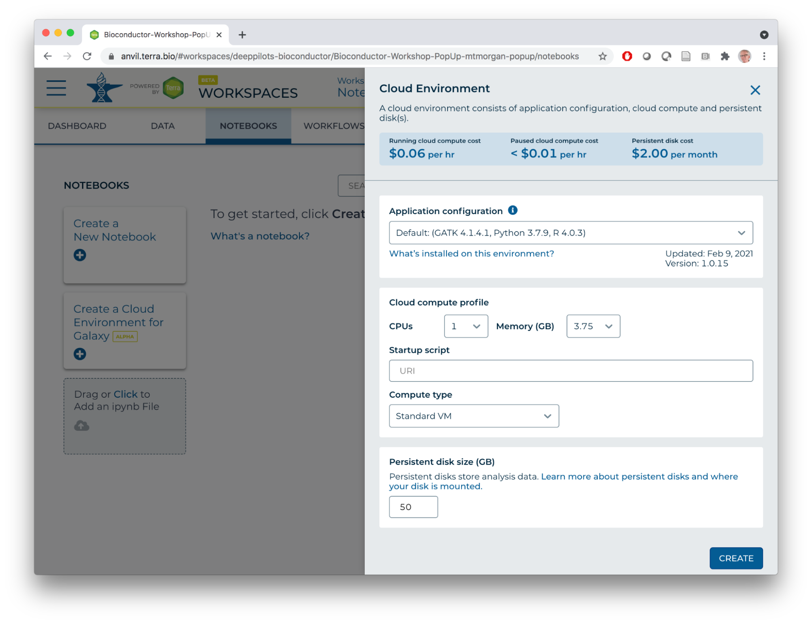
  </figure-styles>
- After pressing the CREATE button, note the Cloud Environment icon at the top right of the NOTEBOOKS tab. Initially, it indicates that the cloud environment is being created...
  <figure-styles width="400">
  
  </figure-styles>
  ...but after 1 or two minutes the necessary cloud resources have been obtained and are ready for your use.
  <figure-styles width="400">
  
  </figure-styles>
- The cloud environment can be stopped (clicking on the PAUSE icon) or reconfigured (clicking on the CONTROL icon) at any time.
- The cloud environment automatically stops after a period of reuse. The same environment can be restarted by again clicking on the RUN icon.

#### Creating and editing a notebook

- With the cloud environment running, click on the Create a New Notebook button, name the notebook and choose R (of course!) as the notebook language.
  <figure-styles shadowless=true>
  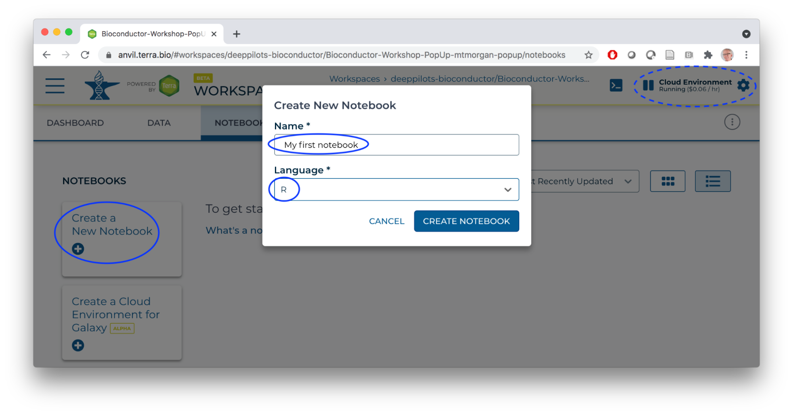
  </figure-styles>
- Use the TEARDROP beside the newly created notebook to open it in Edit mode.
  <figure-styles shadowless=true>
  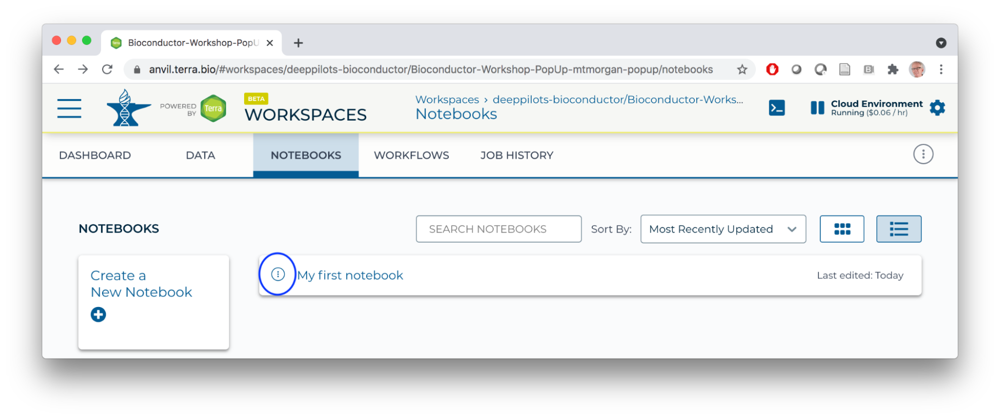
  </figure-styles>
- The Jupyter notebook interface is pictured below. Note the information icons to the top left, showing that we're using an R kernel and that the notebook is editable. We'll use the toolbar widgets to the right to edit the notebook, entering text into cells in the body of the notebook.
  <figure-styles shadowless=true>
  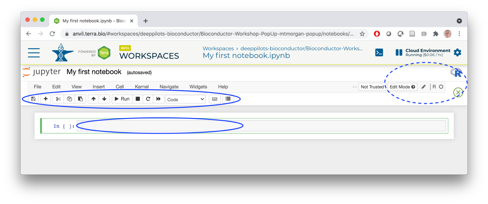
  </figure-styles>
- The notebook is automatically saved to a location on your persistent disk.
- Here I've entered a simple mathematical expression in the first cell and pressed the Run tool. This evaluated the expression and opened a new cell. I used the Cell tool to switch to Markdown and entered some text.
  <figure-styles shadowless=true>
  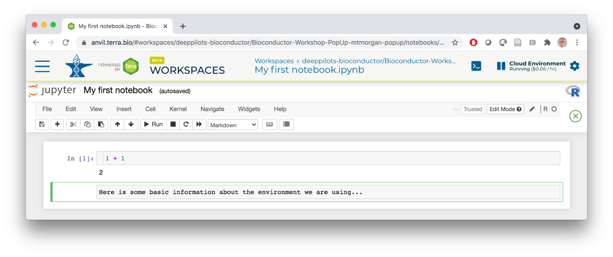
  </figure-styles>
- I pressed the Run tool again, entered some R commands, etc, to end up with the following notebook.
  <figure-styles shadowless=true>
  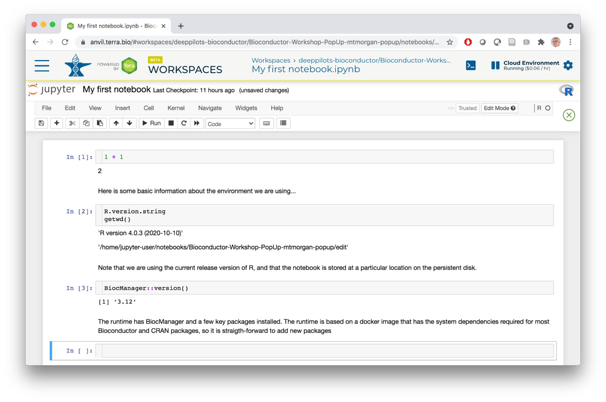
  </figure-styles>
- The notebook is based on a docker image, and the image follows the philosophy of 'bioconductor_docker'
  - The runtime has the system dependencies required to install almost all Bioconductor and CRAN packages, but the packages themselves may require installation.
  - BiocManager is installed, so one can validate the current installation with BiocManager::valid() and update packages (this will take some time…) with BiocManager::install(ask = FALSE).
- See [Terra's Jupyter Notebooks environment Part II: Key operations](https://support.terra.bio/hc/en-us/articles/360027083172-Terra-s-Jupyter-Notebooks-environment-Part-II-Key-operations) for additional material on using notebooks in Terra.

#### What we've accomplished

- Created a compute environment, with CPU, memory, and disk space tailored to our needs.
- Launched a Jupyter notebook within our workspace.
- Executed a few essential commands in the notebook.
- Learned a little about the runtime environment -- disk layout, R version, system software dependencies, package management.

### RStudio Cloud Environments

#### Creating an RStudio cloud environment

- Return to the workspace DASHBOARD and click on the Cloud Environment widget.
  <figure-styles shadowless=true>
  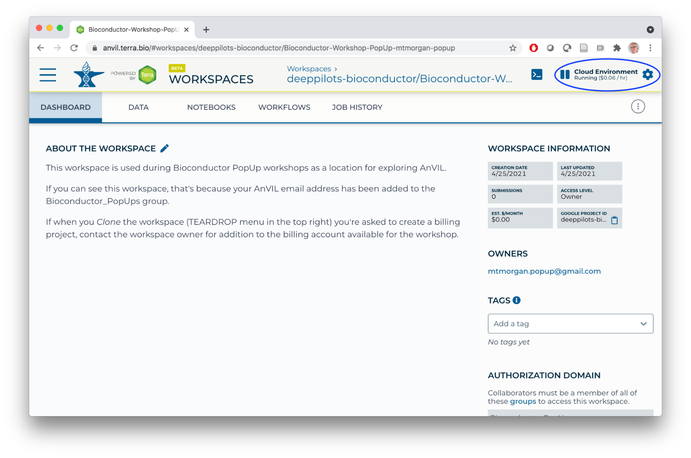
  </figure-styles>
- Select the RStudio custom environment and click NEXT.
  <figure-styles shadowless=true>
  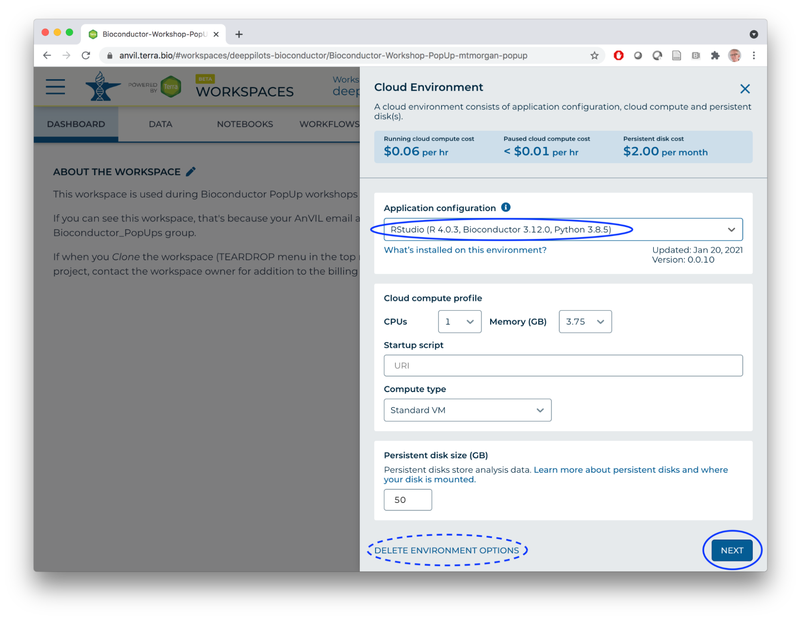
  </figure-styles>
- What's happening?
  - Jupyter runtime is being replaced by RStudio runtime.
  - Persistent disk (user home directories) remain across runtimes.

#### RStudio in AnVIL

- Launch RStudio.
  <figure-styles shadowless=true>
  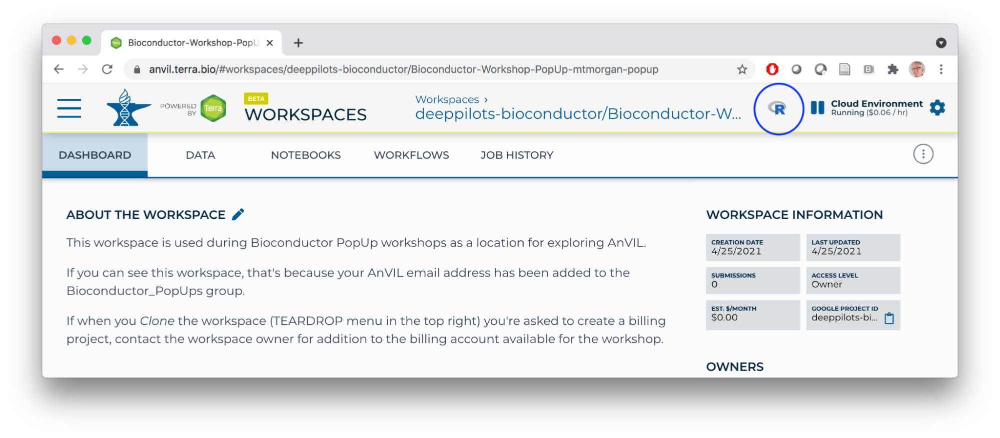
  </figure-styles>
- Our old friend...
  <figure-styles shadowless=true>
  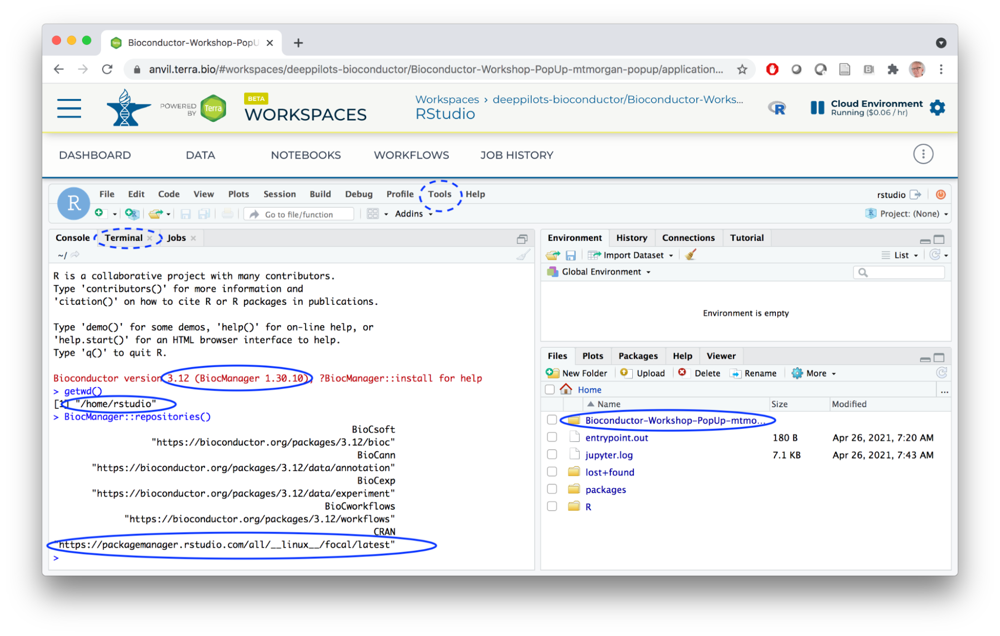
  </figure-styles>
- Persistent disk mounted at `/home/rstudio`.
- Notebooks from the Jupyter runtime under the workspace folder.
- BiocManager available
  - Fast binary installation of CRAN packages.
  - 'bioconductor_docker' philosophy: system requirements for most Bioconductor / CRAN packages already installed.
- Terminal access via the Tools menu.

## Summary

### What You've Accomplished

#### AnVIL Accounts and Workspaces

- Created Google and AnVIL accounts.
- Navigated workspaces.
- Cloning workspaces to allow your own development.
- Billing accounts to pay for the computation you'll perform.

#### Jupyter notebooks

- Created a compute environment, with CPU, memory, and disk space tailored to our needs.
- Launched a Jupyter notebook within our workspace.
- Executed a few essential commands in the notebook.
- Learned a little about the runtime environment -- disk layout, R version, system software dependencies, package management.

#### RStudio Cloud Environments

- Changed compute environment to use RStudio image.
- Launched RStudio to discover an old friend.
- 'Persistent disk'... persists from Jupyter session.
- Some perks, e.g., fast binary installation of CRAN packages.

### Next Steps

- Follow instructions at [Set up billing with $300 Google credits to explore Terra](https://support.terra.bio/hc/en-us/articles/360046295092) to enable billing for your own projects.

### Frequently Asked Questions

- AnVIL or Terra or ??? Terra is the name of the platform. AnVIL is a particular 'flavor' of Terra tailored to the needs of US National Human Genome Research Institute (NHGRI) users. Bioconductor is supported by NHGRI and participates in the development of AnVIL.
- What's a 'billing project?' You (or someone!) will be billed for the cost of computing while in AnVIL. During the workshop, we will pay the bills using resources from the DeepPilots program from the NHGRI.

You'll eventually need to establish your own billing projects, usually linked to an institutional account (or perhaps a personal credit card if you're just 'dabbling'). See [How to set up billing in Terra](https://support.terra.bio/hc/en-us/articles/360026182251-How-to-set-up-billing-in-Terra) (the information about free credits is out-of-date, unfortunately; see for instance the section [Set up billing in Terra from scratch - in three steps](https://support.terra.bio/hc/en-us/articles/360026182251-How-to-set-up-billing-in-Terra#h_6c933857-ed4d-4031-97cb-d29297ea6fb8)).

Although the cloud is infamous for costs that get completely out of control, our use of AnVIL will cost only a couple of dollars per participant over the course of the workshops.
- Can one add system dependencies to a runtime, e.g., libraries required for specific packages? [Using a startup script to launch a pre-configured Jupyter notebook](https://support.terra.bio/hc/en-us/articles/360058193872) discusses using a 'startup script' to customize the environment with, e.g., sudo commands.
- Sharing data between Jupyter notebooks & RStudio -- what is the structure of the persistent disk? The persistent disk is mounted at /home/jupyter-user/notebooks when using a Jupyter notebook runtime, but /home/rstudio under the RStudio environment. So in our workshop when I saved a file at /home/jupyter-user/mtcars.csv I was NOT saving the file to a location on the persistent disk -- switching from a Jupyter to RStudio and back to Jupyter runtime meant that the mtcars.csv file was lost. It would have persisted if I'd saved it as /home/jupyter-user/notebooks/mtcars.csv, and would have been visible in RStudio as /home/rstudio/mtcars.csv.
- Is it possible to use a custom docker image? Yes. [DataBiosphere/terra-docker](https://github.com/databiosphere/terra-docker#terra-base-images) contains suitable R / Jupyter base images; [anvilproject/anvil-docker](https://github.com/anvilproject/anvil-docker) contains RStudio images. Select the image as part of a 'Custom' Cloud Environment.
  <figure-styles shadowless=true>
  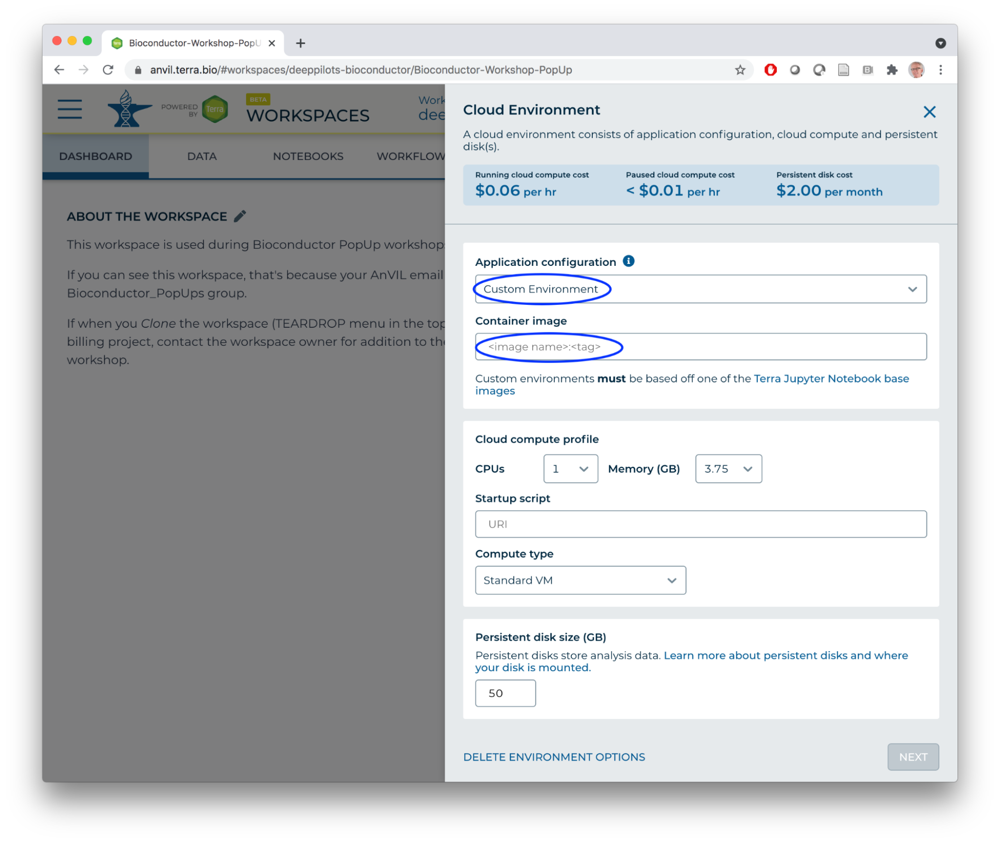
  </figure-styles>
