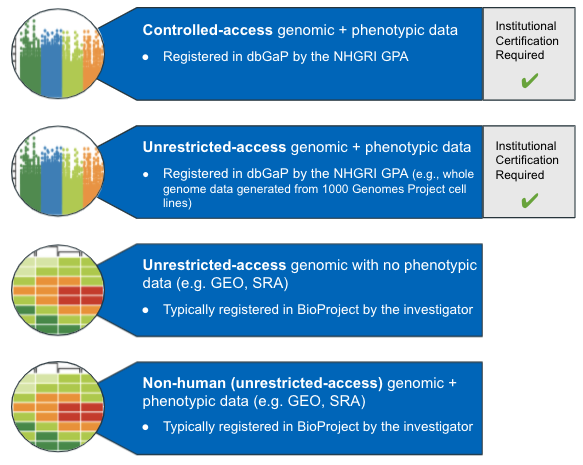

# Step 1 - Register Study/Obtain Approvals

<hero>

AnVIL strives to balance the goals of ensuring that data is as widely and freely available as possible while safeguarding the rights and privacy of subjects who participate in NIH-sponsored research.

This includes protecting the confidential and proprietary genomic and phenotypic data of individual human participants. See [NIH - Data Sharing Guidance](https://grants.nih.gov/grants/policy/data_sharing/data_sharing_guidance.htm).

</hero>

To deposit large-scale, individual-level data into AnVIL, data submitters must follow the steps below.

1. Register study
2. Obtain approval from the National Human Genome Research Institute (NHGRI) or appropriate Institutes and Centers (IC)
3. Obtain approval from the AnVIL ingestion committee

## 1.1. Register study

Before beginning, you will want to make sure your data are compatible with the AnVIL, and register your data with dbGaP or the appropriate [Genome Program Administrator](https://osp.od.nih.gov/genomic-program-administrators/#:~:text=Genomic%20Program%20Administrators%20(GPAs)%20are,for%20the%20NIH%20GDS%20Policy) (GPA).     

- You should register your **before starting** the other approval steps (1.2 and 1.3).
- **Where** you register your data and **who** will advise you of next steps depends on what kind of data you have and how your study is funded.

<figure>

<figure-caption>Where to register the various data types.</figure-caption>
</figure>

### Human study? Register with dbGaP

The exact steps to register your study depend on how your study is funded. See [this link](https://www.ncbi.nlm.nih.gov/projects/gap/cgi-bin/about.cgi) for more detail about dbGaP and how to register your study data.

#### NHGRI-funded researcher?

- Contact **NHGRI GPA Jennifer Strasburger** at [strasbuj@mail.nih.gov](mailto:strasbuj@mail.nih.gov)
- The GPA will lead you through the study registration process.
- For more information on NHGRI Genomic Data Sharing Policy see : [https://inside.genome.gov/20009049](https://inside.genome.gov/20009049). Note that this is an internal NIH document.

#### NIH-funded researcher?

- Contact your Institutes and Centers GPA (if you don't know your GPA, refer to [this list](https://osp.od.nih.gov/wp-content/uploads/IC_GPAs.pdf)) 
- - The GPA will lead you through the study registration process
- For more details, see the [NIH Genomic Data Sharing Policy for Extramural Investigators]( https://www.genome.gov/about-nhgri/Policies-Guidance/Genomic-Data-Sharing/NHGRI-Extramural-Investigators). 

#### Non-NIH-funded?

- Contact **NHGRI GPA Jennifer Strasburger** at [strasbuj@mail.nih.gov](mailto:strasbuj@mail.nih.gov)
- The GPA will lead you through the study registration process
- For more details, see the [NIH Genomic Data Sharing Policy for Extramural Investigators]( https://www.genome.gov/about-nhgri/Policies-Guidance/Genomic-Data-Sharing/NHGRI-Extramural-Investigators). 

### Non-human data? 

- Register with GEO

## 1.2. Obtain NHGRI Approval

### NIH/NHGRI Data Sharing Policy Compliance

Submitted data must be consistent with the requirements of the [NIH Genomic Data Sharing (GDS) Policy](https://www.genome.gov/about-nhgri/Policies-Guidance/Genomic-Data-Sharing).

### Working from an NIH grant?

If your grant explicitly states that grantees are expected to share data in the AnVIL, you have this covered by default. Submit a copy of your grant award and [NHGRI Extramural Genomic Data Sharing Plan and dbGaP Submission Information](https://www.genome.gov/sites/default/files/media/files/2021-01/ExtramuralNHGRI_DSP_post2021_revised012121.pdf) to your AnVIL contact.

### Other Funding Sources

For other work, including Parent Announcements where data deposition in a certain repository wasn’t described, PIs should do **one of** the following:

**Option 1**: Submit a copy of the [NHGRI Genomic Data Sharing Plan template](https://www.genome.gov/sites/default/files/media/files/2021-01/ExtramuralNHGRI_DSP_post2021_revised012121.pdf) - with AnVIL checked off at the bottom of the first page - to your AnVIL approval contact. You may have already filled out this doc, or you can fill out just for this purpose.

or

**Option 2**: Submit **both** of the following

1. Email (from PD) stating the AnVIL team has permission to store, index, and access data on the AnVIL and including a list of people designated to speak and make decisions on behalf of the institution **and**
2. An Institutional Certification, which must include: 
   - Confirmation that data conform to all applicable laws 
   - Limitations for sharing, based on the informed consent of the research participants
   - The NHGRI Genomic Program Administrator who currently registers the study 

The AnVIL team can provide an Institutional Certification template form. 

## 1.3. Obtain AnVIL Data Ingestion Committee Approval

The AnVIL data ingestion committee will evaluate ingestion applications to ensure data deposited into AnVIL meets the high quality of the [NIH Genomic Data Sharing (GDS) Policy](https://www.genome.gov/about-nhgri/Policies-Guidance/Genomic-Data-Sharing). The committee includes NHGRI program officers and AnVIL leadership team members.

When the AnVIL data ingestion committee approves datasets for ingestion, the applicant will receive an approval notice via email.

### Ethical Review

All scientific investigations should be undertaken with the highest priority given to the ethical requirements of such inquiries. AnVIL Program Directors and DIC will evaluate the ethical collection of both the data and of the submitting parties before approving for inclusion in the AnVIL.

### Data Retention

The committee will coordinate with the dataset stewards to determine a reasonable timeframe for retention of data within the AnVIL, as well as any other provisions around the long-term storage, archival, and availability of the data. This will happen during the initial discussions and vetting with the Data Ingestion Committee
