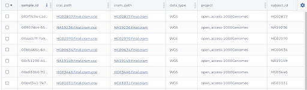
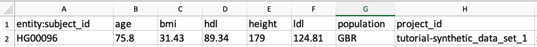

# Step 3 - Prepare for Submission

<hero>

AnVIL accepts two types of data: 1) genomic object files and 2) phenotypes and metadata.
Most studies are submitting both.
In this step, you will organize all required data and metadata in a format compatible with AnVIL.

Note that in addition to the data files, genomic object files require minimal metadata, some of which is generated by the AnVIL (i.e. full path to the files in AnVIL cloud storage).

</hero>

You will submit all metadata (including phenotypic data) in a spreadsheet-like file (TSV/TXT/CSV format). To prepare data for submission, you will

- Make sure all object files conform to AnVIL’s naming requirements
- Generate a TSV file for each table in the data model (from Step 2)

### Tables in an AnVIL Data Workspace

To learn how workspace tables help and organize data in the AnVIL, see [Managing Data with Workspace Tables](https://support.terra.bio/hc/en-us/articles/360025758392-Managing-data-with-workspace-tables-) (estimated read time 15 minutes).

If you prefer a video, you can watch this [“Introduction to data tables”](https://youtu.be/IeLywroCNNA) video on YouTube (5:25 min).

## Genomic Object Files

As part of the submission process, you may be providing AnVIL with genomic object files such as VCFs, CRAMs, BAMs, IDATs, or FASTQs. Before depositing the object files in a workspace bucket (Step 4), you will need to 1) make sure the object file names fit AnVIL requirements and 2) generate a TSV with object file metadata (i.e. `data_type` and `subject_id` in the figure below).

<figure>

<figure-caption>The **sample table** (screenshot above) organizes biospecimen information such as genomic data files associated with subjects in the subject table. Note the `subject_id` column that connects sample data to the subject. 
</figure-caption>
</figure>

### Unallowed Characters (object and TSV file names)

Your genomic object files may only contain numbers, letters, “:”, “-” and “_”. No special characters (&, $, %, #, etc.) are allowed in the file names.

### Data Indexing

Note that AnVIL will generate a global unique ID (GUID) for object files, such as sequencing data, and add to the TSV (i.e. `crai_path` and `cram_path` in the figure above) after you deposit the data files.

These identifiers allow researchers to access data across AnVIL tools, without creating additional copies or transferring across environments.

They facilitate the ability to interoperate with other data commons due to their extensibility. Further, they enable tracking of live data being processed in workflow pipelines, and data backup to cold storage.

### Functional Equivalence (FE)

To maximize the value of AnVIL-hosted data and minimize batch effects in cross-project analyses ([Regier et al., 2018](https://pubmed.ncbi.nlm.nih.gov/30279509/)), CCDG and TOPMed consortia have defined a functional equivalence (FE) standard for alignment and processing of whole-genome sequencing data (i.e. WGS). AnVIL strongly encourages the submission of FE-compliant genome and exome sequencing data aligned to GRChB38. (See the [CCDG pipeline standard](https://github.com/CCDG/Pipeline-Standardization/blob/master/PipelineStandard.md)).

FE is important for downstream joint calling across datasets but is difficult to prove. There is no easy way for AnVIL to validate or have the submitter prove that submitted data were aligned and mapped on a FE pipeline.

If you are unsure of whether or not your data is functionally equivalent, the AnVIL ingestion team may reach out to you to review your dataset prior to submission.

## 3.1 - Generate Table Load Files (TSV, CSV or TXT format)

Your spreadsheet can include an almost unlimited number of rows (individual entities) and columns (entity properties). A video walkthrough of generating a load file (TSV format) from a template is available below:

`video: https://youtu.be/7YyWptsdC-w`

### Unallowed Characters

Your spreadsheet may only contain numbers, letters, “:”, “-” and “_”. **No special characters (&, $, %, #, etc.) are allowed in any fields of the load file**.

### Required Formatting

The first column in the load file is the identifier key (ID field). The first column header corresponds to the node in the data model.

>First column headers must have the following format typed exactly as shown - note the `:` and `_` punctuation:

- **Subject table** - `entity:subject_id`
- **Sample table** - `entity:sample_id`
- **Sequencing table** - `entity:sequencing_id`
- **Family table** - `entity:family_id`

<figure>

<figure-caption>Example: Subject Table in a spreadsheet editor.</figure-caption>
</figure>

### Associating Data in Different Tables

>**Hint** - Where possible, try to include data in the `subject`, `sample`, or `sequencing` tables. If that’s not an option, the data can be submitted as separate tables. Any data beyond these minimal required tables must always be linked to either the `subject_id`, `sample_id`, `family_id`, or `sequencing_id` - depending on what the data element describes. For example, to link data in an additional table to a subject, make sure to include a `subject_id` column.

### Addressing Repeated Elements

Please bring any repeating data elements (i.e. multiple values for a given data element for an individual) to the attention of the AnVIL team to ensure proper modeling and submission.

Examples:

- An individual in a data set has a measurement (e.g., blood pressure, lab test, BMI) taken at multiple time points.
- An individual in a data set is affected by multiple disease/phenotype/conditions included in the study (e.g., an individual in a diabetes study has both diabetes and diabetes retinopathy; both are being tracked in the study).

## 3.2. - Save as "Tab-Delimited Text" or "Tab-Separated Values"

Your editor may give you a warning about losing data in this format, but we assure you, it's fine! Also, Terra will completely ignore the name you give the file. It's the root entity in the first column header (the part in front of the `_id`) that determines the table name in the workspace.

### TSV versus TXT File Extensions

Depending on what spreadsheet editor you use, when you save in the proper format your spreadsheet may have either a ".tsv" or a ".txt" extension. Terra will accept either one.
