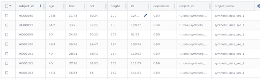

# Step 2 - Set Up a Data Model

After your dataset has been approved by the AnVIL data ingestion committee, you will need to set up and submit your data model, which describes the complete structure of the study data.

You can choose to start with one of two template data models and adjust to meet your needs. You’ll coordinate with the AnVIL data ingest team to facilitate this. If your dataset has been accepted by AnVIL and does not easily fit into an existing template, reach out to the AnVIL Team at <help@lists.anvilproject.org>.

You’ll end this step by completing an intake form to send the data model (in a data dictionary spreadsheet) and all the information the AnVIL team needs to set up your data workspace on the AnVIL.

## 2.1 -  First Steps

### Coordinate with the AnVIL Data Ingest Team
Email <anvil-data@broadinstitute.org> to arrange an AnVIL kickoff meeting to discuss your data, data model, and ingest timeline.

### Register for a Terra Account
AnVIL data are stored and organized in Terra data-oriented workspaces. You will need a Terra Account to upload data into AnVIL. If you do not already have an account on Terra, you will find step-by-step instructions to register at [Creating a Terra Account](/learn/account-setup/creating-a-terra-account).

>*While there are no charges for uploading and storing your data in AnVIL, in order to complete an analysis, you will need to connect a Google Billing Account to your Terra account. See [Overview of Billing Concepts](/learn/billing-setup/billing-concepts) and [Creating a Google Cloud Billing Account](/learn/billing-setup/creating-a-google-cloud-billing-account) for more information.*

## 2.2 - Create Your Data Model

Each node in the AnVIL Data Model (i.e. “Program” or “Subject” etc. in the graphical representation below) includes different types of data (called “properties”). Nodes are connected to each other by unique IDs.

<figure>

<figure-caption>An AnVIL data model.</figure-caption>
</figure>

Data submitters will submit data and metadata from the Biospecimen, Clinical, and Data File nodes in spreadsheet-like files that will be displayed in the data workspace as integrated tables. Each row is a distinct “entity” and each column is a different property (type of data).

#### Example Subject Table

<figure>

<figure-caption>The subject table contans a collection of basic information and phentotypic data about the study subjects (e.g., demographics, age, sex, or race.)</figure-caption>
</figure>

#### Example Sample Table

<figure>

<figure-caption>The sample table organizes biospecimen information such as genomic data files associated with subjects in the subject table. 
</figure-caption>
</figure>

### Data Model Requirements
Please read the descriptions below carefully, and reach out to your AnVIL team contact with any questions. These requirements below help ensure AnVIL datasets are not only useful to the researchers who created them but enable others to analyze data collectively across studies.

### Required Tables for All Studies (csv, tsv, txt, json format)
All studies must submit the following tables (scroll down for details and template tables):
- **Data dictionary table**: Specifies the entire Data Model. It includes (for each separate table in the data model) field names, field descriptions, field types,, enumeration values (where applicable), multi-value delimiter symbol used (where applicable)

- **Subject Table**: Includes required information about the subjects and (usually) associated phenotypic data. The subject_id (first column) is the key field for that table. This key is typically used in other tables to link additional data (i.e. genomic, sequencing, family) to the subject.
- **Sample Table**: Links the subject_ids to the sample_ids where the sample_id (fist column) is the key fields for that table
- **Sequencing Table**: Includes required information about and links to the sequence data associated with the sample_id where the filename is the key field for the table

### Example Additional Tables (CSV format)
- Family Table: Includes information about a particular family with the family_id (first column) as the key field  for the table. Data can include pedigrees or any other family-level information.
- Discovery Table: Includes information about variants of interest that are linked to the subject_id (must include a `subject_id` column)

### Template Data Models

To enable cross-study analysis within the AnVIL, data submitted for hosting by AnVIL should be consistent with data models already in AnVIL or in the process of being ingested into AnVIL when possible. To ensure this, we recommend you adopt or modify one of the Data Model templates below.
- [Rare Disease - CMG Data Model](https://docs.google.com/spreadsheets/d/1zVFyuclXJrThLELM0zGVXCEui8mIfyHLBjH_Mdx6uj8/edit?usp=sharing)

- [Common Disease - CCDG Data Model](https://docs.google.com/spreadsheets/d/1GxKPgtDGMQxi9kPgrk4ApaOCXdsDzMjISSrX7LLUW7I/edit#gid=1507031680)

#### Non-standard Data Models

>If your dataset has been accepted by AnVIL and has needs not described here, please reach out to the AnVIL Team at <help@lists.anvilproject.org>. You can work directly with the AnVIL Phenotype WG and Data Processing WG to integrate into one of these existing data models.

## 2.3 - Generate Your Data Dictionary

All AnVIL studies must submit a **Data Dictionary table** (spreadsheet file) that defines your complete data model. The Data Dictionary specifies the entire Data Model. It includes field names, field descriptions, field types, examples, enumeration values (where applicable), and multi-value delimiter symbols used (where applicable) for each table in the Data Model.

### General Formatting Requirements

Tot be compatible with indexing once in AnVIL, **special characters (i.e. “%” or “*”) cannot be used in any field or file name**. If your files contain special characters, they must all be removed/replaced before ingestion.

### Phenotypic Data Expectations
**Example subject table**

<figure>

<figure-caption>The subject table contans a collection of basic information and phentotypic data about the study subjects (e.g., demographics, age, sex, or race.)</figure-caption>
</figure>

Currently, data stored in a phenotypic (“subject”) table will fall into one of four categories. Requirements for each category are below.

- **Case/Control (or Case alone)** - Information around a particular disease or phenotype of interest for a selected cohort (Example: CMG, CCDG).

- **Electronic Health Record (EHR)** -  Data derived from EHR information (Example: eMERGE).

- **Survey** - Data collected from surveying study subjects (Example: CSER).

- **Family longitudinal** -  Data collected for multiple families for multiple generations (Example: AMISH).

>If your data does not fall into one of the above categories, please reach out to the AnVIL Team (help@lists.anvilproject.org).

### Required Phenotypic Data
To ensure cross-study functionality on AnVIL, dataset categories have the following requirements.
- 1 - Required
- 2 - Required if there are trios or other relationship data in the study.

Data Elements | Case or Case/Control | EHR | Survey |Family longitudinal
-- | -- | -- | -- | --
subject_id | 1 | 1 |1 | 1
sample_id | 1 | 1 | 1 | 1
project_id | 1 | 1 | 1 | 1
dbgap_project_id | 1 | 1 | 1 | 1
data_use_limitation | 1 | 1 | 1 | 1
sex | 1 | 1 | 1 | 1
condition | 1 | - | - | -
affected_status | 1 | - | - | -
family_id | 2 | - | 2 | 1
paternal_id | 2 | - | 2 | 1
maternal_id | 2 | - | 2 | 1
proband_relationship | 2 | - | 2 | -

### Ensuring Uniform Terminology

AnVIL includes a diverse set of studies and a wide range of collected phenotypic data. To maximize useful information for search and synthetic cohort creation, all phenotypic data:

- Must be clearly linked to a subject, and the subject must be clearly linked to other data (e.g., genome, exome, RNASeq, array, etc.).
- Must be composed (where possible) of structured values. Ideally, these values are concept codes from established ontologies including, but not limited to:
  - [NCIt](https://ncithesaurus.nci.nih.gov/ncitbrowser/) - A vocabulary for a diverse set of biological concepts (e.g., disease, phenotype, relationship, anatomy, etc.).
  - [SNOMED](https://www.snomed.org/) - A vocabulary focused on concepts related to clinical data (license required).
  - [UMLS Metathesaurus](https://www.nlm.nih.gov/research/umls/index.html) - Links concepts from multiple vocabularies and ontologies (license required, free to individuals in the USA, includes access to SNOMED).
  - [UBERON](https://www.ebi.ac.uk/ols/ontologies/uberon) - A vocabulary focused on anatomical structure.
  - [HPO](https://hpo.jax.org/app/) - An ontology focused on phenotypic abnormalities.
  - [OMIM](https://www.omim.org/) - An ontology for rare mendelian diseases.
  - [Orphanet](https://www.orpha.net/consor/cgi-bin/index.php) - An ontology for orphan drugs and rare diseases.
  - [ICD](https://icd.codes/) - An ontology for US billing codes.
  - [MeSH](https://meshb.nlm.nih.gov/search) - An ontology for biomedical and health-related information.
  - [RxNorm](https://mor.nlm.nih.gov/RxNav/) - Normalized names for clinical drugs and links to many of the drug vocabularies.

### Genomic Data Expectations
**Example sample table**
<figure>

<figure-caption>The sample table organizes biospecimen information such as genomic data files associated with subjects in the subject table. 
</figure-caption>
</figure>

### Access Restrictions

Known Data Use Limitations (DUL) need to be clearly defined by the data depositor. This is the list of requirements for gaining access and using the data. You will need to submit your protocols for gaining access at the time of ingest.

>Please contact your program officer and the NHGRI Genomic Program Administrator for assistance and/or questions about dbGaP registration and/or consent groups.

## 2.4 - Complete the AnVIL Data Submission Form

Once you have your data model and all information, you will be ready to complete the AnVIL Data Submission Form. The form gathers study information to create the deposit workspace. To complete the form, you will need all of the following information:

- Contact Name
- Sequencing Center
- Data cohorts (# dbGap registrations + # consent codes)
- Data Model files (the Data Dictionary spreadsheet)
- Cohort/Dataset name
- Study Name
- dbGaP registration ID (phsID)
- Consent groups
- Consent codes
- Types of data (i.e., genomic, phenotypic, etc.)
- Number of samples
- Submitter information (emails of all people who need access to the deposit workspace)

<button-link href="https://docs.google.com/forms/d/e/1FAIpQLSeXGjrMEJ3gCftvgcaSyd-yRGdRzHVZwcKw4xbT5FXNcyCXFA/viewform" target="_blank">Launch AnVIL Data Submission Form</button-link>

## Additional Resources

### Reading

- [Understanding entity types and the default entity types in the standard genomic model](https://support.terra.bio/hc/en-us/articles/360033913771-Understanding-entity-types-and-the-standard-genomic-data-model) (estimated time 10 minutes).

- [Formatting requirements for data tables and template upload files](https://support.terra.bio/hc/en-us/articles/360059242671-Adding-data-to-a-workspace-with-a-template).

### Videos

- [Introduction to Data Tables in Terra](https://youtu.be/IeLywroCNNA) (5 minutes)

### Hands-on tutorial
For hands-on practice with a data model and data tables in Terra, please go through parts 1 and 2 of the Terra [Data Tables QuickStart](https://app.terra.bio/#workspaces/fc-product-demo/Terra-Data-Tables-Quickstart) tutorial (estimated time 30-40 minutes). 

