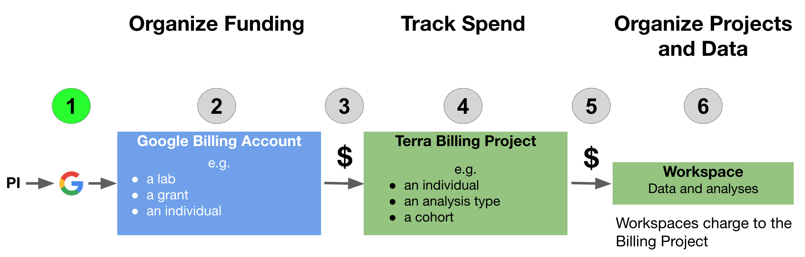

# Step 1: Create a Google Account

## Before you start

- You will need a **credit card or bank account** to activate your free trial and get started.  Don't worry! **You won't be billed until you explicitly turn on automatic billing**, but payment information is needed for verification purposes.
- Before setting up billing yourself, you may want to check with your institutional procurement office and see if they have a preferred account set-up method with Google (such as a third party reseller or an existing account).
- To add lab members, you will need to know the Google account they will use to access Terra.  You can complete most setup steps without this information and then add them once you know the correct accounts.

## Create Google Account

Terra operates on Google Cloud Platform, so you will need a (free) Google account which will allow you to:
- Access the Terra platform to manage team members, data, and analyses
- Access Google Cloud Platform to manage billing
- Receive alerts when spending reaches specified thresholds

If you do not already have a Google account that you would like to use for accessing Terra, [create one now](https://accounts.google.com/SignUp).

If you would like to create a Google account that is associated with your non-Gmail, institutional email address, follow [these instructions](https://support.terra.bio/hc/en-us/articles/360029186611).
