# Getting started with Gen3

## Discovering Data on AnVIL Using Gen3

### Introduction to Gen3

Gen3 is a data platform for building data commons and data ecosystems. The Gen3 platform consists of open-source software that supports data ecosystems by enabling the interoperation and creation of cloud-based data resources. A selection of Gen3-hosted Data Commons can be found [here](https://gen3.org/powered-by-gen3/).
More information, including a detailed User Guide on how to work with a Gen3 Data Commons, can be found below and by visiting [Gen3.org](https://gen3.org/).

### Types of Data hosted on AnVIL Gen3

The [AnVIL](https://anvilproject.org/learn/anvil-mooc/what-is-anvil) by Gen3 currently hosts datasets and cohorts from the following projects and networks:
- Open-access 1000 Genomes project
- Center for Common Disease Genomics (CCDG)
- Center for Mendelian Genomics (CMG)
- Genotype-Tissue Expression (GTEx v8) Program
- Open-access tutorial dataset

Datasets can consist of phenotypic, genomic, and/or clinical data.

Learn more about the datasets [here](https://anvilproject.org/data).

## Login to the AnVIL Gen3 platform

### Homepage

In order to navigate and access data available on the Gen3 platform, please start by visiting the [login page](https://gen3.theanvil.io/login). You will need an eRA Commons account as well as access permissions through the [Database of Genotypes and Phenotypes (dbGaP)](https://www.ncbi.nlm.nih.gov/gap/). If you are a researcher, login using your [eRA Commons account](https://public.era.nih.gov/commons/public/login.do), via the “Login from NIH” option. AnVIL Gen3 consortia developers can login using their Google accounts. Please make sure to use the correct login method.

<figure>
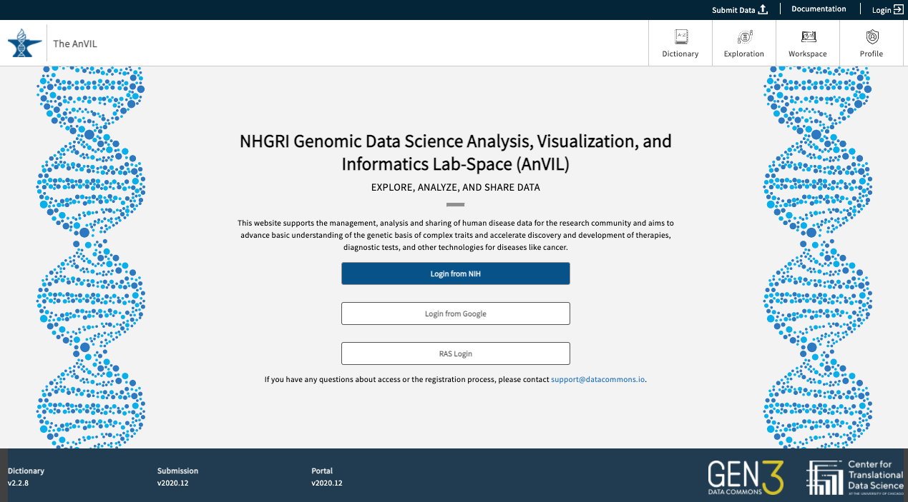
<figure-caption>Login page for the AnVIL Gen3 portal.</figure-caption>
</figure>

Once logged in, your username will appear in the upper right-hand corner of the page. You will also see a display with aggregate statistics for the total number of subjects, samples, and files available within the AnVIL Gen3 platform.

<figure>
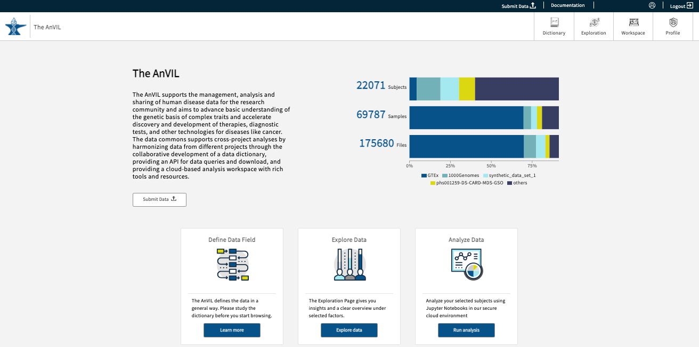
<figure-caption>Post-login view of the AnVIL Gen3 front page.</figure-caption>
</figure>

### Helpful Account-related documentation and resources

1. [Account Setup on AnVIL](https://anvilproject.org/learn#account-setup)
1. [Creating or editing an eRA account](https://era.nih.gov/register-accounts/create-and-edit-an-account.htm)
1. [Creating a dbGaP account](https://dbgap.ncbi.nlm.nih.gov/aa/wga.cgi?page=login)
1. [Setting up a Google account with a non-Google email](https://support.terra.bio/hc/en-us/articles/360029186611-Setting-up-a-Google-account-with-a-non-Google-email)
1. [Linking Gen3 and AnVIL on Terra](https://support.terra.bio/hc/en-us/articles/360050390451-Linking-Gen3-and-AnVIL-on-Terra)
1. [Linking controlled-access authorization (external servers)](https://support.terra.bio/hc/en-us/articles/360038086332)
1. [Requesting Data Access on AnVIL](https://anvilproject.org/learn/accessing-data/requesting-data-access)

### How to check your data access on AnVIL Gen3

To check your user access information, go to the website (<https://gen3.theanvil.io/login>) and click on “Login from NIH”. In the “Exploration Page,” you will be presented with a “Data Access” feature at the top left-hand corner. By selecting any of the 3 available options (Data with Access, Data without Access, and All Data), users will be able to view the list of authorized projects for your specific account. Data with Access will display all authorized projects under a user’s account. Data without Access displays projects without access, though summary statistics can still be viewed. All Data displays all projects regardless of user access. Read more about the Gen3 Explorer in this [section](#data-exploration).

Users can request access to data by visiting the dbGaP homepage. Read more information on Data Access here and in this [section](#data-exploration) in the Documentation.

<figure>
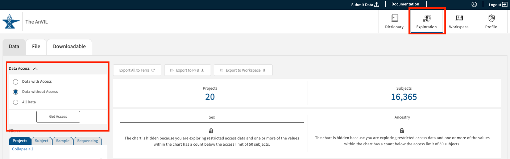
<figure-caption>Screenshot of checking what data you have access to in Gen3.</figure-caption>
</figure>

### Profile page - API keys and Project Access

The profile page can be accessed from the top right-hand corner of the page and contains two primary sections: API keys and Project access.

#### API Keys

If users want to download data files, an **API key** will be required in order to use the [gen3-client](https://gen3.org/resources/user/gen3-client/), which is the Gen3 tool to download data files.

<figure>
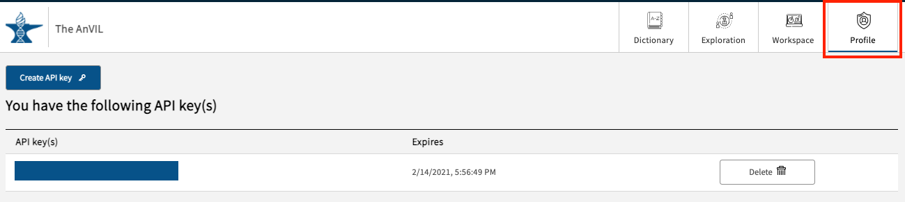
<figure-caption>Profile page with an active API key.</figure-caption>
</figure>

To create a key on your local machine, click the “Create API key” button which will activate the following pop-up window:

<figure>
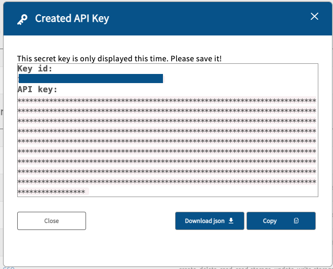
<figure-caption>API key creation pop-up window.</figure-caption>
</figure>

Click the “Download json” button to save the credential file to the local machine. After completion, a new entry will appear in the API key(s) section of the Profile page. It will display the API key key_id and the expiration date. The user should delete the key after it has expired. If for any reason a user feels that their API key has been compromised, the key should be deleted before subsequently creating a new one.\
**Caution: The key expires after one month after the key creation!**

#### Project Access

Users can find project access information under “You have access to the following resource(s)”.

If you are not seeing access to a specific study, please check that you have been granted access within [dbGaP](https://www.ncbi.nlm.nih.gov/gap/) first. If access has been granted for over a week, please contact the AnVIL Help Desk: <help@lists.anvilproject.org>.

<figure>
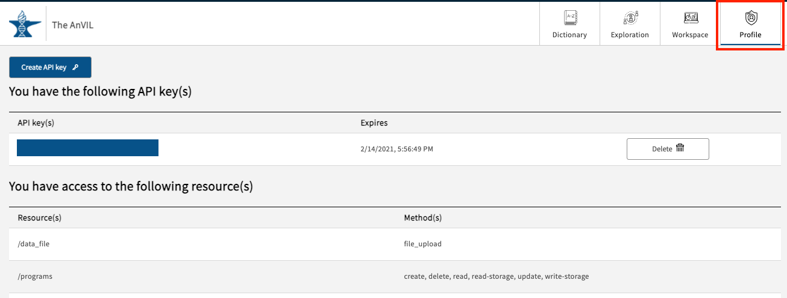
<figure-caption>Profile page with an active key and access to projects.</figure-caption>
</figure>

## Data Exploration

[The Exploration Page](https://gen3.theanvil.io/explorer) providers users with a venue to easily search through data and create cohorts via faceted search fields. By leveraging the different faceted search categories, users can not only create virtual cohorts within individual studies, but also across any of the available studies (with proper user authorization).

As noted in the section [Login to the AnVIL Gen3 platform](#login-to-the-anvil-gen3-platform), users can leverage the **Data Access** panel at the top left-hand corner of the Exploration page in order to view studies they do or do not have access to. Each of the selections is explained in detail below.

<figure>
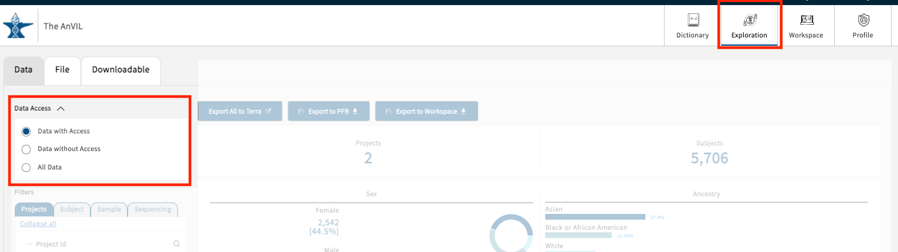
<figure-caption>Data Access panel on the Exploration page. By default, all users are assigned to Data with Access.</figure-caption>
</figure>

### Tiered Access

#### Data with Access

A user can view all of the summary data and associated study information they have access to, including but not limited to Project ID, file types, and clinical variables. For tutorial purposes, the Gen3 AnVIL portal has two projects available: `open_access-1000Genomes` and `tutorial-synthetic_data_set_1`.

<figure>
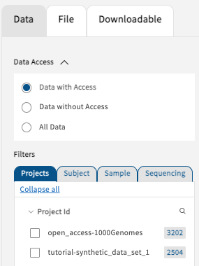
<figure-caption>“Data with Access” displays all user-authorized studies.</figure-caption>
</figure>

#### Data without Access

The “Data without Access” selection will display all of the studies that are currently not accessible by the user. Each of the studies will display a lock symbol next to the Project ID to indicate that subject-level access has not been granted. However, a minimal set of summary statistics will still be available to aid users with their search and exploration.

<figure>
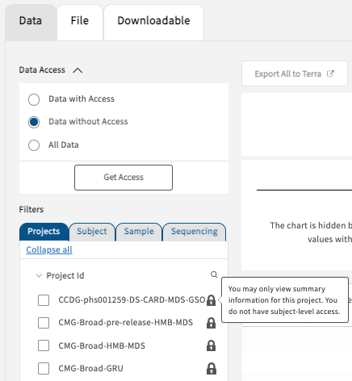
<figure-caption>Users may only view summary information for projects without access.</figure-caption>
</figure>

Projects will also be hidden if the select cohort contains fewer than 50 subjects (50 ↓, "You may only view summary information for this project. You do not have subject-level access", example below); grayed out boxes and locks will both appear.

<figure>
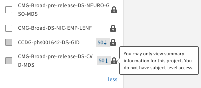
<figure-caption>The grey box containing a downward-facing arrow and the number 50 indicates that the selected virtual cohort contains a subject count below 50. This symbol will be displayed only for studies that are not yet accessible by the user.</figure-caption>
</figure>

Users can request access by clicking on the “Get Access” button, visiting the [dbGaP homepage](https://dbgap.ncbi.nlm.nih.gov/), or following instructions reported [here](https://anvilproject.org/learn/accessing-data/requesting-data-access).

#### “All Data” Access

Selecting the “All Data” option will display all data available on the AnVIL Gen3 data commons independent of user access. Studies not available to a user will be shown locked as demonstrated below.

<figure>

<figure-caption>“All Data” in the Exploration page displays all studies hosted in Gen3 AnVIL. Locks appear when users do not have access to the shown studies.</figure-caption>
</figure>

### The Data Tab

#### Create artificial cohorts

<figure>
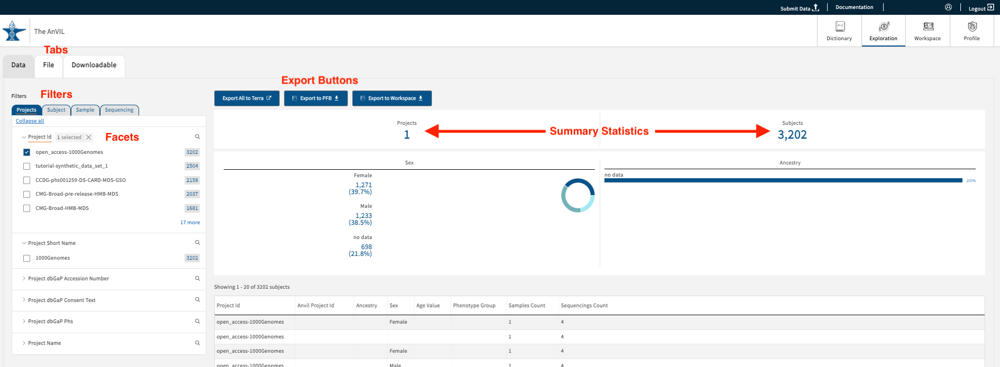
<figure-caption>Exploration page viewed as a user with “Data Access”. The Data Tab on the Exploration page hosts AnVIL-custom tabs, filters, export buttons, and summary statistics.</figure-caption>
</figure>

Under the “Data” Tab, users can leverage the AnVIL data model, designed by the AnVIL Phenotype WG and Data Processing WG, to create virtual cohorts. The selection of search facets will dynamically update the filtered options displayed on the page. If no facets have been selected, all of the data accessible to the user will be displayed. At this time, users can filter based on four categories of clinical information:

<figure>
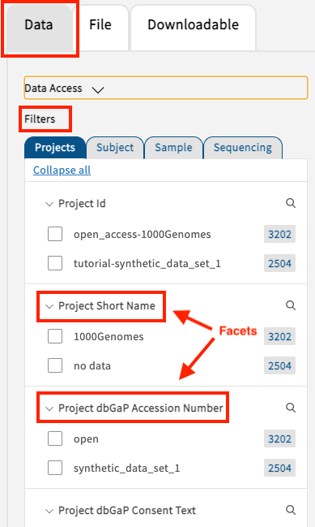
<figure-caption>Users can leverage 4 different filter categories under the Data tab (“Projects”, “Subject”, etc.) each with their own set of search facets. Caution: Multiple facets and filters can be selected anywhere under the Data Tab, but they cannot be combined with facets from the File Tab.</figure-caption>
</figure>

- **Projects**: Any specifically defined piece of work that is undertaken or attempted to meet a single investigative question of requirement. Users can create cohorts by selecting for instance the project name or dbGaP Phs.
- **Subject**: The collection of all data related to a specific subject in the context of a specific experiment. Users can create subject-level cohorts, for example by selecting ancestry, age, sex, or phenotype group.
- **Sample**: All collected information related to the sample such as sample provider, sample type, or tissue type.
- **Sequencing**: Cohorts can be selected based on, but not limited to, exome capture platform, reference genome build, or data processing pipeline.

#### Free Text Search for Submitter IDs

The Data Tab contains a text-based search function for Subject IDs. Under the search bar, users are also presented with a list of suggestions while typing. By clicking on a displayed entry, users can build their virtual cohorts and export data accordingly. The selections can be clicked again from the selected created cohort.

<figure>
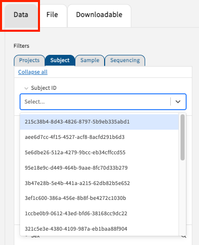
<figure-caption>Full text search for the Subject IDs is available on the Data tab.</figure-caption>
</figure>

### The Files Tab

<figure>
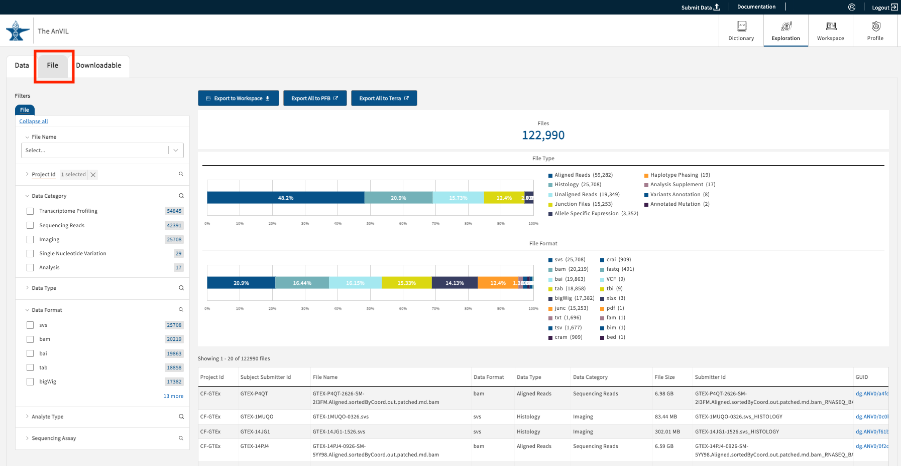
<figure-caption>The Files tab on the Exploration page shows data files on the Gen3 AnVIL commons. The Files Tab can be used to create custom cohorts and export them to Terra.</figure-caption>
</figure>

The Files tab displays study files from the facets chosen on the left-side panel (“Project ID”, “Data Category”, “Data Type”, etc.). Unlike the subject-centric organization of the Data tab, the Files tab allows users to group search results and filters at the file level. A list of the selected files will be displayed in the table at the bottom right-hand corner of the page. The list will dynamically update based on your search filters.

#### Free Text Search for File Names

The Files Tab contains a text-based search function for File Names that will initiate a list of suggestions below the search bar. Click on a single _or_ on multiple suggestions in the list appearing underneath the search bar to create a cohort and export the data. The selections can be clicked again in order to remove them from the cohort.

<figure>
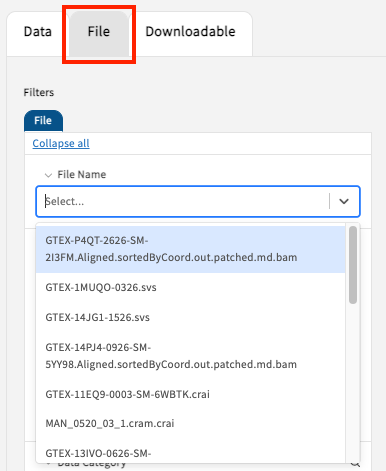
<figure-caption>Full text search available on the File (tab) for File Names.</figure-caption>
</figure>

Each time a facet selection is made, the data summary and displays will update to reflect the applied filters. Once a cohort of data files is created, the user has the identical choices to export as shown for the Data Tab such as “Export to Terra”:

- **Export All to Terra**: initiates a Portable Format for Bioinformatics (PFB) file export of all clinical data and file GUIDs for the selected cohort to Terra. When the export is complete, users will be redirected to the Terra website, where users will be asked to select a new/existing workspace. From here, the user is advised to look at [Terra Documentation](https://support.terra.bio/hc/en-us/articles/360038087312-Understanding-and-using-Gen3-data-in-Terra).

### Downloadable Data Tab and GTEx v8

<figure>
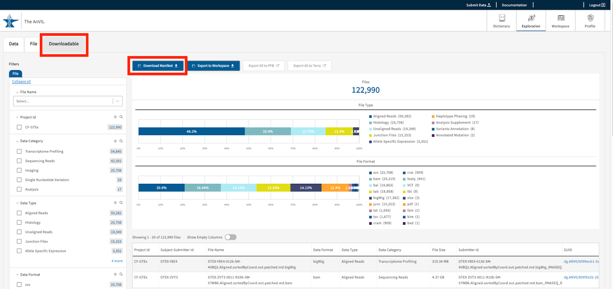
<figure-caption>The Downloadable Tab shows object files and phenotypic data of the GTEx v8 project. Here, custom cohorts can be equally created and downloaded to the local environment.</figure-caption>
</figure>

The Downloadable Tab provides users with the tools needed to download data locally. Only the studies available for download will be displayed in this section of the Gen3 Exploration page. Currently, the GTEx v8 project data is available for free egress downloads [GTEx v8](https://gtexportal.org/home/). Users can create cohorts using search facets including but not limited to “Data Format,” “Data Type”, and “Data Category.”

The GTEx files on AnVIL are divided into object files and phenotype data. Users can download phenotypic data as a PFB file and object files using a JSON file manifest, where the latter will require additional download steps using the [Gen3-Client](https://gen3.org/resources/user/gen3-client/). For a detailed description for downloading either phenotypic data or object files, refer to the links below:

1. [Phenotypic Data Download](https://anvilproject.org/learn/reference/gtex-v8-free-egress-instructions#downloading-gtex-v8-phenotypic-data)
1. [Object Files Download](https://anvilproject.org/learn/reference/gtex-v8-free-egress-instructions#downloading-gtex-v8-object-files)

### Export Data to Terra, PFB, and Workspaces

After a cohort has been selected, the users have three different options for exporting the data.

<figure>
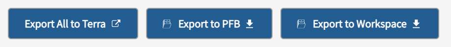
<figure-caption>Three options for exporting the data.</figure-caption>
</figure>

- **Export All to Terra**: initiates a Portable Format for Bioinformatics (PFB)* file export of all clinical data and file GUIDs for the selected cohort to Terra. When the export is complete, users will be redirected to the Terra website, where users will be asked to select a new/existing workspace. From here, the user is advised to look at [Terra Documentation](https://support.terra.bio/hc/en-us/articles/360038087312-Understanding-and-using-Gen3-data-in-Terra).
- **Export to PFB**: initiates a PFB file export of selected clinical data and file GUIDs, which can be downloaded and opened with another program (e.g. Firefox) or converted to a TSV file using [PyPFB](https://github.com/uc-cdis/pypfb).
- **Export to Workspace**: exports a manifest to the user’s workspace and makes the case-associated data files available in the workspace under the `/pd/data` directory.

***Note**: The Portable Format for Bioinformatics (PFB) is an Avro-based file that bundles schema, data, ontologies/controlled vocabularies, and pointers to data files in a single, serializable format that can be sent easily across systems and has the flexibility for different data models. PFB export times can take up to 60 minutes, but often will complete in less than 10 minutes.

The AnVIL provides a secure cloud environment for the analysis of large genomic and related datasets. For this purpose, Terra provides capabilities for large scale batch processing and interactive analysis over thousands of samples and Gen3 stores data on secured Requester Pays AWS buckets.
Therefore, available for download to a local environment is currently only the [GTEx v8](https://gtexportal.org/home/) free egress Phenotypic Dataset under the “Downloadable” Tab. For more information see [here](https://anvilproject.org/learn/reference/gtex-v8-free-egress-instructions).

## Understanding the Gen3 data model

Gen3-powered Data Commons employ a data model which describes, organizes, and establishes relationships for data across different datasets. The data model organizes and connects different categories, _nodes_, with experimental metadata variables, “_properties_”. The data dictionary describes all nodes and enlisting properties in each node.

On the AnVIL, the [dictionary page](https://gen3.theanvil.io/DD) contains an interactive representation of the Gen3 data model in two forms, “graph model” and “table view”, which is described below. Note: the Gen3 Data Dictionary encompasses **all study metadata** displayed in the Gen3 AnVIL portal. Not all studies will contain data associated with the different nodes and properties available.

### Table View

The table view displays all nodes and their short descriptions as a list of entries grouped by their node category.

<figure>
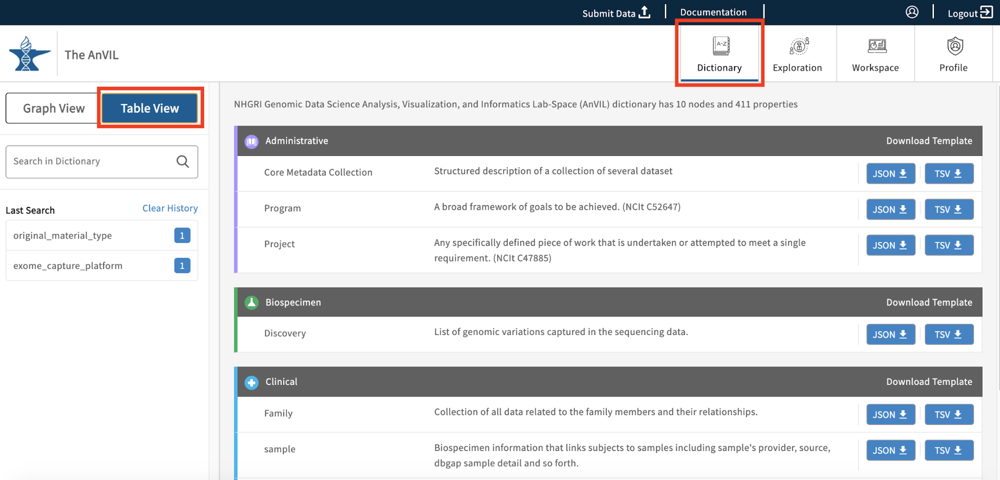
<figure-caption>The Table View of the Gen3 Data Dictionary lists all nodes, short descriptions, and available download templates (“JSON”, “TSV”) sorted by category (“Administrative”, “Clinical”, etc.). Clicking on one of the nodes will open the Properties view of the node. </figure-caption>
</figure>

### Graph View

The graph model view, as seen below, displays all of the nodes and relationships between nodes in a hierarchical view. The model further specifies the node types and links between nodes, as highlighted in the legend (top right-hand side of the Data Dictionary page).

<figure>
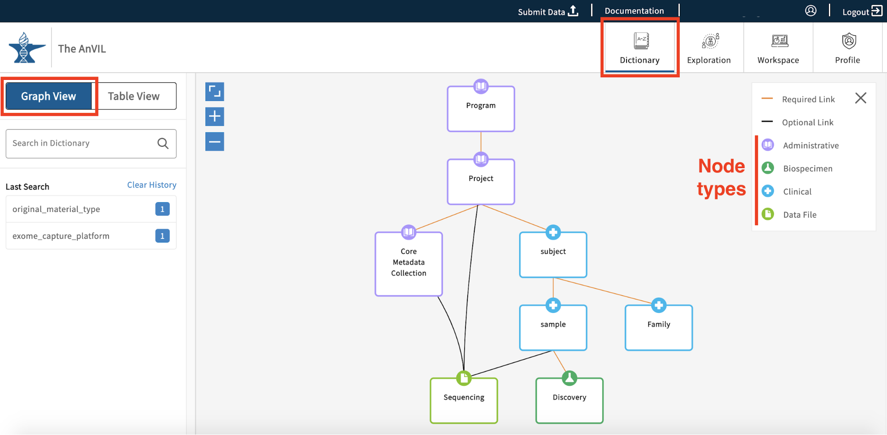
<figure-caption>The interactive Gen3 Data Dictionary in graph view showing nodes in their hierarchical structure.</figure-caption>
</figure>

Users can click on any of the graph nodes in order to learn more about their respective properties. By clicking on a node, the graph will highlight that specific node and all associated links or edges that connect it to the Program node. A "Data Model Structure" list will also appear on the left side toolbar. This will display the node path required to reach the selected node from the Program node.

<figure>
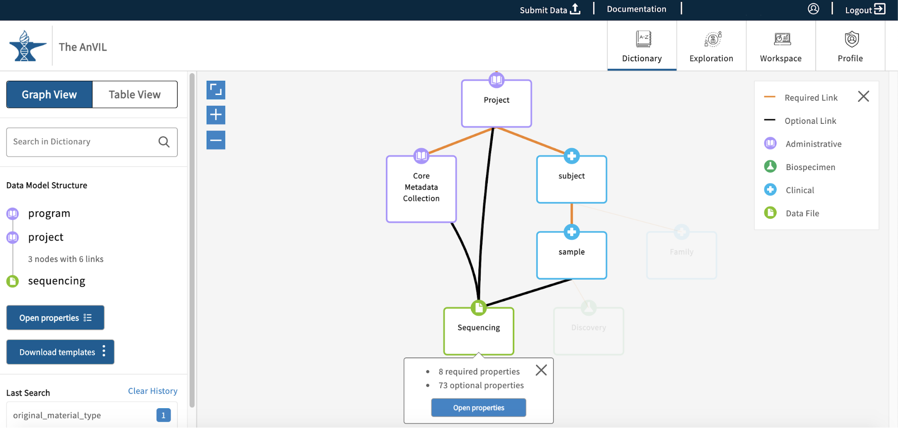
<figure-caption>An example of a node (“sequencing”) being selected in the interactive graph view. A pop-up window will display the number of required and optional properties belonging to the node. Click on “Open properties” to explore.</figure-caption>
</figure>

If additional nodes along the path are selected, other possible paths will be greyed out. The "Data Model Structure" list on the left side toolbar will also update accordingly.

<figure>
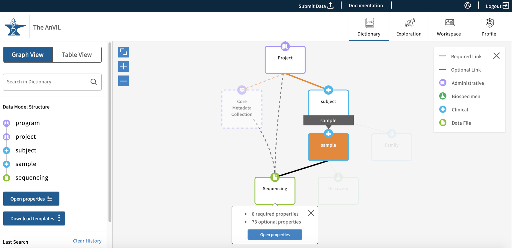
<figure-caption>An example of a second node (“sample”) being selected in the path of the first selected node (“sequencing”).</figure-caption>
</figure>

The left-side toolbar has two options available - “Open properties” and “Download templates”. The Download templates option will download the submission files for all nodes in the "Data Model Structure" list. The Open properties option will open the node properties in a new pop-up window. The Open properties button can also be found on the node that was first selected.

<figure>
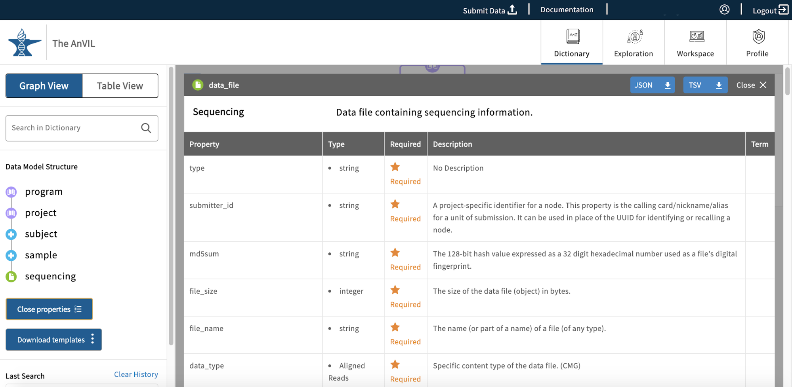
<figure-caption>The node's property window after clicking on “Open properties”. Users can download the template as a TSV or JSON file (light blue button in the top-right corner), and also close the properties (“Close properties”, left side panel).</figure-caption>
</figure>

This property view will display all properties in the node and information about each property:

- **Property**: Name of the property.
- **Type**: The type of input for the node. Examples of this are string, integer, Boolean and enumerated values (enum), which are displayed as preset strings.
- **Required**: This field will display an asterisk if the property is required for the submission of the node into the data model.
- **Description**: This field will display further information about the property.
- **Term**: This field can be populated with external resources that have further information about the property

### Dictionary Search

The Dictionary contains a text-based search function that will search through property names and descriptions. The function supports auto-complete in order to best help users identify and recognize desired search terms.

<figure>
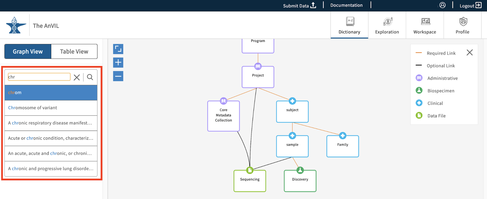
<figure-caption>Auto-complete helps users search through the graph more effectively.</figure-caption>
</figure>

Once a search term is entered, the Dictionary view will update dynamically and highlight the node(s) that contain the search term. Frames around the node boxes indicate whether the searched word was identified in the name of the node (full line) or in the node's description and properties' names/descriptions (dashed line).

<figure>
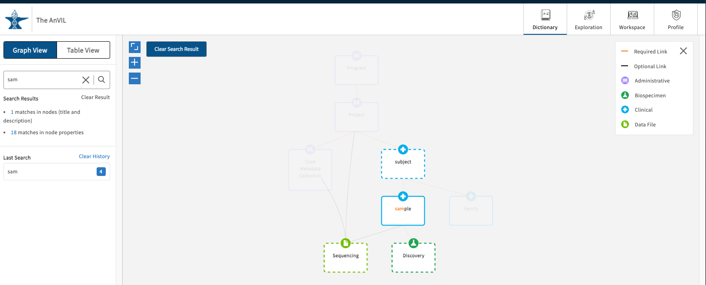
<figure-caption>Search results for "sam" in the Graph View.</figure-caption>
</figure>

By clicking on one of the highlighted nodes, the search term will be highlighted either in the property name or property description sections. From here you can also download a template for uploading a file or that particular node type (light blue buttons). The file can be downloaded as a JSON or TSV file.

<figure>
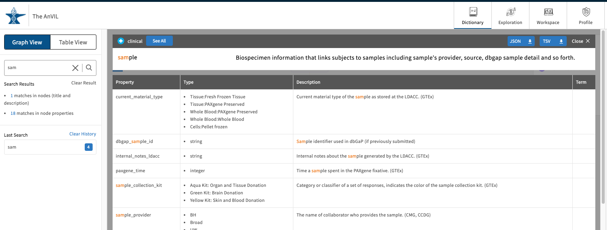
<figure-caption>Search results are highlighted in orange color.</figure-caption>
</figure>

Click "Clear Result" to wipe the free text search if needed. The search history is saved below the search bar in the "Last Search" list. Click on an item here to display the results again. Click "Clear History" if needed.

