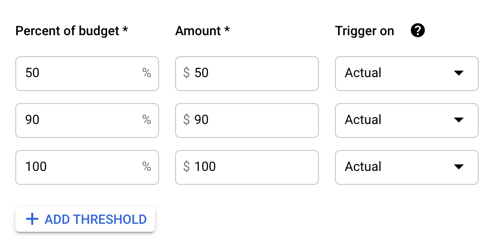

# Setting up Lab Accounts and Billing

This guide is intended to help PIs and lab managers set up and configure the accounts and billing resources required for data analysts to run analyses in Terra.

While there are many ways to configure a lab, the approach described here prioritizes fine-grained monitoring, reporting, and alerting over ease of setup and restricts who can create and share Terra workspaces with a lab manager or other trusted individual.

This approach is recommended for labs new to cloud computing. It enables detailed cloud cost accounting, provides users feedback on the costs of their analyses, and reduces the opportunity for unexpected cloud compute costs.

<hero>For additional information and approaches see [Best practices for managing shared team costs](https://support.terra.bio/hc/en-us/articles/360047235151-Best-practices-for-managing-shared-team-costs).</hero>

### Goals of this guide

* Provide a conceptual overview of cloud billing in Terra and GCP.
* Describe a recommended approach for lab billing configuration.
* Show you how to set up and use the recommended billing configuration.
* Show you how to monitor cloud spending.
* Identify choices you can make to customize your lab setup to your needs or specific situation.
* Capture Google’s promotional $300 getting started credits.

### Overview

This guide is organized into three main sections.

**[Section 1:  Prerequisites](/learn/investigators/setting-up-lab-accounts#prerequisites)** - The first section provides an overview of the concepts, resources, and roles related to billing and account setup.

**[Section 2: Lab Setup Design](/learn/investigators/setting-up-lab-accounts#lab-setup-design)** -  The second section describes the recommended setup design used by this guide and discusses the tradeoffs made and options to refine the setup for your specific needs.

**[Section 3: Lab Setup Guide](/learn/investigators/setting-up-lab-accounts#lab-setup-guide)** -  The third section walks you through the steps necessary to implement the suggested lab setup. Along the way, we also present choices to help you optimize your lab setup to your specific needs and situation.

###  Prerequisites

Before working through the setup guide, it will be helpful to be familiar with Terra workspaces and permissions, the basics of cloud costs, and understand the basic billing concepts.

Knowledge of these concepts and how they interrelate will help you implement the suggested lab setup and customize it to your specific needs.

Critical concepts for review are:

1. **Terra Workspaces and Permissions** - For an overview of Terra workspaces, workspace permissions, and general billing information, see [ Getting Started with AnVIL](/learn).

1. **Cloud Cost Basics** - For an overview of cloud costs see [Understanding Cloud Costs](/learn/introduction/understanding-cloud-costs).

1. **Billing Concepts** - For an overview of Google Cloud Platform and Terra billing concepts, see [Overview of Billing Concepts](/learn/billing-setup/billing-concepts).

## Lab Setup Design

### Lab Management Roles

The lab setup described here defines the following roles and responsibilities:

**Data Analyst**  - A lab member who is granted write + can-compute access on one or more Terra workspaces by a Lab Manager and who will run analyses in Terra.

**Lab Manager** -  A Lab Manager also creates or clones Terra workspaces and shares them with Data Analysts. The Lab Manager is also responsible for creating one or more Terra Billing Projects for each Data Analyst and configuring  GCP budgets and alerts.

**PI** - The PI sets up the lab’s Google Cloud Account, creates its Google Billing Account(s), and Google Payment Method(s), links Terra with GCP, and invites Lab Managers to be GCP “_Billing Account Users_.”

<!--
1. **Administrator** TODO Administrators have a great deal of power overspending.  If you have a lab or accounts manager responsible for expenses, it may make sense to add them as an administrator.  If this is primarily your responsibility, you likely want to keep yourself as the only admin. 
1. **Viewers** -  TODO Viewers can see the activity in the Billing Account but can’t make any changes.  This can be useful for finance staff who need access to the reports or for lab members to see what their analyses are costing.

-->

### Lab Workspace Creation Workflow

Under this setup, Data Analysts will be able to configure analysis and launch workspaces but can not create or clone workspaces on their own or download data from workspaces with requester pays buckets. This setup also prevents Data Analysts from sharing workspaces.

For data Data Analysts obtain access to the workspaces they require:

1. Data Analysts request a Lab Manager to create or clone a new workspace.
1. The Lab Manager:
   1. Decides if a new Terra Billing Project needs to be created to track expenses associated with the new workspace.
   1.  Sets up budgets and alerts for the new Terra Billing Project, if any, or adjusts the budget and alerts for the existing Terra Billing Project if required.
   1. Creates or clones the workspace using the appropriate Terra Billing Project.
   1. Adds and adds the Data Analyst as a “_Writer_” with “_can-execute_” but not “_can-share_” privileges on the new workspace.

### Budgets, Alerting, and Reporting

The most important advice in this guide is **monitor your spending** so you can shut down unexpectedly expensive activities before they have time to accumulate unplanned costs.

The ability to monitor spending is accomplished by scoping GCP budgets and alerts to the level of a Terra Billing Project’s twin Google Billing Project and creating fine-grained Terra Billing Projects, i.e., one per Data Analysts or one per Data Analyst analysis.

As specified in the workflow above, whenever a new workspace is needed, the Lab Manager checks to see if a new Terra Billing Project is also required and, if so, creates it and sets or updates budgets and alerts.

A few cautions to consider are:

>The Google Cloud billing interface does not provide an automatic way to cancel computations when spending reaches a given threshold.

>Google Cloud reports compute costs with a delay of approximately one day.

## Lab Setup Guide

### Before you start

#### Determine if your lab needs to create a Google Cloud Billing Account

You may not need to set up your lab’s own GCP Billing Account. It may be preferable for you to work with an account set up by your institution, your department, or a colleague. Additionally, some institutions may have existing relationships with Google Cloud third-party resellers who can assist you with your setup.

> Check with your institutional procurement office for a preferred method to set up your Google Cloud Billing Accounts, such as a third-party reseller or an existing account.

#### Plan out your configuration

Before you start, you will want to plan out your setup and:

1. Determine the Google ID to use to create your Terra account and log in to GCP.

1. Determine who will be a Lab Manager.

1. Determine who will be a Data Analyst.

1. Determine if you will need to create a new Google Payment Profile to associate with your Google Billing Account and decide what payment method to use.

1. Determine the set of Google Billing Accounts to create. This guide recommends one Google Billing Account per funding source (grant) to cleanly separate costs.

1. Determine the list of Terra Billing Projects to create - This guide recommends one per Data Analyst.  If finer-grained reporting is desired, create on Terra Billing Project per each of a data analyst’s workspaces. Use a consistent naming convention that will help you identify the user and project the Terra Billing Project is for.

1. Determine the set of workspaces to create. This initially may be one per data analyst.

1. If you will be cloning a data workspace with controlled access data for data analysts, make sure each data analyst is a member of the workspace’s Authorization Doman. For more information see [Accessing Data](/learn/accessing-data/requesting-data-access).

1. Determine the expected costs,  budget, and budget alerts you would like for each Terra Billing Project. See [Controlling Cloud Costs - Sample Use Cases](https://support.terra.bio/hc/en-us/articles/360029772212-Controlling-Cloud-costs-sample-use-cases) for a framework for estimating cloud costs. This guide recommends setting alerts at 50% and 90% of the expected budget.

### 1- Obtain a Google ID for each lab member

_All Lab Members_

All lab members that wish to use Terra will need a Google ID to create a Tera account.

As mentioned, a Google ID is an email address that may be:  a non-Google email that has been used to create a Google Account,  a Google email address set up in Gmail, Google Workspace, or Google Identity.

This email must also be the Google ID that lab members will use to log in to Terra, Gen3, and associate with their ERA commons ID for accessing controlled-access data.

Lab members without Google IDs can see [Create Your Google Account](https://accounts.google.com/signup/v2/webcreateaccount?flowName=GlifWebSignIn&flowEntry=SignUp) to register for a Gmail account or create an account with their current non-Google email address.

>To create a Google ID with a non-Google email address, select “Use my current email address instead” on the signup form.

### 2 - Create a Terra Account for each lab member

_All Lab Members_

Once lab members have a Google ID, they can use that email address to create a Terra account. Next, lab members can create Gen3 and Docstore accounts as well and link their accounts.

To create a Terra account:

1. Follow the instructions provided in the  [Account Setup Guide](/learn/account-setup/overview-of-account-setup).

### 3 -  Create Your Lab’s Google Billing Accounts

>If this is your first Google Billing Account, see [Creating a Google Billing Account](/learn/billing-setup/creating-a-google-cloud-billing-account) for a walk-through of the first-time flow. Use the instructions below to add additional accounts.

_PI or Account Administrator_

**For each Google Billing account required:**

1. Sign in to the Manage billing accounts page in the Google Cloud Console.

   <button-link href="https://console.cloud.google.com/billing" target="_blank">Sign in to GCP Manage Billing Accounts</button-link>

2. Select your lab from the “**Select an organization”** dropdown if available.
1. Select the **”ADD BILLING ACCOUNT”** or **”CREATE ACCOUNT”** button.
1. Enter the name for your new Google Billing Account.
1. Select your country and optionally currency if applicable.
1. Select **“CONTINUE”** and follow the instructions to attach or create a Google Payments Profile to fund the new Google Billing Account.
1. Select **“SUBMIT AND ENABLE BILLING”**.

For more information on creating billing accounts, see [Create, modify, or close your Cloud Billing account](https://cloud.google.com/billing/docs/how-to/manage-billing-account#create_a_new_billing_account).

### 4 - Link Terra to your Google Billing Accounts

_PI or Account Administrator_

To create and launch workspaces and consume Google Cloud resources, Terra needs to be linked to each of the Lab’s Google Billing Accounts. This is done in the Google Cloud console by adding Terra as a _Billing Account User_ on each Google Billing Account.

**To add Terra as _Billing Account User_ to a Google Billing Account:**

1. Sign in to the Manage billing accounts page in the Google Cloud Console.

   <button-link href="https://console.cloud.google.com/billing" target="_blank">Sign in to GCP Manage Billing Accounts</button-link>

1. Select your lab from the “Select an organization” dropdown.
1. On the right-hand side of the page, select **“ADD MEMBER”**
1. On the following screen:
   1.  Add _<terra-billing@terra.bio>_ in the **“New members”** form field.
   1. Under **“Select a Role”** select **“Billing”** and then **“Billing Account User”**
   1. Select **“MANAGE ROLES”**

<figure>

<figure-caption>Figure 1. Adding Terra as a Billing Account User to a Google Billing Account.</figure-caption>
</figure>

### 5 - Add each Lab Manager as a Billing Account User on the lab’s Google Billing Accounts

_PI or Account Administrator_

Once a Lab Manage is added as a “_Billing Account User_” and the Google Billing Account is linked to Terra, the Lab Manager can create Terra Billing Projects using the linked Google Billing Account.

**To add a Lab Manager as a _Billing Account User_ to a Google Billing Account:**

1. Sign in to the Manage billing accounts page in the Google Cloud Console.

   <button-link href="https://console.cloud.google.com/billing" target="_blank">Sign in to GCP Manage Billing Accounts</button-link>
1. Select your lab from the **“Select an organization”** dropdown.
1. On the right-hand side of the page, select **“ADD MEMBER”**
1. On the following screen:
   1.  Add the lab member’s GoogleID (email address)  in the **“New members”** form field.
   1. Under **“Select a Role”** select **“Billing”** and then **Billing Account User”**
   1. Select **“MANAGE ROLES”**

The lab manager should now see the linked Google Billing Account when they attempt to create a Terra Billing Project in Terra.

### 6 - Create a Terra Billing Project for each Data Analyst

_Lab Manager_

To enable tracking of cloud costs for each _Data Analyst_, create each _Data Analyst_ their own Terra Billing Project.
Name the Terra Billing Project so that you can identify the Data Analyst by the Terra Billing Project name.

> If you require finer-grained reporting and monitoring, you may wish to create a Terra Billing Project for each Data Analyst’s workspace if they have multiple workspaces.

**To create a Terra Billing Project:**

1. Log into Terra manage billing page.

   <button-link href="https://anvil.terra.bio/#billing" target="_blank">Sign in to Terra Manage Billing</button-link>

1. If prompted, select **“Sign in with Google”**.
1. Select **“CREATE”**  in the top left.
1. Enter a unique name for the Terra Billing Project that will help you identify the Data Analyst.
1. Select a Google Billing Account to link to the Terra Billing Project.
1. Select **“CREATE BILLING PROJECT”**.

>Note: During this step, if you can not see the desired Google Billing Account as an option for creating the Terra Billing Project, make sure the desired Google Billing Account is linked to Terra, and you have been added as a _Billing Account User_ to the desired Google Billing Account.

Once the Terra Billing Project has been created, _Lab Managers_ can see the new Terra Billing Project as an option when creating or cloning a workspace.

### 7 - Create Budgets and Alerts in GCP for each Terra Billing Project

_Lab Manager_

To monitor spending for each _Data Analyst_ create a GCP Budget.

>As discussed, when a Terra Billing Project is created, Terra creates a “twin” GCP Billing Project and associates it with the Terra Billing Project’s Google Billing Account. The “twin” GCP Billing Projects are used to scope individual budgets on their Google Billing Account.

You can create multiple budgets on a Google Billing Account.  This guide recommends creating a budget for every “twin” Google Billing Project on the Google Billing Account.

**To create a budget For each Terra Billing Project:**

1. Sign in to the Manage billing accounts page in the Google Cloud Console.

   <button-link href="https://console.cloud.google.com/billing" target="_blank">Sign in to GCP Manage Billing Accounts</button-link>
1. Select your lab from the **“Select an organization”** dropdown.
1. In the list of billing accounts, select the account you wish to add alerts for.
1. In the left navigation, select “**Budgets and Alerts”**
1. Select **“Create Budget”** on the following page.
1. For the name of the budget, use the Terra Billing Project’s name.
1. In the **“Projects”** drop-down menu, select the GCP Billing Project with the same name as the Terra Billing Project you are creating a budget for and select “NEXT.”
1. Select **“Specified Amount”** from the Budget Type dropdown menu.
1. Enter the target dollar amount of spending and select **“FINISH”**.
1. By default, GCP will create alert thresholds at %50, %90, and %100 of the budget. Emails will be sent to the _Billing Admins_  and _Billing Users_ of the Google Billing Account when the thresholds are met. If desired, select the GCP Budget you just created from the **“Budgets & Alerts”** list, and add or remove thresholds and configure notifications.

<figure>

<figure-caption>Figure 2. Default budget alert thresholds created by GCP on GCP Budget creation.</figure-caption>
</figure>

<hero>See [Set Budgets and Budget Alerts](https://cloud.google.com/billing/docs/how-to/budgets) for additional instructions on creating, modifying, and deleting budgets and alerts. </hero>

### 8 -  Create or Clone Workspaces and add Data Analysts as “Writers” with “can-compute”

_Lab Manager_

**To create workspaces for Data Analysts:**

1. Log in to the Terra workspaces screen.

   <button-link href="https://anvil.terra.bio/#workspaces" target="_blank">Sign in to Terra  Workspaces</button-link>
1. If prompted, select **“Sign in with Google”**.
1. Decide if you will create or clone a workspace:
   1. To create a new workspace, select the “+” button on the top left of the workspaces screen.
   1. To clone a workspace, find the workspace in your workspaces list, select the “three dots” icon on the right, and select **“Clone”**.
1. Select a workspace name and Billing Project for the workspace, being careful to select the billing project created for the Data Analyst who will be computing with the workspace.
1. Select **“CREATE WORKSPACE”** or **“CLONE WORKSPACE”** as appropriate.

**Next, to find the new workspace and share it with the Data Analyst:**

1. Locate the workspace in the workspaces list by filtering on the workspace name.
1. On the “three dots” button on the workspace row and select **“Share”**.
1. On the Share Workspace popup menu:
   1. Search for the Google ID of the Data Analyst in the **“User email”**section.
   1. Select the Data Analysts email address when it appears below the User email select box.
1. When the Data Analyst appears under the “Current Collaborators” section of the form, make the Data Analyst a **“Writer”** and select **“Can compute”**. Do not select “Can share.”

<figure>

<figure-caption>Figure 3. Setting Data Analysts workspace permissions to “Writer” with “can-compute”, but disabling sharing.</figure-caption>
</figure>

<hero>For additional information see [Cloning a Workspace](https://support.terra.bio/hc/en-us/articles/360026130851-How-to-clone-a-workspace) in the Terra documentation. For additional information see [How to Share a Workspace](https://support.terra.bio/hc/en-us/articles/360034540171-How-to-share-a-workspace) in the Terra documentation. </hero>

## We would love your feedback

We would love to hear about your experiences attempting to implement this guide and discuss what worked or any omissions or points that need further clarification.

<hero>For questions, comments, pain points, successes in following this guide, reach out to the AnVIL support from the AnVIL [Help](/help) page.</hero>

