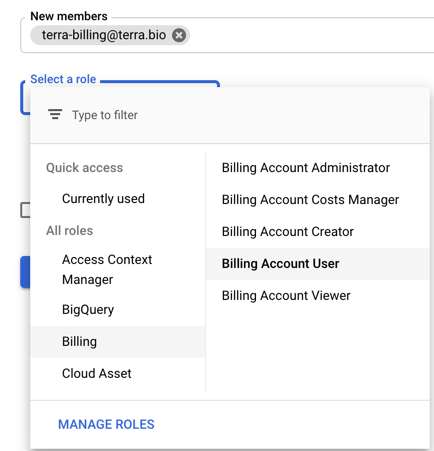
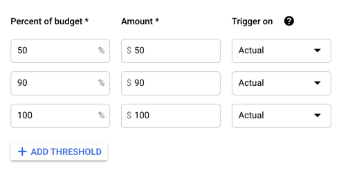
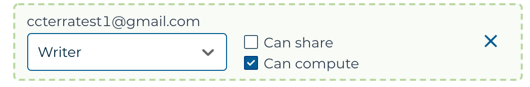

# Setting up Lab Accounts and Billing

This guide is intended to help PIs and lab managers setup and configure the accounts and billing resources required for data analysts to run analyses in Terra.

While there are many ways to configure a lab, the approach described here prioritizes fine grained monitoring, reporting, and alerting over ease of setup and restricts who can create and share Terra workspaces to a lab manager or other trusted individual.

This approach is recommended for labs new to cloud computing as it enables detailed cloud cost accounting, provides users feedback on the costs of their analyses, and reduces the opportunity for unexpected cloud compute spend.

For additional information and approaches see [Best practices for managing shared team costs](https://support.terra.bio/hc/en-us/articles/360047235151-Best-practices-for-managing-shared-team-costs).

### Goals of this guide

* Provide a conceptual overview of cloud billing in Terra and GCP.
* Describe a recommended approach for lab billing configuration.
* Show you how to set up and use the recommended billing configuration.
* Show you how to monitor cloud spending.
* Identify choices you can make to customize your lab setup to your needs or specific situation.
* Capture Google’s promotional $300 getting started credits.

### Overview

This guide is organized into three main sections.

**[Section 1:  Prerequisites](/learn/principal-investigators/setting-up-lab-accounts#prerequisites)** - The first section provides an overview of the concepts, resources and roles related to billing and account setup.

**[Section 2: Lab Setup Design](/learn/principal-investigators/setting-up-lab-accounts#lab-setup-design)** -  The second section describes the recommended setup design used by this guide and discusses the tradeoffs made and options to refine the setup for your specific needs.

**[Section 3: Lab Setup Guide](/learn/principal-investigators/setting-up-lab-accounts#lab-setup-guide)** -  The third section walks you through the steps necessary to implement the suggested lab setup. Along the way, we also present choices to help you optimize your lab setup to your specific needs and situation.

##  Prerequisites

Before working through the setup guide it will be helpful to be familiar with Terra workspaces and permissions, the basics of cloud costs, and to understand the basic billing concepts.

Knowledge of these concepts and how they interrelate will help you implement the suggested lab setup and customize the setup to your specific needs.

Key concepts for review are:

1. **Terra Workspaces and Permissions** - For an overview of Terra workspaces, workspace permissions, and general information on billing see [ Getting Started with AnVIL](/learn).

1. **Cloud Cost Basics** - For an overview of cloud costs see [Understanding Cloud Costs](/learn/introduction/understanding-cloud-costs).

1. **Billing Concepts** - For an overview of Google Cloud Platform and Terra billing concepts see [Overview of Billing Concepts](/learn/billing-setup/billing-concepts).

## Lab Setup Design

### Lab Management Roles

The lab setup described here defines the following roles and responsibilities:

**Data Analyst**  - A lab member who is granted write + can-compute access on one or more Terra workspaces by a Lab Manager and who will run analyses in Terra.

**Lab Manager** -  A Lab Manager also creates or clones Terra workspaces and shares them with Data Analysts. The Lab Manager is also responsible for creating one or more Terra Billing Projects for each Data Analyst and configuring  GCP budgets and alerts.

**PI** - The PI sets up the lab’s Google Cloud Account, creates its GCP Billing Account(s), and Google Payment Method(s), links Terra with GCP  and invites Lab Managers to be GCP “_Billing Account Users_”.

<!--
1. **Administrator** TODO have a great deal of power over spending.  If you have a lab or accounts manager responsible for expenses, it may make sense to add them as an administrator.  If this is primarily your responsibility, you likely want to keep yourself as the only admin. 
1. **Viewers** -  TODO can see the activity in the Billing Account but can’t make any changes.  This can be useful for finance staff who need access to the reports, or for lab members to be able to see what their analyses are costing.

-->

### Lab Workspace Creation Workflow

Under this setup, Data Analysts will be able to configure analysis and launch workspaces but will not be able to create or clone workspaces on their own or download data from workspaces with requester pays buckets. Data Analysts will also be prevented from sharing workspaces.

For data Data Analysts obtain access to the workspaces they require:

1. Data Analysts request a Lab Manager to create or clone a new workspace.
1. The Lab Manager:
   1. Decides if a new Terra Billing Project needs to be created to track expenses associated with the new workspace.
   1.  Sets up budgets and alerts for the new Terra Billing Project, if any, or adjusts the budget and alerts for the existing Terra Billing Project if required.
   1. Creates or clones the workspace using the appropriate Terra Billing Project.
   1. Adds and adds the Data Analyst as a “_Writer_” with “_can-execute_” but not “_can-share_” privileges on the new workspace.

### Budgets, Alerting and Reporting

Likely the most important advice in this guide is **monitor your spending** so you can shut down unexpectedly expensive activities before they have time to accumulate excessive cost.

This is accomplished in this guide by socoping GCP budgets and alerts to the level of a Terra Billing Project’s twin Google Billing Project, and by creating fine grained Terra Billing Projects i.e., one per Data Analysts or one per Data Analyst analysis.

As specified in the workflow above, whenever a new workspace is needed the Lab Manager checks to see if a new Terra Billing Project is also needed and if so creates it and sets or updates budgets and alerts.

A few cautions to consider are:

>The Google Cloud billing interface does not provide a way to automatically cancel computations when a spending threshold is reached.

>Compute costs are reported with a delay of approximately one day.

## Lab Setup Guide

### Before you start

#### Determine if your lab needs it’s own Google Cloud Account

You may not need to set up your lab’s own GCP Account. It may be preferable for you to work with an account setup by your institution, your department or a colleague. Additionally some institutions may have existing relationships with Google Cloud third party resellers who can assist you with your setup.

> Check with your institutional procurement office for a preferred method to setup your Google Cloud Account such as a third-party reseller or an existing account.

#### Plan out your configuration

Before you start you will want to plan out your setup and:

1. Determine the Google ID to use to create your Terra and GCP accounts.

1. Determine who will be a Lab Manager.

1. Determine who will be a Data Analyst.

1. Determine if you will need to create a new Google Payment Profile to associate with your Google Billing Account and decide how to fund it.

1. Determine the set of Google Billing Accounts to create. This guide recommends one Google Billing Account per funding source (grant) to cleanly separate costs.

1. Determine the list of Terra Billing Projects to create - This guide recommends one per Data Analyst.  If finer grained reporting is desired, create on Terra Billing Project per each of a data analyst’s workspaces. Use a consistent naming convention that will help you identify the user and project the Terra Billing Project is for.

1. Determine the set of workspaces to create. This initially may be one per data analyst.

1. If you will be cloning a data workspace with controlled access data  for data analysts, make sure each data analyst is a member of the workspace’s Authorization Doman. For more information see [Accessing Data](/learn/accessing-data/requesting-data-access).

1. Determine the expected costs,  budget and budget alerts you would like for each Terra Billing Project. See [Controlling Cloud Costs - Sample Use Cases](https://support.terra.bio/hc/en-us/articles/360029772212-Controlling-Cloud-costs-sample-use-cases) for a framework for estimating cloud costs. This guide recommends setting alerts at 50% and 90% of the expected budget.

### 1- Make sure each lab member has a Google ID

**All Lab Members**

All lab members that wish to use Terra will need a Google ID to create a Tera account.

As mentioned a Google ID is an email address that may be:  a non Google email that has been used to create a Google Account,  a Google email address setup in Gmail, Google Workspace, or Google Identity.

This email must  also be the Google ID that lab members will use to login to Terra, Gen3, and associate with their ERA commons ID for accessing controlled access data.

Lab members without Google IDs can see [Create Your Google Account](https://accounts.google.com/signup/v2/webcreateaccount?flowName=GlifWebSignIn&flowEntry=SignUp) to register for a Gmail account or create an account with their current non-Google email address.

>To create a Google ID with a non-Google email address select “Use my current email address instead” on the signup form.

### 2 - Have each lab member create a Terra account

**All Lab Members**

Once lab members have a Google ID they can use that email address to create a Terra account. Then create Gen3 and Docstore accounts as well and link their accounts according to the instructions provided in the [Account Setup Guide](/learn/account-setup/overview-of-account-setup) if required.

### 3- Have each Lab Manager create a Google Cloud Account

**All Lab Members**

Each Lab Manager will need a Google Cloud Account created with the Google ID (email) they use to sign in to Terra.  To create a Google Cloud Account:

1. Navigate to <https://cloud.google.com/>
1. Select the “Get started for free” button.
1. On the following screen select “Create account”.
1. When prompted, choose “For myself” and follow the instructions. This will allow you to create an individual Google Cloud account.

### 4 - Create Your Lab’s Google Cloud Account

**PI or Account Administrator**

If you will be creating a Google Cloud Account for the Lab, create it using the email address the PI will use to sign into Terra (or other Google ID as appropriate).  To create a Google Cloud Account:

1. Determine the email address to use for the lab’s Google Cloud Account (possibly the PI’s GoogleID)
1. Navigate to <https://cloud.google.com/>
1. Select the “Get started for free” button.
1. On the following screen select “Create account”.
1. When prompted, choose “To Manage my business” and follow the instructions. This will allow you to create an organizational Google Cloud account.

### 5 -  Create Your Lab’s GCP Billing Accounts

**PI or Account Administrator**

For each GCP Billing account required:

1. Sign in to the google cloud console by navigating to <https://cloud.google.com/> and selecting “Sign in”.
1. Navigate to <https://console.cloud.google.com/billing> (or select “Billing” from the top left Navigation menu).
1. Select your lab from the “Select an organization” dropdown.
1. Select the “ADD BILLING ACCOUNT” button.
1. Enter the name for your new Google BIlling Account .
1. Select your country and optionally currency if applicable.
1. Select “CONTINUE” and attach or create a Google Payments Profile to fund the new Google Billing Account.
1. Select “SUBMIT AND ENABLE BILLING”.

If this is the first Google Billing Account created for your lab’s new GCP Account you will now have $300 in cloud cost credits that you can use for 90 days. See [Google Cloud Free Program](https://cloud.google.com/free/docs/gcp-free-tier) to understand more about Google’s 90-day, $300 free trial and free tier.

For more information on creating billing accounts, see [Create, modify, or close your Cloud Billing account](https://cloud.google.com/billing/docs/how-to/manage-billing-account#create_a_new_billing_account).

### 6 - Add Terra as a “Billing Account User” on each GCP Billing Account

**PI or Account Administrator**

To link your new GCP Billing Accounts to Terra, for each new GCP Billing Account created:

1. Sign in to the google cloud console by navigating to <https://cloud.google.com/> and selecting “Sign in”.
1. Navigate to <https://console.cloud.google.com/billing> (or select “Billing” from the top left Navigation menu).
1. Select your lab from the “Select an organization” dropdown.
1. On the right hand side of the page select “ADD MEMBER”
1. On the following screen:
   1.  Add _<terra-billing@terra.bio>_ in the “New members” form field.
   1. Under “Select a Role” select “Billing” and and then “Billing Account User”
   1. Select “MANAGE ROLES”

### 7 - Add each Lab Manager as a “Billing Account User” on your GCP Billing Accounts

**PI or Account Administrator**

Once a Lab Manage is added as a “_Billing Account User_”, and the Google Billing Account is linked to Terra, the Lab Manager will be able to create Terra Billing Projects using the linked Google Billing Account.

To add a Lab Manager as a “Billing Account User” to a Google Billing Account:

1. Sign in to the google cloud console by navigating to <https://cloud.google.com/> and selecting “Sign in”.
1. Navigate to <https://console.cloud.google.com/billing> (or select “Billing” from the top left Navigation menu).
1. Select your lab from the “Select an organization” dropdown.
1. On the right hand side of the page select “ADD MEMBER”
1. On the following screen:
   1.  Add  the lab member’s GoogleID (email address)  in the “New members” form field.
   1. Under “Select a Role” select “Billing” and then “Billing Account User”
   1. Select “MANAGE ROLES”

The lab manager should now be able to see the linked Google Billing Account when they attempt to create a Terra Billing Project in Terra.

### 8 - Create a Terra Billing Project to track spending for each Data Analyst

**Lab Manager**

Name the Terra Billing Projects so that you can identify the Data Analyst by the project name. If you require finer grained reporting and monitoring you may create a Terra Billing Project for each Data Analyst’s workspace in the case they have multiple workspaces.

To create a Terra Billing Project:

1. Navigate to to <https://anvil.terra.bio/#billing>
1. If prompted select “Sign in with Google”.
1. Select “CREATE”  in the top left.
1. Enter a unique name for the Terra Billing Project that will help you identify the Data Analyst.
1. Select a Google Billing Account to link to the Terra Billing Project.
1. Select “CREATE BILLING PROJECT”.

>Note: If you do not see the desired Google Billing Account as an option to use for creating the Terra Billing Project, make sure the Google Billing Account is  linked to Terra and you have been added as a ”_Billing Account User_” to the Google Billing Account.

### 9 - Create Budgets and Alerts in GCP for each Terra Billing Project

**Lab Manager**

As discussed, when a Terra Billing Project is created, Terra creates a “twin” GCP Billing Project and associates it with the Terra Billing Project’s GCP Billing Account. The “twin” GCP Billing Projects are used to scope individual budgets on their GCP Billing Account.

You can create multiple budgets on a GCP BIlling Account.  This guide recommends cating a GCP Budget for every “twin” GCP Billing Project on the GCP Billing Account.

To create a GCP Budget For each Terra Billing Project:

1. Sign in to the google cloud console by navigating to <https://cloud.google.com/> and selecting “Sign in”.
1. Navigate to <https://console.cloud.google.com/billing> (or select “Billing” from the top left  Navigation menu).
1. Select your lab from the “Select an organization” dropdown.
1. In the list of billing accounts select the account you wish to add alerts for.
1. In the left navigation select “Budgets and Alerts”
1. Select “Create Budget” on the following page.
1. For the name of the budget use the Terra Billing Project’s name.
1. In the “Projects” drop down menu select the GCP Billing Project with the same name as the Terra Billing Project you are creating a budget for and select “NEXT”.
1. Select “Specified Amount” from the Budget Type dropdown menu.
1. Enter the target dollar amount of spending and select “FINISH”.
1. By default GCP will create alert thresholds at %50, %90 and %100 of the budget. Emails will be sent to the _Billing Admins_  and _Billing Users_ of the GCP Billing Account. If desired select the GCP Budget you just created from the “Budgets & Alerts” list and add or remove thresholds and configure notifications.

<hero>See [Set Budgets and Budget Alerts](https://cloud.google.com/billing/docs/how-to/budgets) for additional instructions on creating modifying and deleting budgets and alerts. </hero>

### 10 -  Create or Clone Workspaces and add Data Analysts as “Writers” with “can-compute”

**Lab Manager**

To create workspaces for Data Analysts:

1. Navigate to to <https://anvil.terra.bio/#workspaces>
1. If prompted select “Sign in with Google”.
1. Decide if you will create or clone a workspace:
   1. To create a new workspace, select the “+” button on the top left of the workspaces screen.
   1. To clone a workspace find the workspace in your workspaces list, select the “three dots” icon on the right, and select “Clone”.
1. Select a workspace name and Billing Project for the workspace being careful to make sure to select the billing project created for the Data Analyst who will be computing with the workspace.
1. Select “CREATE WORKSPACE” or “CLONE WORKSPACE” as appropriate.

Next, find the new workspace and share it with the Data Analyst

1. Locate the workspace in the workspaces list by filtering on the workspace name..
1. On the “three dots” button on the workspace row and select “Share”.
1. On the Share Workspace popup menu:
   1. Search for  the Google ID of the Data Analyst in the “User email” section.
   1. Select the Data Analysts email address when it appears below the User email select box.
1. When the Data Analyst appears under the “Current Collaborators” section of the form make the  a “Writer” and select “Can compute” but do not select “Can share”.

<hero>For additional information see [Cloning a Workspace](https://support.terra.bio/hc/en-us/articles/360026130851-How-to-clone-a-workspace) in the Terra documentation. For additional information see [How to Share a Workspace](https://support.terra.bio/hc/en-us/articles/360034540171-How-to-share-a-workspace) in the Terra documentation. </hero>

## We would love your feedback

We would love to hear about your experiences with attempting to implement this guide and discuss what worked or  any omissions or points that need further clarification.

<hero>For questions, comments, pain points, successes in following this guide please reach out to the AnVIL support from the AnVIL [Help](/help) page.</hero>

