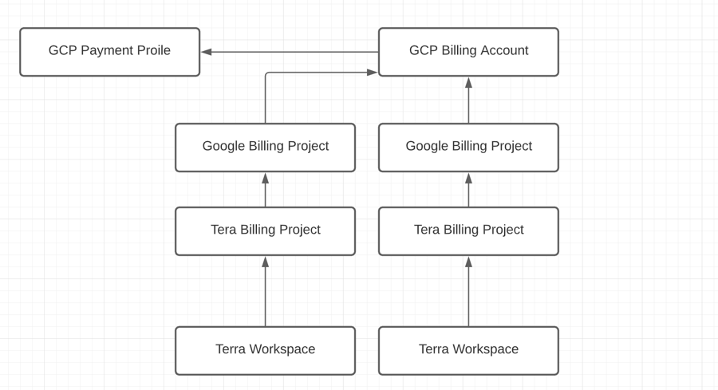

>STATUS: WIP Please see [Google Doc](https://docs.google.com/document/d/1IYDq59kT9IUNgxvPWxVUx7Ipq0HXqWvATaG5FGdYO2M/edit#) to comment or suggest.

# Setting up Lab Accounts

This guide is intended to assist PIs or lab managers in configuring Terra
and Google Cloud Billing to enable lab members to run analysis workflows
in Terra.

There are many ways to configure a lab to use AnVIL. This guide presents an approach
prioritizing transparency and accountability and is designed for labs new to cloud computing that wish to start off with a more cautious, albeit restrictive, configuration.

For additional information and approaches see [Best practices for managing shared team costs](https://support.terra.bio/hc/en-us/articles/360047235151-Best-practices-for-managing-shared-team-costs).

### Goals of this Guide

* Provide a conceptual overview of setting up a Lab Billing in AnVIL.
* Teach key billing concepts and their relationships to each other.
* Provide step-by-step instructions to help you set up your lab in a manner that emphasizes cost control, facilitates cost assignment, and provides transparency in accounting.
* Demonstrate how to monitor and manage spending.
* Capture Google’s promotional $300 getting started credits.

## Recommended Approach

The key aspects of this approach are to:

1. Create one Google Billing Account per funding source to help clearly allocate expenses to the appropriate funding sources.

1. Create a single Terra Billing Project per lab member so that lab member spend can be individually tracked, monitored, and alerted on.

1. Be restrictive and intentional about the lab members who are allowed to share workspaces with others who can then launch them and incur GCP costs on behalf of the lab. (By default disallow sharing for workspace writers).

1. Assign a lab manager who creates and shares workspaces with other lab members but who also ensures that lab managers can not share workspaces themselves.

1. Setup monitoring and alerting on cloud cost spend.

## Billing Overview

Terra, AnVIL's analysis platform, runs in the Google Cloud Platform (GCP).

Terra is free to use; you can browse showcase workspaces as soon as you
register for an account. Compute operations such as running
workflows, running Jupyter Notebooks, and accessing and storing data in Terra
incur Google Cloud Platform charges.

These charges are billed by GCP and paid through your Google Cloud Platform payment method.

For more information about cloud costs and current fees see [Understanding Cloud Costs](/learn/introduction/understanding-cloud-costs)

## Billing Concepts

**Google Cloud Account** - An account on the Google Cloud Platform (GCP) created with the same Google ID (email address) you use for your Terra account.

**Google Organization** - The individual, company, or institution owning the
Google account and who will be responsible for payment.

**Google Payments Profile** - A google resource for holding payment methods
associated with the organization.

**GCP Billing Account** - A Google Organization can have one or more billing
accounts. Each billing account operates in a single currency and can be used
to separate charges paid for by different funding sources. A GCP Billing Account can be associated with one or more GCP Billing Projects.

**GCP Billing Project** - GCP Billing Projects are associated with a
single Google Billing Account. GCP compute resources are linked to a single
GCP Billing project to assign expense and control
access. Compute charges flow through the compute resource's GCP Billing
Project to its GCP Billing Account.

**GCP Billing Account Budget**  - You can create multiple budgets for each Google Billing Account. Each budget can specify a project, budget amount, and alerts.

**Terra Billing Project** - Terra Billing Projects are linked to a single GCP Payment Account and one or more Terra workspaces. When compute is launched in a workspace, the compute charges are billed to the Google Billing Account associated with the workspace’s Terra Billing Project. When a Terra Billing Project is created, its “twin” Google Billing Project is created, linking Terra to Google Billing.

**Terra Workspace** - A workspace is a Terra resource that holds data and
analysis tools. Uploading data into a workplace, storing data in a workspace over time, and running compute from within a workspace all incur GCP charges.

## Helpful Resources

1. [Guide to Cloud Billing Resource Organization & Access Management](https://cloud.google.com/billing/docs/onboarding-checklist)

1. [Working With Workspaces](https://support.terra.
   bio/hc/en-us/articles/360024743371-Working-with-workspaces)

## Lab Setup Process

### Before You Start

1.  You will need a credit card or bank account to activate your free trial and get started.

> You will not be billed until you explicitly turn on automatic billing, but payment information is needed for verification purposes.

2. Before setting up billing, check with your institutional procurement office for a preferred account set-up method with Google (such as a third-party reseller or an existing account).

1. To add lab members, you will need to know the Google account they will use to access Terra.   You can always add additional lab members once you have completed the initial setup.

### Roles
This guide assumes the following roles and permissions:

1. **Lab Manager** - Will be assigned as a Terra Billing Project owner and will create workspaces for lab members.

1. **Lab Member** - Will be prevented from creating workspaces and will
   instead be assigned to one or more Terra workspaces with can-compute access. They will be able to launch the workspace but not able to
   and share the workspace, but not give other collaborators can-compute
   access to the workspace. This prevents anyone besides those assigned by the Lab Manager from incurring GCP costs on behalf of the lab.

### Overview of Setup

1. Create one Google Billing Account per funding source.
1. Link your Google Billing Accounts to Terra by  adding terra-billing@terra.bio as a Billing Account User to each Google Billing Account
1. Create one Terra Billing Project for each lab member and assign the lab member as a member.
1. Create one workspace per lab member and make each lab member writer with can-compute but true and can-share false.
1. Setup bulling budgets and alerts for each Terra Billing Project.

>Note that given this lab members will still be able to create their own workspaces where they will be owners with can-compute and can-share that are linked to their lab Terra Billing Project.

## Steps

### 1 - Create Your Lab’s Google Accounts
Identify which Google account to use, or create one. For more information see [Setting up a Terra account with a non-Google email](https://support.terra.bio/hc/en-us/articles/360029186611-Setting-up-a-Google-account-with-a-non-Google-email).

### 2 - Create Your Lab’s Terra Accounts

1. Create a Terra account with the email address associated with the Google
   Account. https://support.google.com/accounts/answer/27441

### 3 - Create Your Lab’s Google Cloud Account

### 4 - Create Your Lab’s GCP Billing Accounts

1. Identify how many GCP Billing Accounts will need to be created - One per funding source is the recommended approach in this guide.

1. Identify or create the Payment Methods to be used for each GCP Billing
   Account. For more information see [Create and manage your payments profile](https://support.google.com/paymentscenter/answer/9028746?ref_topic=9017383).

1. Create the GCP Billing Accounts. For more information see [Create, modify,
   or close your Cloud Billing account](https://cloud.google.com/billing/docs/how-to/manage-billing-account#create_a_new_billing_account).

### 5 - Add Terra as “User” on each GCP Billing Account

1. Add Terra as a user on each GCP Billing Account created.

### 6 - Create a Terra Billing Project per Lab Member

1. Assign a Lab Manager who will be responsible for creating all workspaces.

1. Create one or more Terra Billing Projects e.g. one per funding source or one per Data Analyst. Assign the Lab Manager the ability to create workspaces under each Terra Billing Project.

### 7 - Create Budgets and Alerts in GCP

1. Create budgets and alerts for GCP Billing Projects created by Terra when the Terra Billing Projects were created. See [Set Budgets and Budget Alerts](https://cloud.google.com/billing/docs/how-to/budgets) for additional instructions.

### 8 - Add Lab Members to Workspaces

1. Identify lab members who will be given can-compute access to specific workspaces and create the workspaces and assign access while preventing lab members from sharing workspaces with other users who might then incur GCP charges.

