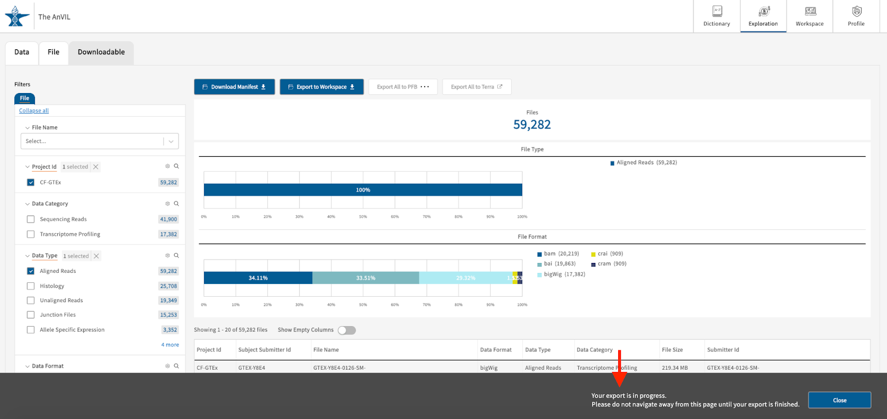
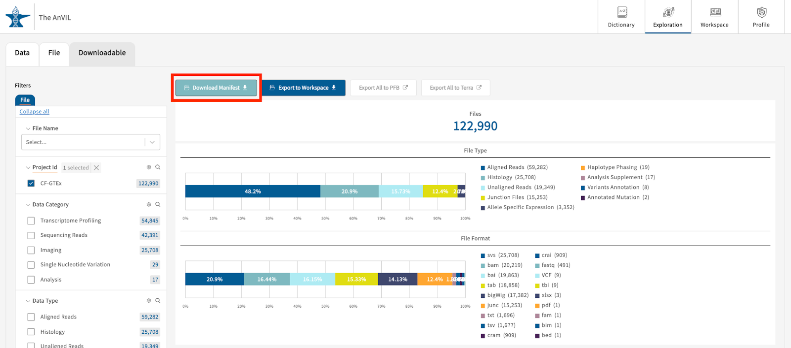

# GTEx v8 - Free Egress Instructions

## Overview

The Genotype-Tissue Expression (GTEx) Program is a widely used data resource and tissue bank to study the relationship between genetic variants (inherited changes in DNA sequence) and gene expression (how genes are turned on and off) in multiple human tissues and across individuals. Previously, large genetic studies identified variants that are associated with human diseases. However, it is less clear how these variants affect gene expression and thereby contribute to human diseases. 

To provide insight into how genes are expressed differently across the body and how they are regulated, GTEx includes whole-genome sequence and RNA-sequence from nearly 1000 deceased adult donors, with multiple tissue samples collected per donor (e.g. lung, brain, pancreas, skin, etc.). It also features an image library of the tissue samples, and a form to request tissue samples.

The primary entry point for accessing GTEx data is through the GTEx portal (<https://gtexportal.org/>). The GTEx Portal provides open access to data including gene expression, QTLs, and histology images. However, due to the nature of our donor consent agreement, raw data and attributes which might be used to identify the donors, such as raw sequencing data or variant calls, are not publicly available on the GTEx Portal. 

### Requesting Access

Accessing the raw data requires authorization from the NIH database of Genotypes and Phenotypes (dbGaP). dbGaP was developed to archive and distribute the data and results from studies that have investigated the interaction of genotype and phenotype in Humans. If you do not currently have access to the GTEx data on dbGaP, you can apply for access to the data by selecting “Request Access” at this [link](https://www.ncbi.nlm.nih.gov/projects/gap/cgi-bin/study.cgi?study_id=phs000424.v8.p2).

Once you are approved for accessing the raw GTEx data, you can either analyze the protected data within the cloud using the Terra Platform within [this workspace](https://app.terra.bio/#workspaces/anvil-datastorage/AnVIL_GTEx_V8_hg38) or you can download the protected data to your home institutions for free using the instructions provided below. 

### Downloading vs. Analyzing in Terra

For many analyses, it will be substantially easier and more efficient to perform your analysis within Terra as Terra provides the capabilities for large scale batch processing and interactive analysis over thousands of samples. However, for some use cases, such as joint analysis & integration with your own protected clinical data, downloading the data provides additional flexibility.

> Please note that you should not attempt to export the protected data from the Terra workspace, as this will incur egress fees as the data are exported from the cloud environment. Instead, please follow the directions below to download the data free of charge from the Gen3 platform.

### Security Requirements

If you elect to download the protected data, it is your responsibility to maintain data security and privacy within your institutional servers. Please review the NIH Office of Science Policy guide on “[Requesting Access to Controlled-Access Data Maintained in NIH-Designated Data Repositories](https://osp.od.nih.gov/scientific-sharing/requesting-access-to-controlled-access-data-maintained-in-nih-designated-data-repositories-e-g-dbgap/)” for more information.

### Getting Help

For help or support executing the instructions below please reach out to the Gen3 team at <support@datacommons.io>.


## Downloading GTEx v8 Phenotypic Data
### Step 1 - Login to Anvil Gen3

**Login** to the [AnVIL Gen3 Commons](https://gen3.theanvil.io/login) with your **NIH credentials** and navigate to the Exploration page.


### Step 2 - Generate a PFB File in the Exploration page

**PFB** (**P**ortable **F**ile for **B**iomedical data) contains both the associated phenotypic information and the complete list of object files (as GUIDs, or Globally Unique Identifiers) that have been ingested into the Gen3 data dictionary. To **generate and download the PFB** file:

1. Navigate to the **Exploration Page** (<https://gen3.theanvil.io/explorer>)
1. Click on the “**Downloadable**” tab and select “**CF-GTEx**” under “Project Id”
1. Please choose a single **Data Type** from the Data Type filter on the left

1. Click on the “**Export All to PFB**” button. Please wait patiently for this step - can take 30 - 60s - and please do not navigate away while the export is in progress


1. Download generated PFB file\


#### Optional - Filter Facets and Cohort Generation

Additional search facets can be applied in the “Downloadable” tab in order to generate a GTEx v8 cohort. The selection of a cohort will be reflected in the manifest.json and PFB files created.

1. Under the **Downloadable Tab**, you can view additional data search facets such as **Data Category**, **Data Type**, **Data Format**, **Analyte Type**, and **Sequencing Assay**.
1. By selecting value(s) under any search facet, the Exploration page will update dynamically to display only data files that contain the selected values for that property.

### Step 3 - Install PyPFB

**PyPFB** (<https://github.com/uc-cdis/pypfb>) is a Python SDK developed by the Gen3 team to create, explore, and modify PFB files generated by the Gen3 Portal. To install PyPFB

1. Open a **terminal window**
1. Run **command line** shown below
```shell
$ pip install pypfb
```
> Note: Please make sure you are running at least version 0.5.0. To ensure this, you can run the **command line** shown below:
```shell
$ pip install pypfb==0.5.0
```

### Step 4 - Convert PFB to TSV

Once PyPFB has been successfully installed, parse the previously downloaded PFB file (Step 2) into **tab-delimited files (.tsv)** by running the command shown below.
```shell
$ pfb to -i <PATH_to_export_pfb.avro> tsv
```

Running the command above will generate a directory of (./tsvs/) that contains all of the nodes and their clinical data for the select cohort in the PFB.

```shell
sean@cdis:~/AnVIL/AnVIL_demo$ pfb to -i export_2020-10-16T20\ 28\ 42.arvo tsv
Creating ./tsvs/program.tsv
Creating ./tsvs/project.tsv
Creating ./tsvs/subject.tsv
Creating ./tsvs/sample.tsv
Creating ./tsvs/sequencing.tsv
Done, created 6 files under: ./tsvs/
```

## Downloading GTEx v8 Object Files

### Step 1 - Login to Anvil Gen3
**Login** to the AnVIL Gen3 Commons with your **NIH credentials** and navigate to the Exploration page.


### Step 2 - Generate a Manifest of Object Files in the Exploration Page
To download the GTEx v8 object files, you need to create a **manifest JSON file** which contains a complete list of Globally Unique Identifiers (GUIDs) associated with the GTEx v8 object files.

1. Navigate to the **Exploration Page** (<https://gen3.theanvil.io/explorer>)
1. Click the “**Downloadable**” tab and select “**CF-GTEx**” under “Projects” and “Project Id”
1. Click “**Download**” button and then click “**Download Manifest**”


### Step 3 - Download and Configure the Gen3-Client
The **gen3-client** (<https://gen3.org/resources/user/gen3-client>) provides an easy-to-use, command-line interface for downloading files from a Gen3 data commons.

1. **Download gen3-client** from [HERE](https://github.com/uc-cdis/cdis-data-client/releases) and pick the most recent binary executable based on your operating system. Unzip the executable in the working directory of your choice.
1. **Download an API key** from the Gen3 data commons from [HERE](https://gen3.theanvil.io/identity)\

1. **Configure** a profile with downloaded API key by running the following command
```shell
$ gen3-client configure --profile=<profile_name>
--cred=<PATH_to_credentials.json>
--apiendpoint=https://gen3.theanvil.io
```
You’re expected to see messages of successful configuration as shown below.
```shell
sean@cdis:~$ ./gen3-client configure --profile=AnVIL --cred=AnVIL_credentials.json --apiendpoint=https://gen3.theanvil.io
2020/11/02 07:55:46 Profile 'AnVIL' has been configured successfully.
```

### Step 4 - Download Object Files
To download the object files, use the manifest.json (Step 2) with the gen3-client and run the command line as shown below.

```shell
$ gen3-client download-multiple --profile=<profile_name>
--manifest=<path-to-manifest/manifest.json>
--download-path=<path-to-file-directory> --protocol=s3
```

> Important: “**--protocol**” **tag** is important to this command as it will determine which bucket the files will be downloaded from. The “**s3**” value will download from the egress free Cleversafe bucket for the datasets in the “Downloadable” tab.

> **Note**: With larger manifests containing more than 100,000 files such as GTEx v8, the initial process of reading and parsing the manifest into the gen3-client can take anywhere from 30 - 240 mins.
