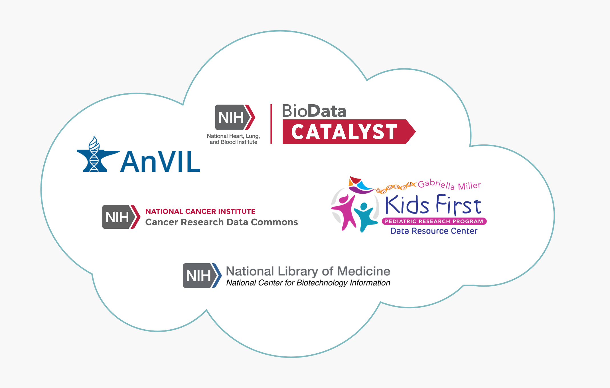

# NIH Cloud Platform Interoperability Effort
### Helping to create a federated genomic data ecosystem

 <hero>The NIH Cloud Platform Interoperability Effort (NCPI) will establish and implement guidelines and technical standards to empower end-user analyses across participating cloud platforms and facilitate the realization of a trans-NIH, federated  data ecosystem.
 </hero>

The NCPI was created as an outcome of the NIH Workshop on Cloud-Based Platforms Interoperability held at RENCI on October 3-4th, 2019 to facilitate interoperability among the genomic analysis platforms established by the NCI, NHGRI, NHLBI and the NIH Common Fund.

## Platforms

The NCPI's  participating platforms are:

[**AnVIL**](/) - The NHGRI Genomic Data Science The Genomic Analysis, Visualization, and Informatics Lab-space, or AnVIL, is NHGRI's genomic data resource that leverages a cloud-based infrastructure for democratizing genomic data access, sharing and computing across large genomic, and genomic-related data sets. [[more]](/ncpi/platforms#nhgri-anvil)

[**BioData Catalyst**](https://biodatacatalyst.nhlbi.nih.gov/) - NHLBI BioData Catalyst is a cloud-based platform providing tools, applications, and workflows in secure workspaces. By increasing access to NHLBI datasets and innovative data analysis capabilities, BioData Catalyst accelerates efficient biomedical research that drives discovery and scientific advancement, leading to novel diagnostic tools, therapeutics, and prevention strategies for heart, lung, blood, and sleep disorders. [[more]](/ncpi/platforms#nhlbi-biodata-catalyst)

[**Cancer Research Data Commons**](https://datacommons.cancer.gov/) - The goal of the National Cancer Institute’s Cancer Research Data Commons (CRDC) is to empower researchers to accelerate data-driven scientific discovery by connecting diverse datasets with analytical tools in the cloud. The CRDC is built upon an expandable data science infrastructure that provides secure access to many different data across scientific domains via Data Commons Framework. [[more]](/ncpi/platforms#nci-cancer-research-data-commons-crdc)

[**Kids First Data Resource Center**](https://kidsfirstdrc.org/)  -  The NIH Common Fund's Gabriella Miller Kids First Pediatric Research Program’s (“Kids First”) vision is to “alleviate suffering from childhood cancer and structural birth defects by fostering collaborative research to uncover the etiology of these diseases and by supporting data sharing within the pediatric research community.”  [[more]](/ncpi/platforms#nih-common-fund---kids-first-data-resource-center)

## Team 
This new interoperability effort is a collaboration between NIH representatives, platform team members and researchers running cross-platform research efforts to inform and validate the interoperability approaches.

## Initial Focus

<hero>The NCPI is helping to enable cross-platform authentication and authorization, cross-platform data discovery and the cross-platform exchange of datasets, analysis workflows and analysis results.</hero>

The NCPI has intentionally constrained the problems we are addressing to those achievable in the near term that can demonstrate value to researchers by enabling specific research projects.
 
 We are currently focused on the deliverables listed below.

### Generic Search Results Hand-off
  
We are working to establish a generic and universal hand-off mechanism so data portal users can further analyze search results on any analysis platform that supports the format.
   
This will allow data portals to develop and maintain a single “export mechanism” which would be available to any analysis platforms that invested in supporting the standard format. Importantly, this gives researchers greater freedom in how and where they compute.

By improving the hand-off of search results from portals to workspace environments through standardization, we will enable researchers to query on multiple portals and aggregate their search results to a common cloud workspace of their choosing in order to perform an analysis. 
 
For example, this will let a researcher search for Kids First and TOPMed data on their respective portals and then take the results to the Terra environment on either AnVIL or BioData Catalyst where they can perform a joint analysis on these data.
  
Currently, this simple scenario has limited or no support across portals and analysis workspaces, making this type of joint analysis impossible for most users.

### Single Sign On Pilot with NIH RAS 

In collaboration with the [NIH CIT Researcher Auth Service (RAS) Initiative](https://datascience.nih.gov/data-infrastructure/researcher-auth-service), we will pilot a single sign on authentication/authorization workflow.

### Cross-Platform Data Discovery

To make the most effective use of the data managed by NCPI platforms, users must be able to view, browse, and search datasets available across all resources. This would allow biomedical researchers to understand what data is already available. This, in turn, will allow for better experimental design of future studies and will prevent duplication of current and past efforts. To allow such "bird's eye view" of the data we are building the NCPI Dataset Catalog. Initially the catalog will use infrastructure built by the [AnVIL project](/data) to generate overview of available datasets. 

## Cross-Platform Research Efforts

 <hero> This interoperability effort is guided by several cross-platform research efforts. Feedback from the research efforts is used to aid discovery of detailed interoperability requirements and validate the utility of the developed features. </hero>
 
There are currently six cross-platform research efforts:

* Three research efforts integrate data from BioData Catalyst and the Kids First DRC.
* Two research efforts integrate data from CRDC and AnVIL.
* One research effort integrates data across Anvil, Kids First DRC and BioData Catalyst.

For more information on the research efforts and their related use cases please see the [Research Use Cases](https://docs.google.com/document/d/1rhxkfUHxOI1Es1SX5kOH1Gadlk-gcOlYEQ6RL9_u_p4/edit#heading=h.91ug8sbahj9o) section of the Systems Interoperation Working Group charter.

 
## Working Groups

The NCPIs has five working groups:

[Community Governance Working Group](/ncpi/working-groups#community-governance-working-group) - Working to establish a set of [principles](/ncpi/interoperating-principles) for promoting interoperability across multiple platforms to remove operational barriers to trans-platform data sharing and analysis.

[Coordination Working Group](/ncpi/working-groups#coordination-working-group) - Coordinating discourse, collaboration, and meetings between the working groups of NCPI.

[FHIR Working Group](/ncpi/working-groups#fhir-working-group) - Assessing the potential of FHIR resources to model and share complex clinical and phenotypic data.

[Outreach and Training Working Group](/ncpi/working-groups#outreach-and-training-working-group) - Creating a public knowledge base with training materials and a cloud cost guide to educate researchers on the research use cases enabled by interoperable cloud based data commons. 

[Systems Interoperation Working Group](ncpi/working-groups#nih-systems-interoperation-working-group) - Testing and implementing technical standards (e.g. GA4GH APIs) for data exchange and demonstrating their effectiveness in enabling key cross-platform research use cases. 

## Progress Updates
The NCPI will give progress updates every six months. Summaries of past progress updates are listed below.

### October 30th  2020 - 3rd NCPI Workshop

* [Agenda](https://docs.google.com/document/d/1xNjYzuC7AUsCK81CQi3IOIdLQZrE1yB98hbXuzkHas4/edit)
* [Detailed Meeting Notes](https://docs.google.com/document/d/1g2nBe6_P-X-TlwzeAkULUdQTi3wpuWyppa7DDApTYhY/edit)

**Day 1**
* [Zoom Recording](https://youtu.be/8HAxEvakPtk) (Video and Audio - 3:45 long)
* [Slide Deck](https://docs.google.com/presentation/d/1SMG73wwpJI8-uAv7cSZ1dn0wyePUEyLkFhbSBl6-2wE/edit)

**Day 2**
* [Zoom Recording](https://youtu.be/Tzs1N30q5Z0) (Video and Audio - 4:12 long)
* [Slide Deck](https://docs.google.com/presentation/d/1jkkpjD_CiYfnFM8dRElGBGXth9-1cLsMV7qYgxxAwNM/edit#slide=id.ga6bb340ce7_1_8)

### April 16, 2020 - 2nd NCPI Workshop

* [Agenda](https://docs.google.com/document/d/1NM_fOdbMKRnT-GFZMWYZ7W65Y0UpQ9lE4RekOvbXg9I/edit)
* [Presentation Slides](https://docs.google.com/presentation/d/1He7naDpPQugrROq8Gh0VjxLiFyDnOuWUukLyToEoNzU/edit?usp=sharing)
* [Zoom Recording](https://drive.google.com/file/d/1sk35jfEl6RDApApJIRawfof5wkXpU5O1/view)

### October 03, 2019 - 1st NCPI Workshop

* [Agenda](https://docs.google.com/document/d/1lA-pgt5-afpM0Vz5ytIv62BlcQmcB-pGhwXf1CHuHhc/edit?usp=sharing)

