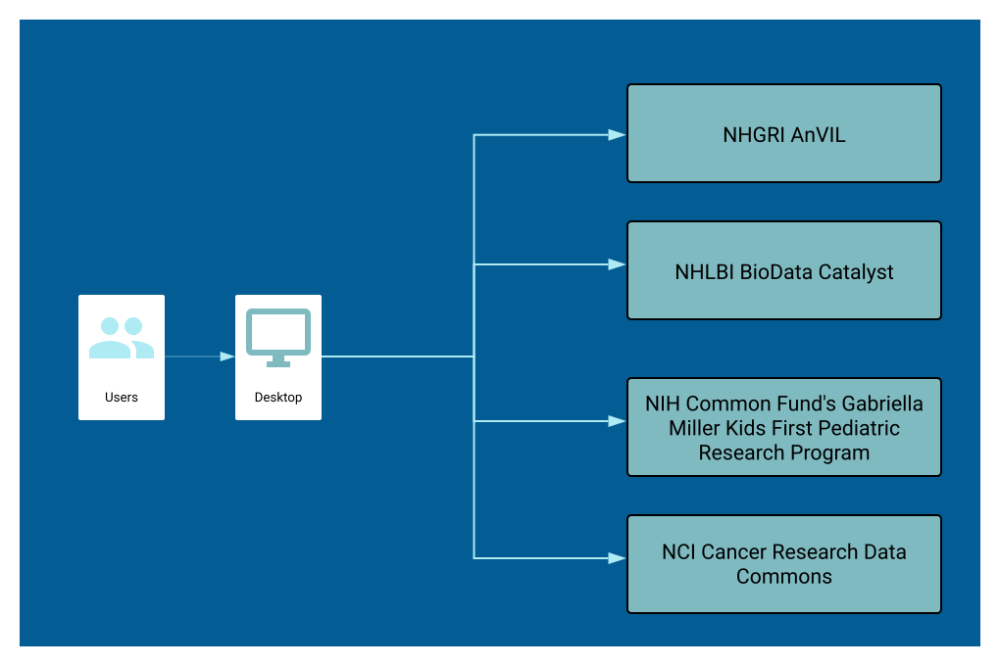
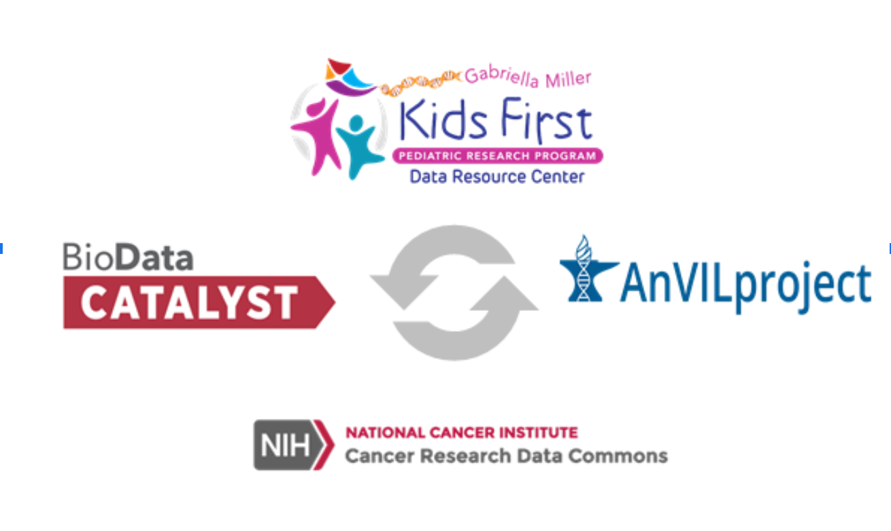

# About the NIH Cloud Platform Interoperability Effort (NCPI)

## Overview

The NIH Cloud Platform Interoperability Effort (NCPI) was created as an outcome of the NIH Workshop on Cloud-Based Platforms Interoperability held at RENCI on Oct 3-4th, 2019 with the purpose of driving interoperability among the genomic analysis platforms established by the NCI, NHLBI, NHGRI and the NIH Common Fund.
 
This new interoperability effort is a collaboration between NIH representatives and team members from each platform and will establish guidelines and technical standards to empower end-user analyses across participating platforms and facilitate the realization of a trans-NIH federated data ecosystem.

 The NCPI will demonstrate progress based on realistic researcher use cases every 6 months.

## Platforms

The NCPI will work to enable analysis across:

* NHGRI AnVIL,
* NHLBI BioData Catalyst,
* NIH Common Fund's Gabriella Miller Kids First Pediatric Research Program,
* and the NCI Cancer Research Data Commons.

## Data Commons

Each of the systems listed above can be classified as “Genomic Data Commons” as they collocate data, cloud computing infrastructure and commonly used tools & applications for managing, integrating, analyzing and sharing data that are exposed through APIs to create an interoperable resource. [1]

### Components of a Data Commons

**Data Portals** allow researchers to query across data they make available to the community.  Examples include the Kids First Data Resource Center Portal (https://portal.kidsfirstdrc.org), the Genomic Data Commons (GDC) Portal (https://gdc.cancer.gov), and the GTEx Portal (https://gtexportal.org).

A **Workspace Environment** is one where users can take links to data files (genomic, clinical, phenotypic, etc) along with analytical tools and put them together, performing analysis at scale through a simple web interface.  Examples include Terra, Seven Bridges Genomics, DNAstack, DNAnexus, and Galaxy.

**Data Storage**

**Workflows**

Each of these platforms above are made up of:

1. portals for finding and aggregating data,
1. cloud based analysis workspaces,
1. collections of analytical workflows and tools,  and
1. cloud-based data storage repositories (in either AWS or Google),

## Interop Technical Use Cases

Authenticate across platforms and platform components -

Authorization across platforms and platform componets - managing approvals

Search for data across plaforms - 

Export data from one plaform to another - 

Harmonize data across platforms and datasets -

Harmonize phenotypic data across platforms and datasets -

Harmonize clinical data across platforms and datasets -

Export an analysis program or workflow  from one platform to another -

Export analysis results from one platform to another -

Run cross platform workflows - 

## Interop Research Use Cases

 This new interoperability effort is being driven by additional key use cases that our research community has identified.

[1] Robert L. Grossman, Data Lakes, Clouds, and Commons: A Review of Platforms for Analyzing and Sharing Genomic Data, https://arxiv.org/abs/1809.01699, 2018.  Alternatively: Trends in Genetics, Volume 35, Number 3, pages 223-234, March, 2019. PMID: 30691868 PMCID: PMC6474403 [Available on 2020-03-01] DOI: 10.1016/j.tig.2018.12.006
  