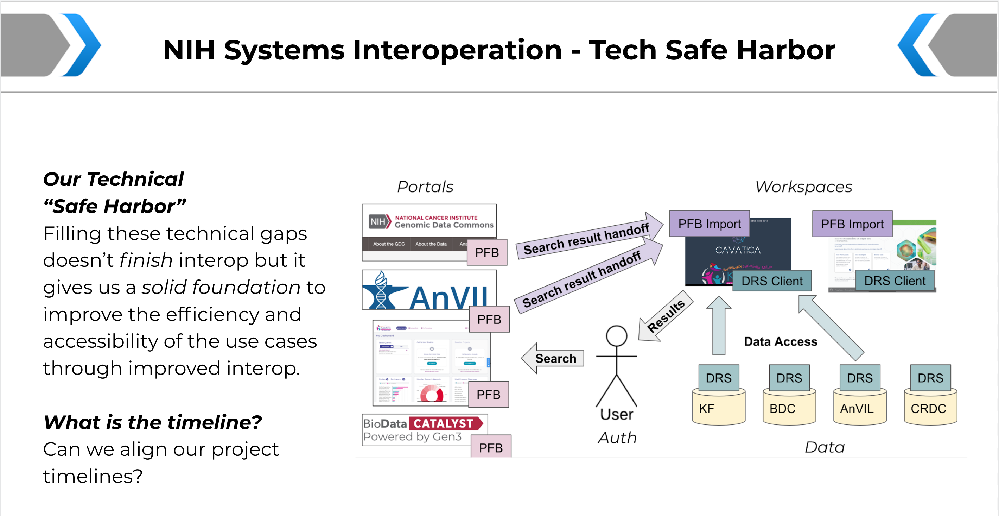

# NIH Systems Interoperation Working Group

<hero small>The AnVIL participates in the NIH Systems Interoperation Working Group.</hero>

## Mission
 The NIH Systems Interoperation Working Group group will spearhead technical improvements to cloud "stacks" created by the Common Fund (Kids First Data Resource Center), NCI (CRDC), NHGRI (AnVIL), and NHLBI (BioData Catalyst) that enable improved interoperability.  We will demonstrate progress rooted in realistic researcher use cases every 6 months.

## Out of Initial Scope

Given the time constraints and interest in showing progress in 6 months, we have purposely constrained the problem we are addressing to that which is achievable and maximizes value to researchers.  In the first 6 months we are not requiring use of a single-sign on mechanism across all datasets or stacks (but feedback for the RAS pilot is certainly expected), harmonization of metadata, or large scale data harmonization across projects.  These are worthwhile and interesting topics that are likely to be future areas of focus for this group.  But we will stay focused initially on the "lowest hanging fruit" in terms of user functionality and interoperability improvements.

## Background

Right now it is very difficult to use GTEx, Kids First, TOPMed, and TCGA cloud-based datasets together (or in distinct combinations).  While data portals make it easy to find data in most cases, it is difficult to take search results from a given data portal to a preferred analysis workspace (cloud compute environment). 
 
 Currently, there is not a way that researchers can browse multiple data portals (Kids First, AnVIL, Catalyst, etc), collect their search results, and take them to a single compute environment of their choosing (Terra, Seven Bridges, Cavatica, DNAstack, Galaxy, etc).
   
  Some data portals can send search results to analysis workspaces (Kids First DRC to Cavatica for example) but this is limited to specific analysis workspace + portal combinations (see Fig 1) while other portals cannot interact with analysis workspaces at all.

Luckily, new and emerging standards (PFB, GA4GH DRS) can help to make the interface between data portals and analysis workspaces consistent, allowing many portals to send search results (e.g. lists of sample IDs and some metadata) to many different analysis workspace environments, ultimately giving researchers better access to data and increased flexibility in their analysis.

<figure-caption>Figure 1: Currently portals can send search results to only specific compute environments (or no compute environments) making it much harder for researchers to use data across multiple projects in a common compute environment of their choice.</figure-captoin>

## Goals
The key goal of this activity is to establish a generic and universal handoff mechanism so Data Portal users can further analyze search results on any analysis platform that supports the format (Figure 2).  This would allow for Data Portals to develop and maintain a single “export mechanism” which would be available to any Analysis Platform that invested in supporting the standard format. Importantly, this gives their users much more freedom in how and where they compute.

<figure-caption>Figure 2: By adopting a common standard to hand off search results from data portals to workspace environments we can 1) give researchers flexibility in how they perform their analysis and 2) we make it possible to work with datasets from different data portals in a common analysis workspace environment, allowing for joint analysis.</figure-captoin>

This group aims to improve interoperability between cloud "stacks" created by the Common Fund (Kids First Data Resource Portal), NCI (CRDC), NHGRI (AnVIL), and NHLBI (BioData Catalyst). The goal over the next 12 months is to expand users’ (researchers) analysis capabilities by interfacing advanced search capabilities available on portals with data analysis workspace environments, managing authorization as efficiently as possible to provide a good user experience.
 
 By improving the handoff of search results from portals to workspace environments through standardization, we will enable researchers to query on multiple portals and aggregate their search results to a common cloud workspace of their choosing in order to perform an analysis. For example, this will let a researcher search for Kids First and TOPMed data on their respective portals and then take the results to the Terra environment where they can perform a joint analysis on these data. Right now, this simple scenario has limited or no support across portals and analysis workspaces, making this type of joint analysis impossible for most users.

## Deliverbles

Build the necessary infrastructure to enable the use cases below
Document the standards and conventions we use so that other systems can implement the same approaches
Provide user-facing materials (blog post, tutorials, and/or documentation) so that other researchers can leverage what is built

To facilitate this each IC resource will:

1. enable users from another IC portal to search their data/tool assets,
1. allow users from another IC resource to "bring" data/tools to the other resource for computation, assuming the appropriate approvals are in place.

