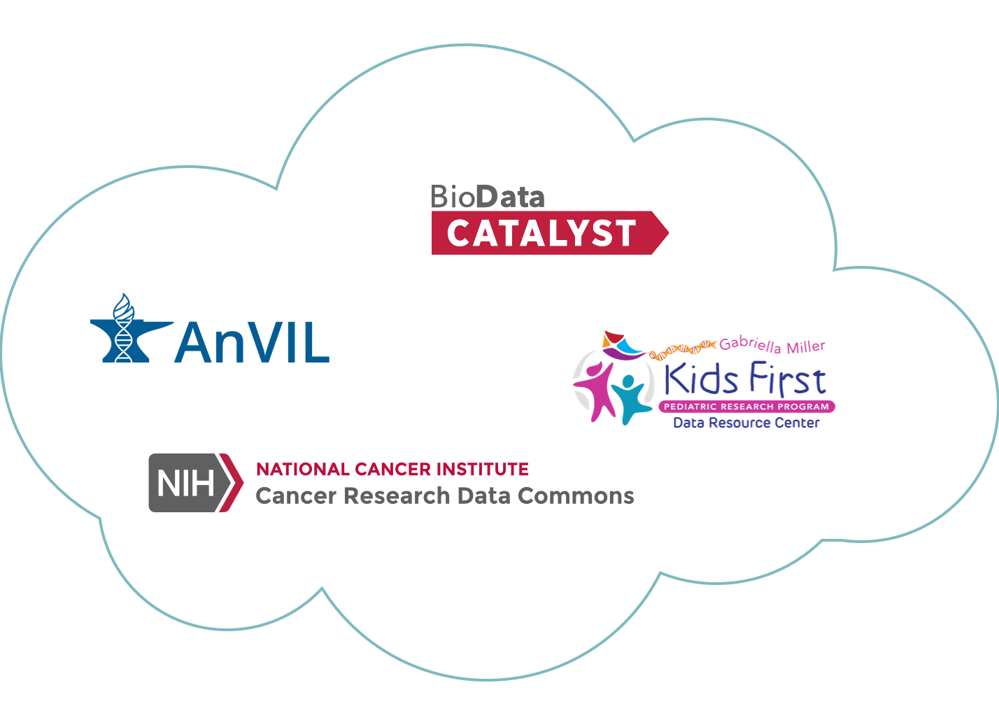

# NIH Cloud Platform Interoperability Effort

## The NCPI is helping to create a federated, genomic data ecosystem.

 <hero small>The NIH Cloud Platform Interoperability Effort (NCPI) will establish and implement guidelines and technical standards to empower end-user analyses across participating platforms and facilitate the realization of a trans-NIH, federated  data ecosystem.
 </hero>

## Overview

The NCPI was created as an outcome of the NIH Workshop on Cloud-Based Platforms Interoperability held at RENCI on October 3-4th, 2019 to facilitate interoperability among the genomic analysis platforms established by the NCI, NHGRI, NHLBI and the NIH Common Fund.

The NCPI's current participating platforms are:

* [AnVIL](https://anvilproject.org),
* [BioData Catalyst](https://biodatacatalyst.nhlbi.nih.gov),
* the [Cancer Research Data Ccommons](https://datacommons.cancer.gov/) and 
* the [Kids First Data Resource Center](https://kidsfirstdrc.org).

 
 
### Team 
This new interoperability effort is a collaboration between NIH representatives, platform team members and researchers running cross-platform research efforts to inform and validate the interoperability approaches.

### Timeline 

The NCPI will demonstrate progress based on specific use cases that enable the  research efforts every six months.
 

### Overview of Collaborating Data Commons

Each of the collaborating data commons securely hosts data in the cloud and collocates that data with a cloud based execution environment for running repeatable analysis workflows.

The NCPI is facilitating the interoperability aspect of these data commons platforms and is helping to enable cross-platform authentication and authorization, cross platform data discovery and the exchange of datasets, analysis workflows and analysis results.

More detail on the individual participating platforms is given below:

[**AnVIL**](/) - The NHGRI Genomic Data Science The Genomic Analysis, Visualization, and Informatics Lab-space, or AnVIL, is NHGRI's genomic data resource that leverages a cloud-based infrastructure for democratizing genomic data access, sharing and computing across large genomic, and genomic-related data sets. [[more]](/ncpi/platforms#analysis-visualization-and-informatics-lab-space-anvil)

[**BioData Catalyst**](https://biodatacatalyst.nhlbi.nih.gov/) - NHLBI BioData Catalyst is a cloud-based platform providing tools, applications, and workflows in secure workspaces. By increasing access to NHLBI datasets and innovative data analysis capabilities, BioData Catalyst accelerates efficient biomedical research that drives discovery and scientific advancement, leading to novel diagnostic tools, therapeutics, and prevention strategies for heart, lung, blood, and sleep disorders. [[more]](/ncpi/platforms#biodata-catalyst)

[**Cancer Research Data Commons**](https://datacommons.cancer.gov/) - The goal of the National Cancer Institute’s Cancer Research Data Commons (CRDC) is to empower researchers to accelerate data-driven scientific discovery by connecting diverse datasets with analytical tools in the cloud. The CRDC is built upon an expandable data science infrastructure that provides secure access to many different data across scientific domains via Data Commons Framework. [[more]](/ncpi/platforms#cancer-research-data-commons-crdc)

[**Kids First Data Resource Center**](https://kidsfirstdrc.org/)  -  The NIH Common Fund's Gabriella Miller Kids First Pediatric Research Program’s (“Kids First”) vision is to “alleviate suffering from childhood cancer and structural birth defects by fostering collaborative research to uncover the etiology of these diseases and by supporting data sharing within the pediatric research community.”  [[more]](/ncpi/platforms#kids-first-data-resource-center)

## Our Initial Focus

The NCPI has intentionally constrained the problems we are addressing to those achievable in the near term  which can demonstrate value to researchers by enabling specific research projects. We are currently focused on the following deliverables:

### Generic Search Results Hand-off
  
 We are working to establish a generic and universal hand-off mechanism so data portal users can further analyze search results on any analysis platform that supports the format.
   
 This will allow data portals to develop and maintain a single “export mechanism” which would be available to any analysis platforms that invested in supporting the standard format. Importantly, this gives researchers greater freedom in how and where they compute.

By improving the hand-off of search results from portals to workspace environments through standardization, we will enable researchers to query on multiple portals and aggregate their search results to a common cloud workspace of their choosing in order to perform an analysis. 
 
 For example, this will let a researcher search for Kids First and TOPMed data on their respective portals and then take the results to the Terra environment where they can perform a joint analysis on these data.
  
 Currently, this simple scenario has limited or no support across portals and analysis workspaces, making this type of joint analysis impossible for most users.

### NIH RAS Single Sign On Pilot

In collaboration with the NIH CIT Researcher Auth Service (RAS) Project, we will pilot a single sign on authentication/authorization workflow.

## We are guided by cross-platform research efforts.

 <hero small> This interoperability effort is guided by several research efforts that exercise specific research use cases. Feedback from the research efforts is used to aid discovery of detailed interoperability requirements and validate the utility of the developed interoperability features. </hero>
 
### Our first research efforts make use of cross-platform data exchange.

There are currently six active driver research efforts:

* Three research efforts integrate data from BioData Catalyst and the Kids First DRC.
* Two research efforts integrate data from CRDC and AnVIL.
* One research effort integrates data across Anvil, Kids First DRC and BioData Catalyst.

For more information on the research efforts and their related use cases please see the [Research Use Cases](https://docs.google.com/document/d/15BFO2-RlOUqIMY87bKSqlxUcb4qlaNiY-Q6Imk7WREo/edit?pli=1#heading=h.91ug8sbahj9o) section of the Systems Interoperation Working Group charter.

 

## Working Groups

The NCPIs has five working groups:

[Community Governance Working Group](/ncpi/working-groups#community-governance-working-group) - Establish a set of [principles](/ncpi/interoperating-principles) for promoting interoperability across multiple platforms to remove operational barriers to trans-platform data sharing.

[Coordination Working Group](/ncpi/working-groups#coordination-working-group) - Coordinate discourse, collaboration, and meetings between the working groups of NCPI.

[FHIR Working Group](/ncpi/working-groups#fhir-working-group) - Assess the potential of FHIR resources to model and share complex clinical and phenotypic data.

[Outreach and Training Working Group](/ncpi/working-groups#outreach-and-training-working-group) - Create a public knowledge base with training materials and a cloud cost guide to educate researchers on the research use cases enabled by interoperable cloud based data commons. 

[Systems Interoperation Working Group](ncpi/working-groups#nih-systems-interoperation-working-group) - Test and implement technical standards (e.g. GA4GH APIs)  for data exchange and demonstrate their effectiveness by enabling key cross-platform research use cases. 

## Progress Updates
The NCPI will give progress updates every six months. Summaries of past progress updates are listed below:

1. [April 16, 2020 -  NIH Interoperability Workshop (Remote)](/ncpi/progress-updates/ncpi-progress-update-2020-04-16)
