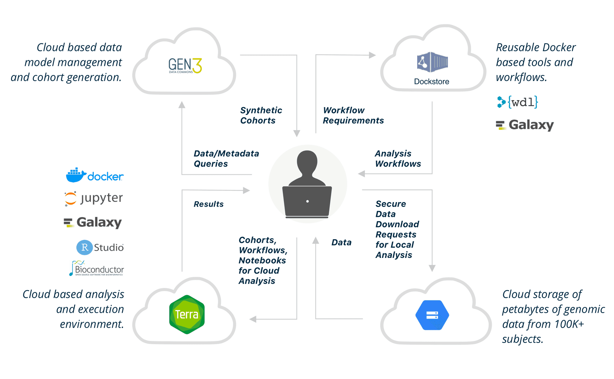
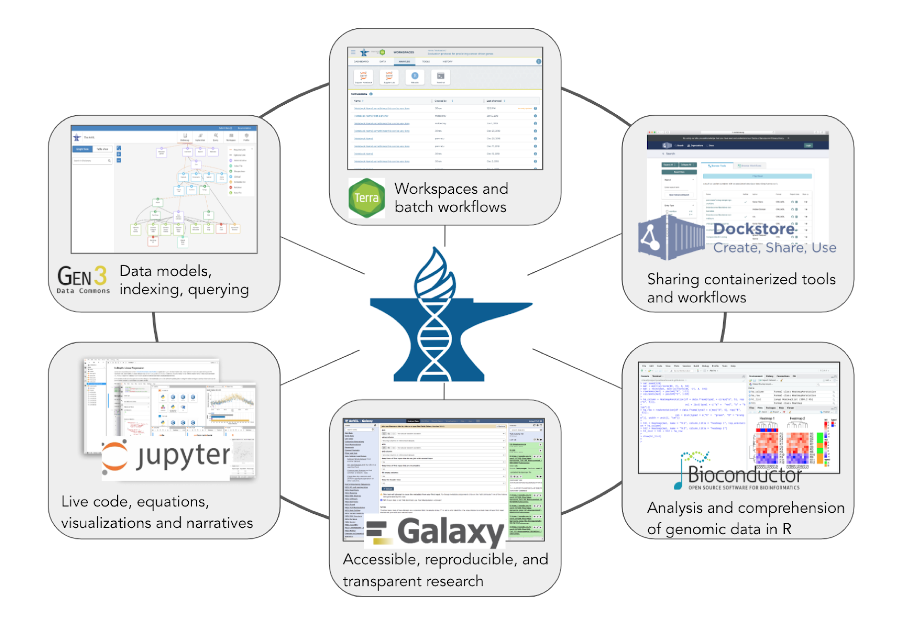

# NHGRI Analysis and Visualization Lab-space (AnVIL)
<https://anvilproject.org/>

<socials>
<social-twitter-handle handle="useAnVIL" showbird="true"></social-twitter-handle>
<social-youtube url="https://www.youtube.com/channel/UCBbHCj7kUogAMFyBAzzzfUw"></social-youtube>
</socials>

The NHGRI AnVIL is a cloud based environment that hosts high value data sets and commonly used bioinformatics tools in a secure FedRAMP-certified environment that can scale to meet the computational needs of researchers.

The AnVIL will provide automated data access with the DUOS platform. AnVIL users have access to extensive training materials spanning from general genomics to advanced analysis methods using modular and open access Massively Open Online Courses (MOOCs).

### Funder
National Human Genome Research Institute, Eric Green (director), Valentina Di Francesco (program officer), Ken Wiley (program officer).

### PIs
Schatz, Philippakis, O’Connor, Grossman, Morgan, Paten, Nekrutenko, Carroll, Goecks, Hall (Ira), Hall (Jennifer), Tan, Hansen, Overby Taylor, Carey, Afgan, Leek, Ellrott, Waldron, Wang, Banks, Lawson, O’Donnel, Luria.

### Institutions
The Broad Institute, Johns Hopkins University, University of Chicago, Penn State University, University of California, Santa Cruz, Oregon Health and Sciences University, Harvard University, Vanderbilt University, Roswell Park Comprehensive Cancer Center, Washington University, City University of New York, American Heart Association, Carnegie Inst. for Science, Yale University.

## Datasets

Source | Cohorts | Samples | Participants | Size (TB)
-- | -- | -- | -- | --
CCDG | 198 | 270,135 |256,318 | 2,582
CMG | 39 | 15,732 | 14,973 | 61
1000 Genomes | 1 | 3,202 |3,202 | 73
GTEx (v8) | 1  | 17,382 | 979 | 182 
Convergent Neuro | 2 | 304 | 304 | 5
HPRC | 1 | 57 | 47 | 160
PAGE | 4 | 690 | 690 | 17
WGSPD1 | 5 | 1,504 | 9,943 | 176
T2T | Pending | Pending | Pending |Pending
eMERGE* | Pending | Pending | Pending | Pending
All Datasets | 251 | 309,006 | 286,456 | 3,256

## Tools

- AnVIL uses the Terra platform to launch and run tools on Google Cloud Platform within a FedRAMP-certified secure boundary.
- Users can currently run batch analysis with WDL and interactive analysis with:
     - Bioconductor,
     - Galaxy, 
     - seqr,
     - Jupyter Notebooks supporting Python, R and RStudio.

- The Dockstore workflow repository is integrated with Terra, providing access to hundreds of published workflows.

- AnVIL enables users to bring their own tools to the platform.

## Authentication

- Both Google emails and NIH RAS IDs are used as an authentication mechanism for controlled access data.

## Authorization

- Consortium and developer whitelists are maintained to provide access to data.
- General users submit DARs through dbGAP.

## Indexing

- Data objects are assigned permanent globally unique IDs (GUIDs) to allow for access across tools, without requiring copies be created and transferred.
- Datasets are identified through faceted search over phenotypic data.

## Data Models

- AnVIL has adopted the Terra Interoperability data model ([TIM](https://datamodel.terra.bio/)), an expandable data mode to support multiple, diverse data models.

## Security
* FedRAMP Certified
* FedRAMP 1 ATO

## Architecture 

