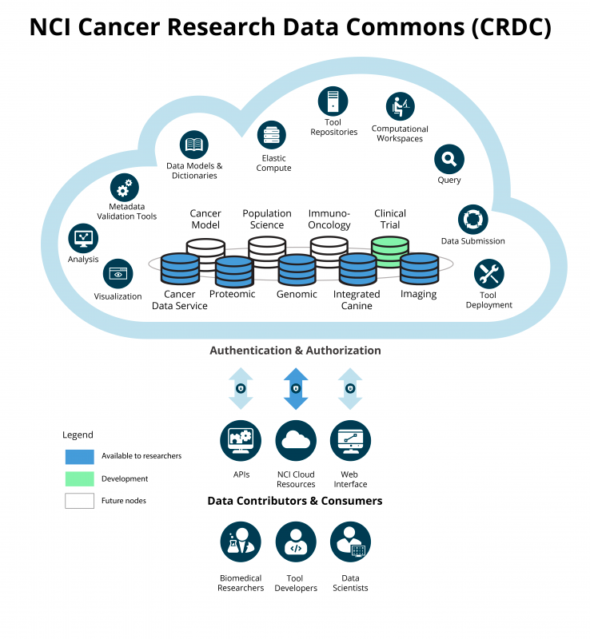
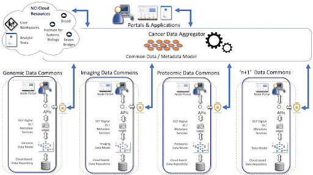

# NCI Cancer Research Data Commons (CRDC)
<https://datacommons.cancer.gov/>
<socials>
<social-twitter-hashtag hashtag="NCICommons" showbird="true"></social-twitter-hashtag>
<social-twitter-handle handle="genomicscloud"></social-twitter-handle>
<social-twitter-handle handle="BroadFireCloud"></social-twitter-handle>
<social-twitter-handle handle="isb_cgc"></social-twitter-handle>
<social-youtube url="https://www.youtube.com/embed/tk1nEX2gnqk"></social-youtube>
</socials>

`video: https://youtu.be/tk1nEX2gnqk`

### Vision
To enable all participants across the cancer research and care continuum, including providers and patients, to contribute, access, and analyze diverse data that will enable new discoveries and lower the burden of cancer.

### Mission
To create a virtual, expandable infrastructure that provides secure access to multi-modal data, allowing users to analyze, share, and store results, leveraging the storage and elastic compute of the cloud.

### Approach
To provide interoperable resources through federation, data harmonization, standards, and tools and services that can be reused across the research community and to enable enhanced data sharing.

### Funder
The CRDC is funded by the NCI.

### PIs
Anand Basu, Andrey Fedorov, Bill Longabaugh, Bob Grossman, Brandi Davis-Dusenbery, Brian O’Conner, David Pot, Melissa Haendel, Ron Kikinis.

### Institutions
Brigham and Women’s Hospital,
Enterprise Science and Computing (ESAC),
Frederick National Labs,
General Dynamics Information Technology,
Institute for Systems Biology,
Oregon State University,
Seven Bridges,
The Broad Institute,
University of Chicago.

## Datasets

- **Genomics** - [BEATML](https://www.cancer.gov/about-nci/organization/ccg/blog/2019/beataml),[CCL](https://www.cancer.gov/about-nci/organization/ccg/blog/2019/beataml), [CGCI](https://gdc.cancer.gov/cancer-genome-characterization-initiatives-cgci), COSMIC, [CPTAC](https://proteomics.cancer.gov/programs/cptac), [CTSP](https://www.ncbi.nlm.nih.gov/projects/gap/cgi-bin/study.cgi?study_id=phs001175.v1.p1), [FM](https://www.ncbi.nlm.nih.gov/projects/gap/cgi-bin/study.cgi?study_id=phs001175.v1.p1), [GECCO](https://www.natureindex.com/institution-outputs/united-states-of-america-usa/genetics-and-epidemiology-of-colorectal-cancer-consortium-gecco/5397fd27140ba04e30000000), HCA, [HCMI](https://gdc.cancer.gov/human-cancer-model-initiative-hcmi), LCCC 1108, [MMRF](https://gdc.cancer.gov/about-gdc/contributed-genomic-data-cancer-research/foundation-medicine/multiple-myeloma-research-foundation-mmrf), [NCICCR](https://gdc.cancer.gov/about-data/publications/DLBCL-2018), [Organoid](https://www.ncbi.nlm.nih.gov/projects/gap/cgi-bin/study.cgi?study_id=phs001611.v1.p1), PPTC, [TARGET](https://ocg.cancer.gov/programs/target), [TCGA](https://registry.opendata.aws/tcga/), [VAREPOP](https://www.ncbi.nlm.nih.gov/projects/gap/cgi-bin/study.cgi?study_id=phs001374.v1.p1)

- **Proteomics** - [CPTAC2](https://cptac-data-portal.georgetown.edu/cptac/public?scope=Phase+II+%2525), [CPTAC3](https://cptac-data-portal.georgetown.edu/cptac/public?scope=Phase+III), CPTAC-TCGA, [PBTA](https://cptac-data-portal.georgetown.edu/cptac/s/S047;jsessionid=76FD96700FC7D8999669204518B48BB4), [ICPC](https://proteomics.cancer.gov/programs/international-cancer-proteogenome-consortium#:~:text=The%20International%20Cancer%20Proteogenome%20Consortium,cancer%20and%20proteogenomic%20research%20centers.)

- **Imaging** - [TCIA](https://www.cancerimagingarchive.net/)

- **30+ datasets** - covering genomics, proteomics, imaging, and more. Some data are present in both AWS and GCP, some present only on one cloud infrastructure.

- **~300 Reference and analyzed datasets** - available in BigQuery

- Bring your own data is available on Cloud Resources.

- New data being added through both existing and new data nodes on a continual basis.

- Key dataset list at : https://datacommons.cancer.gov/data#key-datasets

## Tools

### Cloud Resources

- **Seven Bridges** - 400+ publicly available tools and workflows in Common Workflow Language, + Dockstore, Rstudio, Jupyter notebooks, collaborative genome browser

- **Broad** - >700+ publicly available workflows and tools in Workflow Development Language, Integrated Genome Viewer, Docktore, Jupyter notebooks, BigQuery, ML,  pipelines

- **ISB-CGC** - Google: VMs, BigQuery, AI, ML, Pipelines, Cohorts, Image Viewers, Notebooks, Plotting, Dockstore

- Bring your own tools is available.

### Data Repositories
- [GDC](https://gdc.cancer.gov/) - Data Analysis Visualization Exploration ([DAVE](https://gdc.cancer.gov/analyze-data/gdc-dave-tools)) tools  
- [PDC](https://pdc.cancer.gov) - Pepquery, Morpheus, Genome Browser, DDA & DIA common data analysis pipelines

### Analytical Tools
- List of analytical tools: https://datacommons.cancer.gov/analytical-tools 

## Authentication

- eRA Commons IDs (controlled data)
- [NCI Data Commons Framework Services](https://dcf.gen3.org/) (DCFS) by Gen3
- Individual, OIDC platform authentication

## Authorization

- eRA Commons IDs (controlled data)
- NCI Data Commons Framework Services (DCFS) by Gen3
- Individual, OIDC platform authentication

## Indexing

- Permanent globally unique IDs (GUIDs) for data in Google & Amazon locations
- GUIDs are cloud-agnostic, promoting access and providing a mechanism for versioning data

## Data Models

- There are many data models across the CRDC, including [ICDC](https://cbiit.github.io/icdc-model-tool/), [CTDC](https://cbiit.github.io/ctn-model/), [PDC](https://pdc.cancer.gov/data-dictionary/dictionary.html), and [GDC](https://gdc.cancer.gov/developers/gdc-data-model)
- Center for Cancer Data Harmonization develops overarching model and mapping.
- CRDC also  participates in GA4GH efforts

## Architecture 
### User Perspective

### System Perspective

