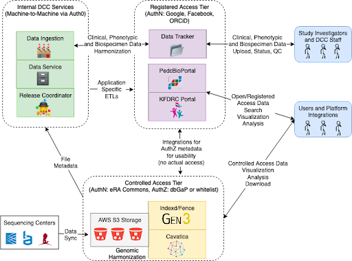

# Kids First Data Resource Center
[https://kidsfirstdrc.org](https://kidsfirstdrc.org)

<socials>
<social-twitter-handle handle="kidsfirstdrc" showbird="true"></social-twitter-handle>
<social-youtube url="https://www.youtube.com/channel/UCK9sPu0j4_ci4m3nNFa6gVw/featured"></social-youtube>
</socials>

`video: https://www.youtube.com/watch?v=6lGbSnn3JGw`

## Vision

Gabriella Miller Kids First Vision: Alleviate suffering from childhood cancer and structural birth defects by fostering collaborative research to uncover the etiology of these diseases and supporting data sharing within the pediatric research community.

## Funder
NIH Common Fund’s Gabriella Miller Kids First Pediatric Research Program; administered by NHLBI (PO: Charlene Schramm) overseen by [NIH Kids First Working Group](https://commonfund.nih.gov/kidsfirst/members).

## PIs 
Adam Resnick, Brandi Davis-Dusenbery, Vincent Ferretti, Robert Grossman, Allison Heath, Deanne Taylor, Sam Volchenboum.

## Institutions
Children’s Hospital of Philadelphia, CHU Sainte-Justine, University of Chicago, Seven Bridges Genomics.

## Data

### Portal
<https://portal.kidsfirstdrc.org/>

### Kids First Released Datasets (22K + Participants):
- 21 Kids First datasets released as of 9/14 (more in coming weeks)
    - **14 Structural Birth Defects datasets** spanning congenital diaphragmatic hernia, congenital heart defects, orofacial cleft, other craniofacial anomalies, disorders of sex development etc.
  - 7 **Childhood Cancer datasets** spanning neuroblastoma, ewing sarcoma, leukemia, enchondromatoses etc.
  - **1 cohort of children with both structural birth defects and cancer**

- 5 fully interoperable datasets (e.g., TARGET, CBTN)

### Totals
- 44 datasets
- 48,000 genomes
- 20,000 cases approved for Sequencing as Part of Kids First ([Link](https://commonfund.nih.gov/kidsfirst/x01projects))

## Interoperability Use Cases
We have a number of researchers that will be working across datasets in multiple platforms. In general, pediatrics and developmental biology spans organs, disease and data types - making effective and sustained interoperability a critical need.

Examples of overlapping cohorts:
- **INCLUDE**: KFDRC and INCLUDE Data Hub
- **PCGC**: KFDRC and BDC
- **CMG**: KFDRC and AnVIL
- **CSER**: KFDRC and AnVIL
- **NBL**: KFDRC and NCI CRDC
- **AML**: KFDRC and NCI CRDC
- **Brain Tumors/CCDI**: KFDRC and NCI CRDC

Early on, we realized we needed “intra”-operability for releases and developed a release coordination protocol. Perhaps an area for interoprability as well.

## Clinical/Phenotipic Data Interop Pilot Opportunities
Clinical and phenotypic data has been identified as a limiting factor across supported studies. The wide range provides challenges, but also opportunities for interoperability. Areas under investigation include:

* FHIR as a core standard
* Terminologies for harmonized and computable data values
* Identifying virtual cohorts across the platforms based on clinical and phenotypic data
* Workflows for clinical/phenotypic data harmonization

## Tools
### Kids First DRC Workflows
- **Goal** - functional equivalency to other large datasets/resources
- **Germline** - Trio/family-based GATK germline best practices
- **Somatic** - Strelka2, Mutect2, Lancet, VarDict, Manta, Control-FREEC
- **RNA-Seq** - STAR 2-pass, RSEM, Kallisto, STAR-fusion, Arriba
### CAVATICA
- Over 450 public apps
- Interactive analysis with Jupyter Notebooks and RStudio
- Over 500,000 workflows run on CAVATICA since launch in March 2016
### Variant Workbench (Coming Soon!)
- Query Kids First data within a Zeppelin Notebook environment
- Identify rare variants using SQL and PySpark 
## Integration with PedCBioPortal
- Open access visualization and analysis of somatic mutations, expression, proteomics

## Authentication

- **Controlled access** - eRA Commons
- **Registered access** - Google, Facebook and ORCiD (OAuth2)

## Authorization 

- **NIH Datasets** - Telemetry reports from dbGaP either to Kids First Framework Services or NCI CRDC Framework Services

- **Consortium Datasets** - Whitelist via Gen3 (also eRA Commons AuthN)

## Indexing

The Kids First Data Service integrates with Gen3 indexd to index and associate relevant data for querying to the files. Cavatica also recently released GA4GH DRS endpoints for all files.

## Architecture

