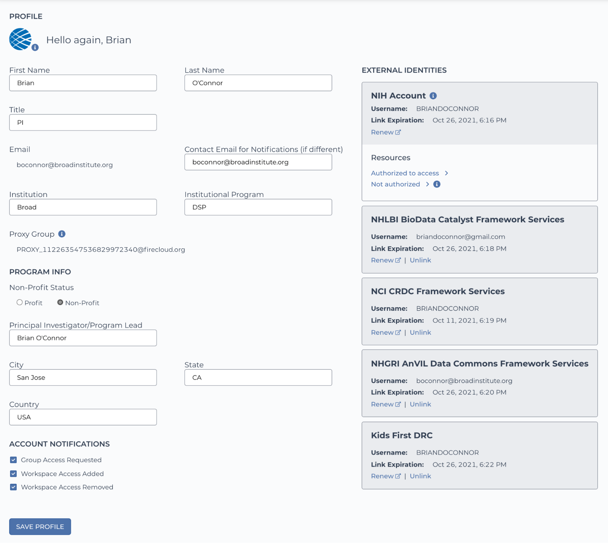
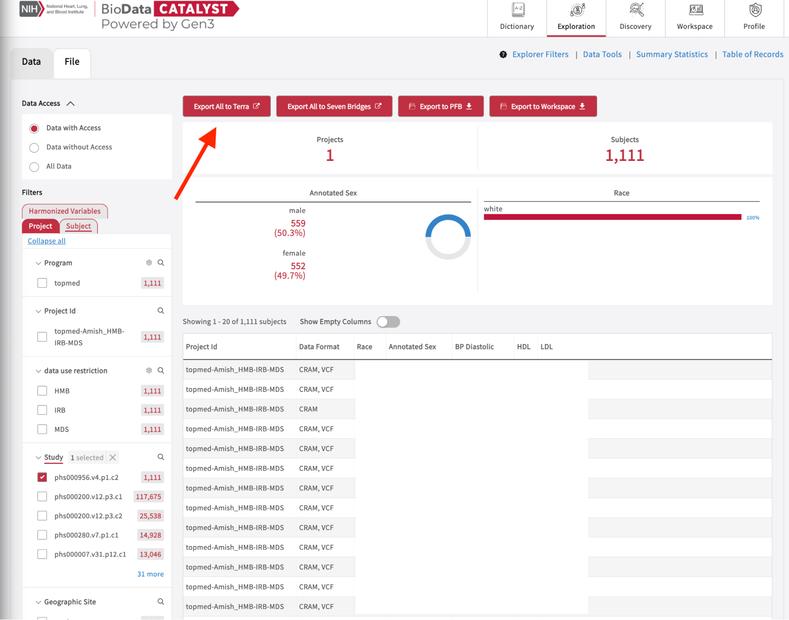
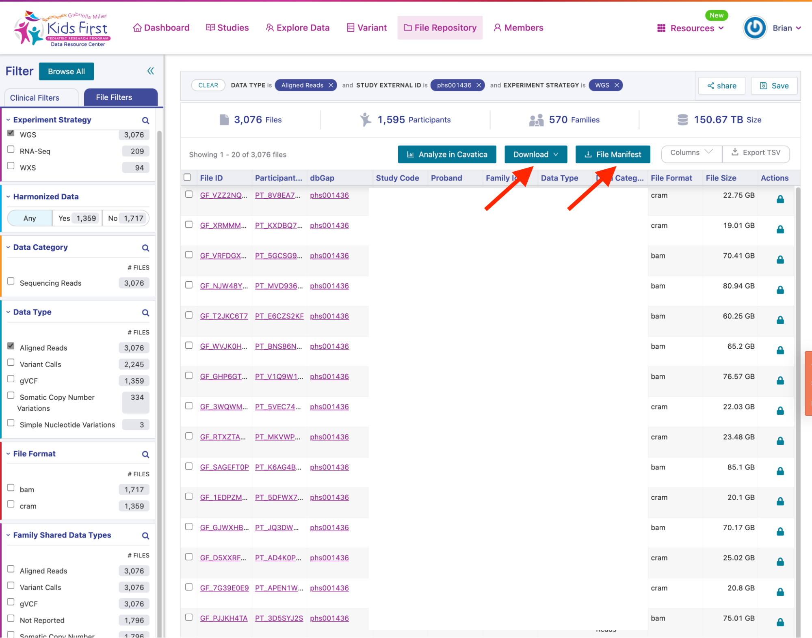
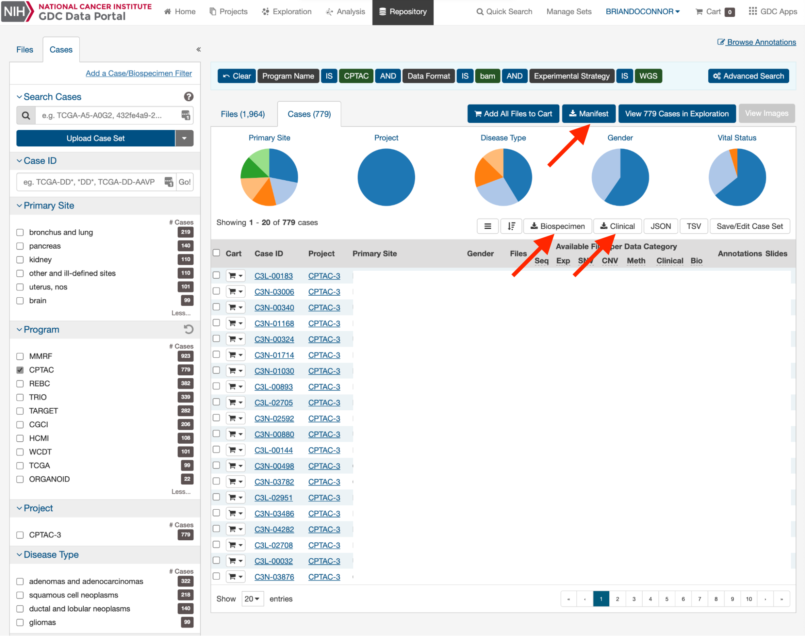
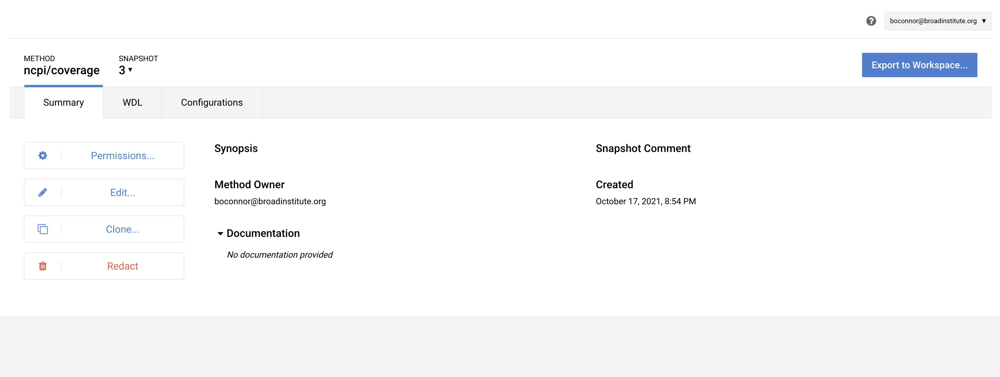
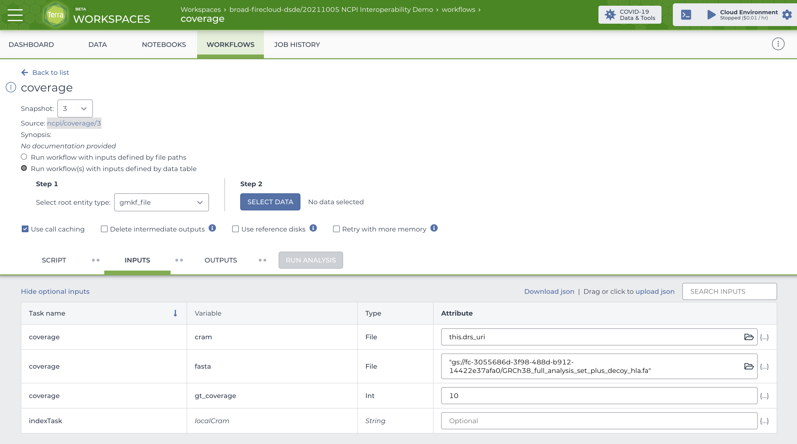
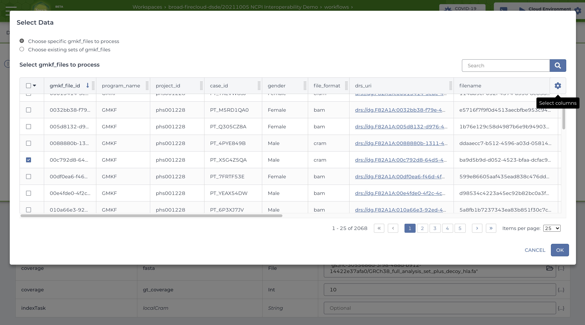

# NCPI October 2021 Interop Demo

## Background

The [NCPI](https://anvilproject.org/ncpi) effort was created in October of 2019 to facilitate interoperability among the genomic analysis platforms established by the NCI, NHGRI, NHLBI, the NIH Common Fund, and NCBI. It is a collaboration between NIH representatives, platform team members, and researchers running cross-platform research efforts to inform and validate the interoperability approaches.

From a researchers' standpoint the 5 groups are making it easier to work across datasets and projects in the Terra and Seven Bridges cloud analysis platforms. Because of NCPI and the interoperability it has promoted, researchers can use a Terra or SBG environment of their choice to access *all* NCPI data.

Previous to the NCPI effort, researchers had the choice of applying for dbGaP access for datasets and then either 1) downloading the files to their local institution or 2) using specific environments for specific datasets (e.g. Cavatica for GMKF data, Terra for AnVIL data). This made it harder to ask scientific questions *across* datasets.

NCPI has improved interoperability between NIH systems by:

* promoting the adoption of the NIH RAS Passport system for authN/Z, this gives a single-signon for researchers with authorization information from dbGaP
* promoting the use of GA4GH DRS for making accessing data on the cloud seamless regardless of computational platform a researcher is using
* promoting alignment of policies between NCPI systems to allow for researchers to work across them

As of October 2021, the NCPI systems are linked together using RAS+DRS. This means a researching working in Terra or SBG can access >11PB of 'omics data from AnVIL, BioData Catalyst, CRDC, and Kids First in a single workspace for the first time.

## About this Repo

This repository is essentially a tutorial showing how I was able to leverage the NCPI system interoperability to start the initial phases of Melissa Wilson's ["Sex as a Biological Variable"](https://docs.google.com/document/d/1y7Mt0JFA4REp2IELlWAVwiIrq_6i7_n3tQOpoxzMeWI/edit#heading=h.1vxylonbp5xz) use case. NCPI uses researcher use cases like this one to drive its work. I did the following for this demonstration:

1. I picked a single dbGaP project from AnVIL, BDCat, CRDC, and Kids First that included both WGS data (bams and crams) and sex annotations. I applied for access in dbGaP (for those needed).
1. For each project, I browsed the respective portal and downloaded manifests (GMKF and CRDC) or clicked the export to Terra button directly
1. I ran my script to convert manifests to TSV data models that Terra could understand for GMKF and CRDC, including DRS URIs
1. I uploaded those to the same Terra workspace that I sent AnVIL and BDCat data to through the 'send to Terra' buttons
1. I wrote a WDL workflow that does a basic QC step which is the first step in Melissa Wilson's XYAlign pipeline (coverage)
1. I parameterized the workflow with a subset of files and ran it

This is simple but it shows a few key things:

* I could run a workflow in Terra on data I was authorized to use from AnVIL, BDCat, CRDC, and Kids First
* no data was duplicated and paid for by me, Terra understood how to use DRS to stream in data on demand from the same cloud/region (AnVIL, BDCat, CRDC) or over the Internet from AWS without charge. Not needing to make copies of data to work with them save huge amounts of time and money
* the total data available for these platforms is ~11PB, if I was authorized to access all those projects I could, in theory, use this approach to access all data from each of them

My hope is others can use this basic approach to access the portion of the ~11PB of data that makes sense for their research and work with it easily in Terra.

## Dependencies

For local development (say you want to extend the scripts I used to process the manifest files) you need Docker (along with `docker-compose`) setup and running on your computer.

If you just want to run these scripts you will also need to run these through docker-compose or figure out the dependencies to run outside of Docker (Python plus a few libraries, easy).

Once you get your manifests processed to something ready for use on the cloud you need:

* a [Terra.bio](https://app.terra.bio) account
* connection in Terra to authorization for each system (AnVIL, BDCat, CRDC, and Kids First)
* the workflow uploaded to Terra, see the workflows directory



Make sure you account link for the AnVIL, BDCat, CRDC, and Kids First systems.

## Running

To run the environment that has all the dependencies installed:

- `git clone https://github.com/briandoconnor/ncpi-interop-demo.git`
- `docker-compose up --build` to build and launch a Docker environment

## Connecting

Once you have the Docker running, you can connect using:

```
# connect from your computer terminal
$> ./connect.sh

# now go to the working directory with my script
root@02d2b8fce3af:~# cd python/scripts/python_manifest_transform_script/
```

This is an environment where you can run the script below with all dependencies pre-installed.

You can copy manifests from the GMKF and CRDC portals here.

## Data & Manifests

I selected a single project form each of AnVIL, BDCat, CRDC, and GDC:

### AnVIL

I'm using GTEx V8, which has 838 subjects with WGS and sex annotations.


This is easy to import to Terra, just use the "Export all to Terra" button.\
No need to transform manifests using my script.

### BDCat

I'm using NHLBI TOPMed: Genetics of Cardiometabolic Health in the Amish. dbGaP Study Accession: phs000956.v4.p1.c2, which has WGS w/ sex, 1,111 subjects.



This is easy to import to Terra, just use the "Export all to Terra" button.\
No need to transform manifests using my script.

### GMKF

I'm using Gabriella Miller Kids First (GMKF) Pediatric Research Program in Susceptibility to Ewing Sarcoma Based on Germline Risk and Familial History of Cancer, dbGaP Study Accession: phs001228.v1.p1. WGS w/ sex, aligned reads, 1595 subjects.

You need to download the manifest, biospecimen, and clinical files (convert excel to TSV).



### GDC

I'm using the National Cancer Institute’s Clinical Proteomic Tumor Analysis Consortium (CPTAC), WGS w/ sex, 779 subjects.

You need to download the manifest, biospecimen, and clinical files (convert excel to TSV).



## Python Manifest Transform Script Usage

I have a basic script located in `cd python/scripts/python_manifest_transform_script/process_manifest.py` that transforms a manifest from the GMKF and CRDC portals into something you can upload to Terra.

The magic ingredient here is knowing how to turn file IDs from these two platforms into DRS URIs that Terra understands.

If you want more information on the DRS servers used in the project, their prefixes, and hostnames, see this [document](https://docs.google.com/document/d/1Wf4enSGOEXD5_AE-uzLoYqjIp5MnePbZ6kYTVFp1WoM/edit#).

Here are examples of calling the script on manifests (+other data) from GMKF and CRDC (GDC) portals:

### GDC

```
python process_manifest.py --gdc gdc/gdc_manifest.2021-09-28.txt --clinical gdc/clinical.tsv --aliquot gdc/aliquot.tsv > gdc_workspace.tsv
```

You can find links to the manifest, clinical, and aliquot files on the search results page in GDC (repository tab).

### GMKF

```
python process_manifest.py --gmkf gmkf/kidsfirst-participant-family-manifest_2021-09-30.tsv  --clinical gmkf/clinical.tsv > gmkf_workspace.tsv
```

You can then upload the gmkf_workspace.tsv and gdc_workspace.tsv files to your Terra workspace.

## Uploading TSVs to Terra

You can see what this process looks like in a video I posed to YouTube [here](https://www.youtube.com/watch?v=Gr0C1KYOZi8).

## Uploading the Workflow to Terra

I created a simple WDL in `workflows/myWorkflow.wdl`

You can add this to your Terra workspace under the workflows tab. Just use the "Find a Workflow" button, click Broad Methods Repository, and this will let you upload the WDL as a workflow on Terra that you can then export to this workspace.



You can see the image below for how I configured it in the workspace below.



## Running the Workflow in Terra

Now that you have your workspace created, populated with pointers to data from AnVIL, BDCat, CRDC, and GMKF, and the coverage workflow has been uploaded you can now run the workflow by selecting data. In this figure I'm selecting a single CRAM to process from GMKF. You can do something similar and then run the workflow. Keep in mind, I've only tested with CRAMs currently.



## Terra Workspace

I created a private workspace to try out this process, see [20211005 NCPI Interoperability Demo](https://app.terra.bio/#workspaces/broad-firecloud-dsde/20211005%20NCPI%20Interoperability%20Demo). You need to be added to the workspace to access it, I will be handing this off to the user ed team shortly to make a public workspace that anyone can access.

## More Info

### The Future

In the future I'm hoping the GMKF and GDC portals will include the ability to directly send search results to Terra to avoid the hassle of having to create TSV file uploads from the manifests.

I'm also hoping to flesh out this tutorial more completely since I realize it presumes a lot of knowledge about NCPI and Terra. I hope this work can also be picked up by both the Terra User Ed team and the User Outreach team of NCPI for broader distribution.

### Python Version

See the [official python images](https://hub.docker.com/_/python) on DockerHub as well as the [releases of Debian](https://wiki.debian.org/DebianReleases). I'm using Debian Buster and Python 3 as the basis for the Python environment that gets launched:

```
python:3-buster
```

It's probably a good idea to use a specific version number of Python when writing real scripts/services.

### Dev Environment Origins

This project dev environment is inspired by, and forked from, this blog post:

** Simplified guide to using Docker for local development environment**

_The blog link :_

[https://blog.atulr.com/docker-local-environment/](https://blog.atulr.com/docker-local-environment/)
