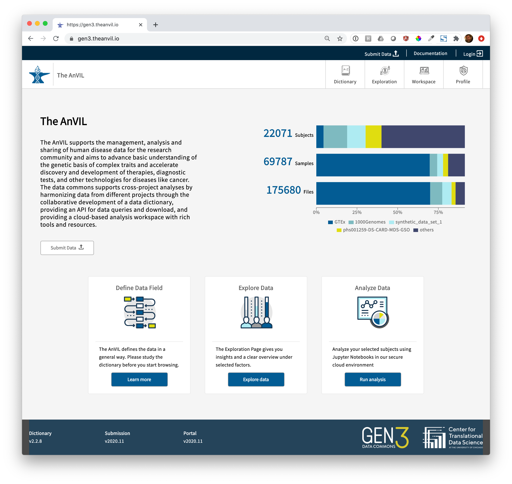

# Announcing Gen3 Availability in AnVIL

Gen3 was deployed into production within AnVIL in June 2020, and since then many thousands of subjects have been indexed from the 1000 Genomes, GTEx, CCDG and CMG projects. The remaining cohorts in AnVIL from the CMG and CCDG projects are currently in processing

Gen3 is a cloud-based software platform for managing, analyzing, harmonizing, and sharing large datasets. As an open source platform for developing data commons, Gen3 accelerates and democratizes the process of scientific discovery, especially over large or complex datasets.

Researchers may visit https://gen3.theanvil.io/ to explore AnVIL's Gen3 indexed datasets, create virtual cohorts in the Gen3 Data Explorer and export them to [AnVIL's Terra instance](https://anvil.terra.bio/#workspaces) for analysis. 

