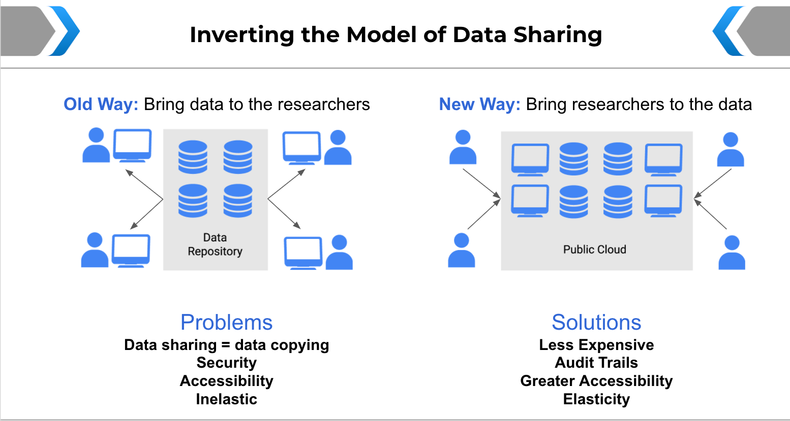

# Introducing AnVIL - NHGRI's Analysis, Visualization and Informatics Lab-space

<hero>AnVIL is a cloud-based genomic data commons that co-locates high value genomic datasets with commonly used bioinformatics tools in a secure, [interoperable](/ncpi) computing environment.</hero>

