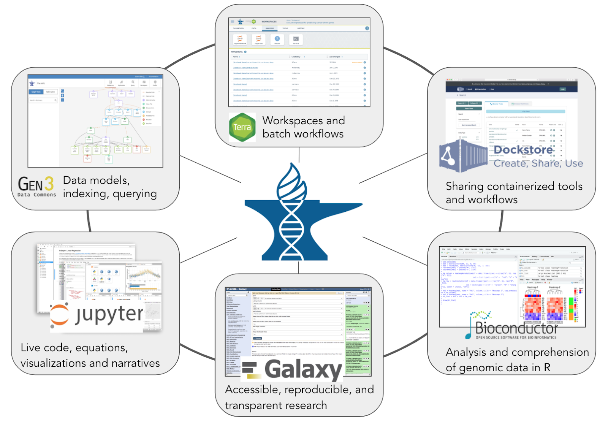
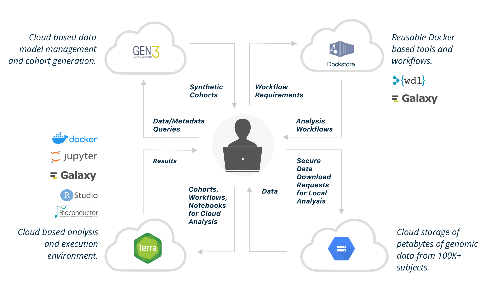

# What is AnVIL?

<hero>AnVIL is NHGRI's Genomic Data Science Analysis, Visualization, and Informatics Lab-Space.</hero>

The traditional model of genomic data sharing – centralized data warehouses such as dbGaP from which researchers
download data to analyze locally – is increasingly unsustainable. Not only are transfer/download costs prohibitive, but
this approach also leads to redundant siloed compute infrastructure and makes ensuring security and compliance of
protected data highly problematic.

<figure>

<figure-caption>From the NHGRI Genomic Data Science Analysis, Visualization and Informatics Lab-space (AnVIL) poster presented at <external-link link="https://twitter.com/hashtag/T2THPRC">#T2THPRC</external-link>. (<a href="./_files/2020.09.21.T2T.HRPC.AnVIL-Poster-wide.pdf" download>Download the Poster</a>)</figure-caption>
</figure>

The NHGRI Genomic Data Science Analysis, Visualization, and Informatics Lab-Space, or AnVIL, inverts the traditional
model, providing a cloud environment for the analysis of large genomic and related datasets.

By providing a unified environment for data management and compute, AnVIL eliminates the need for data movement, allows
for active threat detection and monitoring, and provides elastic, shared computing resources that can be acquired by
researchers as needed.

## Platform Components

The platform is built on a set of established components that have been used in a number of flagship scientific
projects. The Terra platform provides a compute environment with secure data and analysis sharing capabilities.
Dockstore provides standards based sharing of containerized tools and workflows. The Gen3 data commons framework
provides data and metadata ingest, querying, and organization. Bioconductor and Galaxy provide environments for users at
different skill levels to construct and execute analyses.

<Platforms></Platforms>

## Analysis Tools

AnVIL provides a collaborative environment for creating and sharing data and analysis workflows for both users with
limited computational expertise and sophisticated data scientist users.

AnVIL provides multiple entry points for data access and analysis, including execution of batch workflows written in
WDL, notebook environments including Jupyter and RStudio, Bioconductor packages for building analysis on top of AnVIL
APIs and services, and will offer Galaxy instances for interactive analysis. It will be possible to integrate additional
analysis environments through standard APIs.

<Tools current></Tools>

<Tools coming></Tools>

## Datasets

AnVIL provides access to key [NHGRI datasets](https://anvilproject.org/data/consortia), such as the CCDG (Centers for
Common Disease Genomics), CMG (Centers for Mendelian Genomics), eMERGE (Electronic Medical Records and Genomics), as
well as other relevant datasets.

## Platform Interoperability

AnVIL is a member of the [NIH Cloud Platform Interoperability Effort (NCPI)](/ncpi) and is collaborating with
the [NCPI working groups](/ncpi/working-groups) to establish and implement technical standards enabling cross platform
authentication and authorization, cross platform data discovery, and the cross platform exchange of datasets, analysis
tools, and derived data.

[AnVIL is a registered knowledgebase and repository](https://fairsharing.org/4204) in
the [FAIRsharing registry](https://fairsharing.org/) of data and metadata standards, inter-related to databases and data
policies.

## Platform Vision

Long-term, the AnVIL will provide a unified platform for ingestion and organization for a multitude of current and
future genomic and genome-related datasets.

Importantly, AnVIL will ease the process of acquiring access to protected datasets for investigators and drastically
reduce the burden of performing large-scale integrated analyses across many datasets to fully realize the potential of
ongoing data production efforts.

## Getting Started

See our [Learn](/learn) section for information on getting started with the AnVIL platform.
