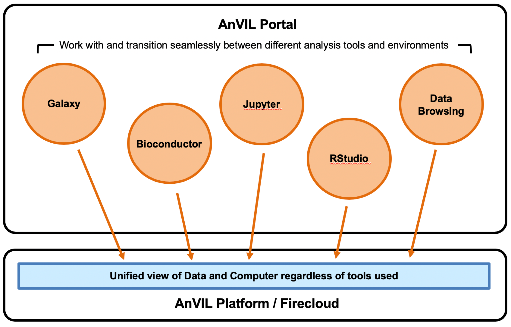

#Typography Test Page
##Training

<hero>AnVIL hosts high value datasets relevant to human health and disease.</hero>

Through a combination of online courses, in-person workshops, and course materials, content will be created using the [FAIR data principles](https://www.nature.com/articles/sdata201618) and tailored to a variety of scenarios. Specific modules will be created for data consumers, data analysts, methods developers, and principal investigators.

##Responsibility for External Sites:
This website may contain links to other web sites. Some of those web sites may be operated by third parties. We provide the links for your convenience, but we do not review, control, or monitor the privacy practices of web sites operated by others.

We are not responsible for the performance of web sites operated by third parties or for your business dealings with them. Therefore, whenever you leave this web site we recommend that you review each web site's privacy practices and make your own conclusions regarding the adequacy of these practices.

Researchers can gain access to AnVIL hosted data sets by **submitting a data access request** through dbGaP for CCDG, CMG, or GTEx data. All 1000 Genomes data is publicly accessible.

###Webforms
anvilproject.org uses webforms forms on this site. These forms require users to give contact information. Contact information from the registration form is used only to send material relating to the [event/course/purpose] for which it was collected and will not be sold to another party.


## Data Sets
### [CCDG](https://www.genome.gov/Funded-Programs-Projects/NHGRI-Genome-Sequencing-Program/Centers-for-Common-Disease-Genomics)
The Centers for Common Disease Genomics are a collaborative large-scale genome sequencing effort to comprehensively identify rare risk and protective variants contributing to multiple common disease phenotypes.

### CCDG
The Centers for Common Disease Genomics are a collaborative large-scale genome sequencing effort to comprehensively identify rare risk and protective variants contributing to multiple common disease phenotypes.

---

First navigate to the parent directory and then use the `Create New File` button as shown below.

First navigate to the parent directory and then use the ```Create New File``` button as shown below.

---

### Create the "Front Matter"
Metadata describing the page and indicating its publication date, and author are held in the pages "Front Matter". Front matter is a yaml section that lists key values pairs of configuration for the page in the very beginning or "front" of the file.

>####TIP
>Note that you can not create an empty directory using the Github interface. However you can create a directory while adding a file by adding the new directory name before the file name then hitting the "/" character

With the front matter created its time to add the page content in markdown. See one of the many [markdown guides](https://github.com/adam-p/markdown-here/wiki/Markdown-Cheatsheet) on the internet

##Add the Page Content
#### Creating a New Page
For new pages, it may be helpful to start writing first in google doc or other word processor that has both a spell checker and the ability to solicit reviews from peers.

#### Add the page URL to the siteMap.js
To get your page added to the siteMap and deployed, please open a pull request for for your new page in the [Github Project](https://github.com/anvilproject/anvil-portal/pulls) for the AnVIL portal repository.

<figure>

<figure-caption>Figure 1: A unified view of data and computer regardless of tools used.</figure-caption>
</figure>

####Getting Content Reviewed
##### Creating a Pull Request Against Staging
Once the file looks ok, submit a pull request against the staging branch, describing your changes and then request reviewers.

##### PR Review Policy
We will generally request 2 reviewers for any complex technical content, team consensus for any marketing/branding/value proposition issues and allow the site maintainers to make typo or grammar fixes without additional reviewers.

> We use the **staging** branch of the  repository as the base for modifying the content.

###Contact Us
Please feel free to reach out to us on the [AnVIL Gitter channel](https://gitter.im/anvil-project/Lobby) or email our [help desk](mailto:help@lists.anvilproject.org).

##Research
Researchers can gain access to AnVIL hosted data sets by submitting a data access request through dbGaP for CCDG, CMG, or GTEx data. All 1000 Genomes data is publicly accessible.

AnVIL users will have access to the commonly used bioinformatic tools such as:
- WDL - Batch processing of GATK and other workflows
- Jupyter - Interactive analysis with the python or R programming languages; the R environment includes a family of Bioconductor 3.10 packages.

Future additions to the AnVIL analysis ecosystem will include the Galaxy workbench, the Genome Browser support by UCSC, and additional community sourced analysis solutions:
1. Properties within the data model (Gender, Blood Pressure, etc.)
1. Definitions for the property
1. Property type (encoded, decimal, string, etc.)

All 1000 Genomes data is publicly accessible.

## Current Tools
- WDL - Batch processing of GATK and other workflows
- [Jupyter](https://jupyter.org/) - Interactive analysis with the python or R programming languages; the R environment includes a family of [Bioconductor](https://www.bioconductor.org/) 3.10 packages.

### Creating a New Page
1. Add a new [markdown](https://en.wikipedia.org/wiki/Markdown) (`.md`) file for the new page.
1. Add a "`front matter`" metadata section to the new markdown file.
1. Add the page content as markdown.
1. Add the page to the siteMap.js file.

Typically the folder structure mirrors the structure or the the site. This is not strictly necessary as the URL to a page is defined by the site map and not the folder structures. However, it does make pages much easier to find when they need to be updated.

##Data dictionary
1. A data dictionary (data model), containing the following information:
    - Properties within the data model (Gender, Blood Pressure, etc.)
    - Definitions for the property
    - Property type (encoded, decimal, string, etc.)
    - Units of measurement
    - Allowable Values (0 means x, 1 means y, etc.)
    - Linkages to external concept codes (where possible)
1. Phenotype data files, including the following broken down by node:
    1. the ID of the entry within that node
    1. the ID of the entry within a parent node. That is, the node under which this node is linked in the graph model. An additional column can be added if the node has multiple parents
    1. Columns for the data value for each property for that entry. Using demographics as an example, a property column may be "Gender", with each line containing a numeric value associated with the property in the data dictionary
1. A data dictionary (data model), containing the following information:
    1. Properties within the data model (Gender, Blood Pressure, etc.)
    1. Definitions for the property
1. A data dictionary (data model), containing the following information:
    - Properties within the data model (Gender, Blood Pressure, etc.)
    - Definitions for the property
1. Phenotype data files, including the following broken down by node:
    - the ID of the entry within that node
    - the ID of the entry within a parent node. That is, the node under which this node is linked in the graph model. An additional column can be added if the node has multiple parents
    - Columns for the data value for each property for that entry. Using demographics as an example, a property column may be "Gender", with each line containing a numeric value associated with the property in the data dictionary
